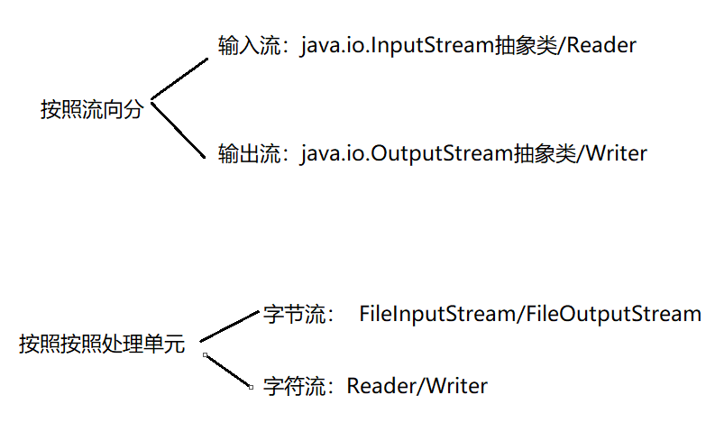
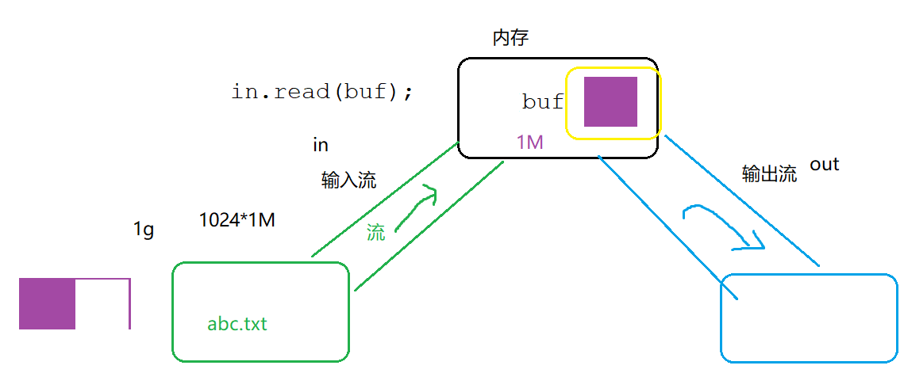
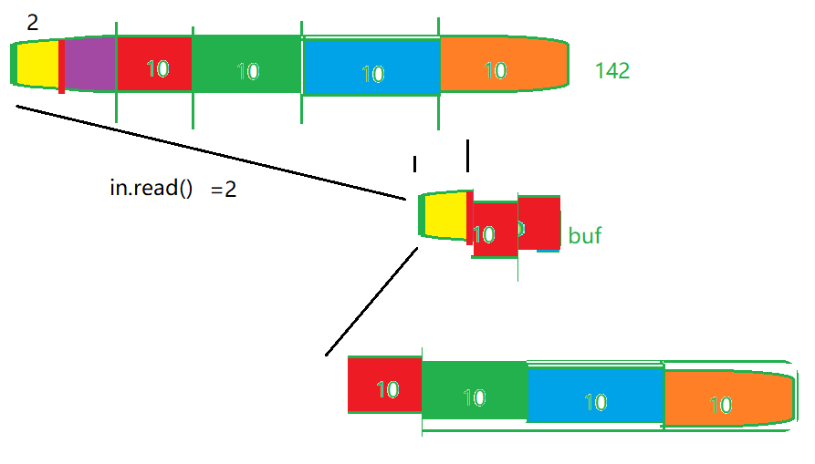
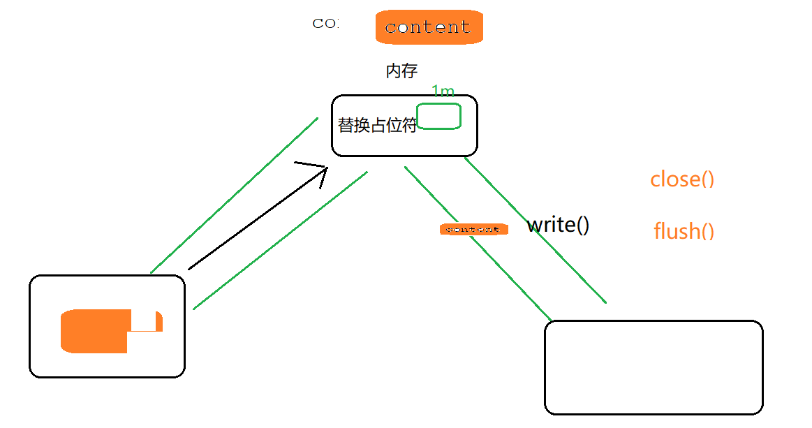

# IO: 输入流InputStream   输出流OutputStream


```
java.io.*
```

文件：硬盘上的文件  txt  docx  电影 图片 

本章的核心：通过 IO 来操作文件。

File

```java
import java.io.File;
import java.io.IOException;

public class Demo01 {
    public static void main(String[] args) {
        //file:文件\目录\不存在的文件或目录
//        File file = new File("d:/abc.txt");
        File file = new File("hello.txt");

        System.out.println("相对路径："+file.getPath() );
        System.out.println("绝对路径："+file.getAbsolutePath());
        System.out.println("文件名称："+file.getName() );
        System.out.println("文件大小："+file.length() );//单位字节


        System.out.println(      file.isFile()==true? "文件":"非文件" );
        System.out.println(      file.isDirectory()==true? "目录":"非目录" );
        boolean flag = file.exists();
        try {
            if(flag) {
//                file.delete();
                //彻底删除（不过回收站）
                System.out.println("删除成功");
            }
            else {
                file.createNewFile();
                System.out.println("创建成功");
            }

        } catch (IOException e) {
            e.printStackTrace();
        }
    }
}

```

相对路径/绝对路径：

	- 如果FIle（"绝对路径"）：getPath() 和getAbsolutePath()的结果一致，打印的都是绝对路径
	- 如果FIle（"相对路径"）：getPath() 打印相对路径;getAbsolutePath（）打印绝对路径

## 流


流：是一种FIFO的数据结构

分类：



>  说明：1.字节流就是 将内容转为了字节形式进行传输， 1 字节 ->8二进制 ，二进制可以传输任何类型的数据，因此字节流也可以传输任何类型的数据。
>
> 2.字节流是8位通用字节流(   1 字节 ->8二进制 ) （字节流可以处理任何类型，处理文本文件以外的其他文件） ;字符流是16位的unicode字符流 （只用于处理字符，处理文本文件）
>
> 3.在while循环中 分批次传输时，字节流使用的缓冲区是 byte[],字符流使用的缓冲区是 char[]


- 其他流

文件复制



输入

```java
import java.io.File;
import java.io.FileInputStream;
import java.io.IOException;
import java.io.InputStream;

public class InputStreamDemo {
    public static void main(String[] args) {
        InputStream in = null ;
        try {
            in =   new FileInputStream(new File("d:/abc.txt"));
//            InputStream in = new FileInputStream("d://abc.txt");
            System.out.println(in.available());//file.length()
            byte[] buf = new byte[in.available()] ;
            in.read(buf);//将文件abc.txt内容读取到buf中
            //buf :byte[] ->String
            System.out.println(new String(buf));


        }catch (Exception e){
            e.printStackTrace();
        }finally {
            try {
                in.close();
            } catch (IOException e) {
                e.printStackTrace();
            }
        }
    }
}

```

输出

```java
import java.io.FileNotFoundException;
import java.io.FileOutputStream;
import java.io.IOException;
import java.io.OutputStream;

public class OutputStreamDemo {

    public static void main(String[] args) {
        OutputStream out = null ;
        try {
             out = new FileOutputStream("d:/xyz.txt") ;
             out.write("helloworld123".getBytes()); //内存->xyz.txt
        } catch (FileNotFoundException e) {
            e.printStackTrace();
        } catch (IOException e) {
            e.printStackTrace();
        }finally {
            try {
                out.close();
            } catch (IOException e) {
                e.printStackTrace();
            }
        }
    }
}

```

文件复制

```java
import java.io.*;

public class FileCopy {
    //abc.txt->内存->xyz.txt
    public static void main(String[] args) {
        InputStream in = null ;
        OutputStream out = null ;
        try {
            //abc.txt->内存
             in = new FileInputStream("d:/abc.txt") ;

             out = new FileOutputStream("d:/xyz.txt") ;
            //开辟10字节的内存
            byte []buf = new byte[10] ;
            int len = -1 ;
            ;
        while(   (len= in.read(buf)) != -1){//in ->buf
            out.write(buf,0,len);//buf->out
        }

        } catch (FileNotFoundException e) {
            e.printStackTrace();
        } catch (IOException e) {
            e.printStackTrace();
        }finally {
            try {
                if(out !=null)out.close();
                if(in !=null) in.close();
            } catch (IOException e) {
                e.printStackTrace();
            }
        }
    }
}
```




使用字符流进行文件的复制



```java
import java.io.*;

public class FileCopyCharactor {
    public static void main(String[] args) {
        //文件->内存（Reader）
        Reader reader = null ;
        Writer writer = null ;
        try {
             reader = new FileReader("d:/个人介绍.txt");
             writer = new FileWriter("d:/个人完整介绍.txt") ;

            char[] buf = new char[4];
            StringBuffer sb = new StringBuffer() ;

            int len = -1 ;
            while((len =reader.read(  buf)) != -1 ){
                // str += buf ;
                sb.append(buf,0,len) ;//将每次读取到的 4个字符 拼接起来
            }

            System.out.println(sb);

            //在内存中 替换占位符
            String content = sb.toString() ;
            content= content.replace("{name}","颜群")
                    .replace("{enterprise}","蓝桥学院")
                    .replace("{weixin}","157468995");

            //将替换后的内容 输出到文件   ，内存 ->文件（Writer）
            writer.write(content);
            System.out.println("成功...");

//            writer.flush(); 将管道中的数据 刷出到 文件中

        } catch (FileNotFoundException e) {
            e.printStackTrace();
        } catch (IOException e) {
            e.printStackTrace();
        }finally {
            try {
               if(writer!=null) writer.close();
                if(reader!=null) reader.close();
            } catch (IOException e) {
                e.printStackTrace();
            }

        }
    }
}

```


自带缓冲区的字符流：缓冲区大小，一行

BufferedReader /BufferedWriter

```java
import java.io.*;

public class FileCopyCharactorBuffered {
    public static void main(String[] args) {
        //文件->内存（Reader）
        Reader reader = null ;
        Writer writer = null ;

        BufferedReader br = null ;
                BufferedWriter bw = null ;

        try {
             reader = new FileReader("d:/个人介绍.txt");
             writer = new FileWriter("d:/个人完整介绍2.txt") ;


             br = new BufferedReader( reader) ;
             bw = new BufferedWriter( writer);

            StringBuffer sb = new StringBuffer() ;

            String line = null ;

            while( (line= br.readLine()) != null   ){
                sb.append(line) ;
            }

            System.out.println(sb);

            //在内存中 替换占位符
            String content = sb.toString() ;
            content= content.replace("{name}","颜群")
                    .replace("{enterprise}","蓝桥学院")
                    .replace("{weixin}","157468995");

            //将替换后的内容 输出到文件   ，内存 ->文件（Writer）


            bw.write(content);
            System.out.println("成功...");

//            writer.flush(); 将管道中的数据 刷出到 文件中

        } catch (FileNotFoundException e) {
            e.printStackTrace();
        } catch (IOException e) {
            e.printStackTrace();
        }finally {

            /*
            *    1先关出，再关入
            *    2从外往内关  br外 = new BufferedReader( reader内) ;
            * */
            try {
               if(bw != null) bw.close();
              if(br!=null )  br.close();
               if(writer!=null) writer.close();
                if(reader!=null) reader.close();
            } catch (IOException e) {
                e.printStackTrace();
            }
        }


    }
}

```

带缓冲区的字符流  对象 = new  带缓冲区的字符流(字符流) ；


二进制流

DataInputStream/DataOutputStream


二进制流  对象 = new 二进制流(字节流) ；

```java
import java.io.*;
//二进制流
public class FileCopyData {
    //abc.txt->内存->xyz.txt
    public static void main(String[] args) {
        InputStream in = null ;
        OutputStream out = null ;
        InputStream dataInput = null ;
        OutputStream dataOutput = null ;
        try {
            //abc.txt->内存
             in = new FileInputStream("d:/IMG_6285.JPG") ;

              dataInput = new DataInputStream(in) ;//字节流->二进制流

             out = new FileOutputStream("e:/颜群微信3.jpg") ;
              dataOutput = new DataOutputStream(out );//字节流->二进制流

            //开辟10字节的内存
            byte []buf = new byte[10] ;
            int len = -1 ;

        while(   (len= dataInput.read(buf)) != -1){//in ->buf
            dataOutput.write(buf,0,len);//buf->out
        }
            System.out.println("成功");

        } catch (FileNotFoundException e) {
            e.printStackTrace();
        } catch (IOException e) {
            e.printStackTrace();
        }finally {
            try {
                if(dataOutput !=null) dataOutput.close();
                if(dataInput !=null) dataInput.close();
                if(out !=null)out.close();
                if(in !=null) in.close();
            } catch (IOException e) {
                e.printStackTrace();
            }


        }
    }
}

```


