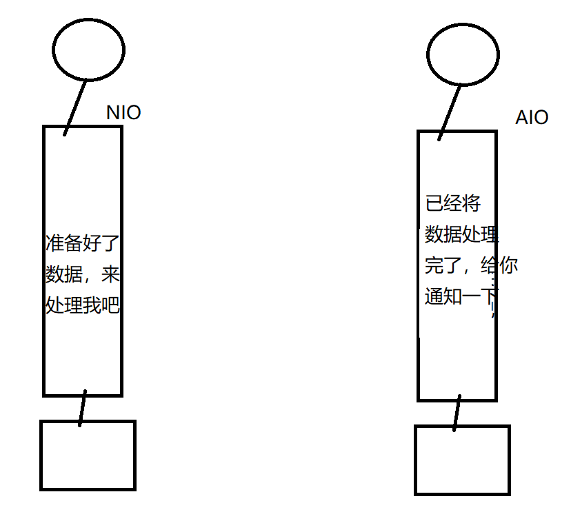
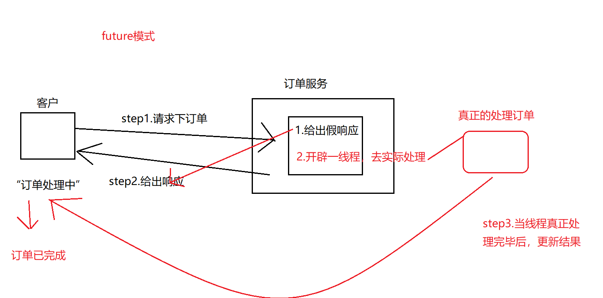
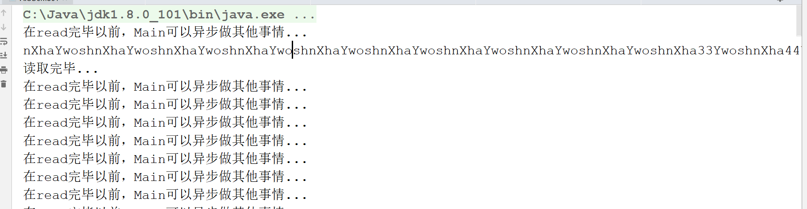

# AIO

IO： BIO ，Blocking IO，  同步 阻塞式IO

NIO：new IO, Non Blocking IO  ,  同步非阻塞式IO

AIO： （就是给NIO增加了几种类型的Channel）， NIO2.0， 异步 非阻塞式IO


AIO增加的Channel：  1.（文件）AsynchronousFileChannel   2.通信，（服务端）AsynchronousServerSocketChannel，（客户端）AsynchronousSocketChannel

简单理解：AIO就是比NIO多了以上几个Channel,这些channel支持异步操作


示例：

NIO和AIO的区别：

NIO:如果某个Channel中已经准备好了客户端数据，就来通知我（就来通知服务端处理）

AIO：如果某个Channel中已经准备好了客户端数据  并且已经将数据读取完毕，就来通知我（就来通知服务端处理）





AIO实现逻辑： future模式、回调函数

future模式：当服务端接收到请求后，立刻给出一个”假响应|中间结果“ ，同时开辟一个线程 去真正的处理这件事情，当把事情真实完毕之后，再更新刚才的”假响应|中间结果“。



回调函数： 例如ajax,简单的将，就是 当服务端将请求处理完毕后，将结果返回到的函数，就称为 回调函数。


示例：future模式

```java
package aio;

import java.nio.ByteBuffer;
import java.nio.channels.AsynchronousFileChannel;
import java.nio.file.Paths;
import java.util.concurrent.Future;

/*
 * Created by 颜群
 */
public class AIODemo01 {

    //读文件，future模式
    public static void test01() throws Exception{
        AsynchronousFileChannel channel = AsynchronousFileChannel.open(Paths.get("d:/a.txt"));
        ByteBuffer buffer = ByteBuffer.allocate(1024*10);

        //future模式   假设文件大小3312
        Future<Integer> future = channel.read(buffer, 0);//1.响应一个假结果   2.开辟一个线程真正的处理

        //两个线程：一个线程 自上而下顺序执行  ，另一个线程 执行read，即读取文件

        //验证两个线程并发执行:当 read没有结束时，一个线程在执行read，另一个线程在打印..
        while(!future.isDone()){
            System.out.println("在read的同时，Main在执行其他事情...");
        }

        //假结果 (get()方法会一直阻塞，直到“真正处理的线程”将结果更新后，才停止阻塞)
        //future.get()当没有读完文件时，返回值（即读取的数据<3312），当文件读取完毕后，更新返回值位3312
        Integer readNumber = future.get();

        buffer.flip() ;
        System.out.println("readNumber:"+ readNumber);
        System.out.println( new String(buffer.array(),0,buffer.limit())  );

    }

    public static void main(String[] args) throws Exception {
        test01() ;

    }
}

```


回调示例：

```java

    public static void test02()  throws Exception{//回调 读
        AsynchronousFileChannel channel = AsynchronousFileChannel.open(Paths.get("d:/a.txt"));
        ByteBuffer buffer = ByteBuffer.allocate(1024 * 10);

        //回调
        channel.read(buffer, 0, null, new CompletionHandler<Integer, Object>() {
            //开辟的新线程（真实读取数据的线程 ）
            //成功(数据读完了)
            @Override
            public void completed(Integer result, Object attachment) {
                buffer.flip() ;
                System.out.println(  new String( buffer.array(),0,buffer.limit() ));
                System.out.println("读取完毕...");
            }

            //失败

            @Override
            public void failed(Throwable exc, Object attachment) {

            }
        });


        //main线程
        while(true){
            System.out.println("在read完毕以前，Main可以异步做其他事情...");
            Thread.sleep(100);
        }
    }
```




future：写

回调：写

```java

    public static void test03()  throws Exception {//future 写
        Path path = Paths.get("d:/b.txt");
        if(  Files.exists(  path)   ){
            Files.delete(  path);
        }
        AsynchronousFileChannel channel = AsynchronousFileChannel.open(path, StandardOpenOption.WRITE, StandardOpenOption.CREATE_NEW);
        ByteBuffer buffer = ByteBuffer.allocate(1024);

        buffer.put( "helloworld" .getBytes()) ;//写到buffer
        buffer.flip() ;

        Future<Integer> future = channel.write(buffer, 0);//写到文件中
        buffer.clear() ;

        while(!future.isDone()){
            System.out.println("main异步执行其他事情...");
        }

        Integer result = future.get();
        System.out.println("写完毕，写入的字节数："+result);
    }

    public static void test04() throws Exception {//回调： 写
        Path path = Paths.get("d:/c.txt");
        if(  Files.exists(  path)   ){
            Files.delete(  path);
        }
        AsynchronousFileChannel channel = AsynchronousFileChannel.open(path, StandardOpenOption.WRITE, StandardOpenOption.CREATE_NEW);
        ByteBuffer buffer = ByteBuffer.allocate(1024);

        buffer.put( "helloworld" .getBytes()) ;//写到buffer
        buffer.flip() ;

        channel.write(buffer, 0, null, new CompletionHandler<Integer, Object>() {
            @Override
            public void completed(Integer result, Object attachment) {
                System.out.println("写入完毕，共写入了字节数：" +result );
            }

            @Override
            public void failed(Throwable exc, Object attachment) {
                    exc.printStackTrace();
            }
        }) ;


        while(true){
            System.out.println("main....");
            Thread.sleep(100);

        }

    }
k
```


