# NIO

IO存在一些问题：

- 服务端接收客户端的accept()方法是一个阻塞式方法，该方法会一直阻塞，直到有客户端发来连接。因此，服务端在等待期间（阻塞）会什么也不做，造成资源浪费。
- 如果在高并发环境下，服务端需要通过开辟线程来分别处理各个客户端请求。但是每开辟一个线程 大约会消耗1mb内存，因此在高并发环境下对内存等资源的损耗也是非常大的。

以上可以通过NIO进行优化。

NIO: new IO、non blocking io  (jdk1.4之后提供的)  ,高效率实现IO技术

IO：面向流的操作、阻塞式

NIO：面向通道、非阻塞式


NIO三个组成： 缓冲区buffer、通道Channel、选择器Selector

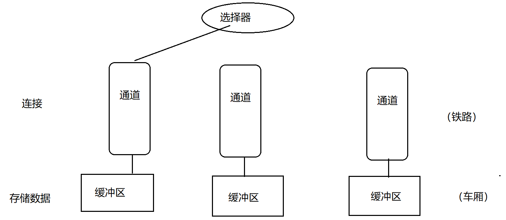

## 缓冲区  

java.nio.Buffer ：数组

实现类（7个）：ByteBuffer、ShortBuffer、IntBuffer、LongBuffer、FloatBuffer、DoubleBuffer、CharBuffer（没有BooleanBuffer、StringBuffer）

## ByteBuffer

    private int mark = -1;
    private int position = 0;
    private int limit;
    private int capacity;
    long address;
position：下一个读或者写的元素的位置

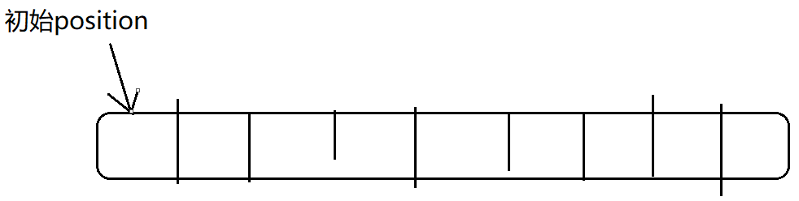


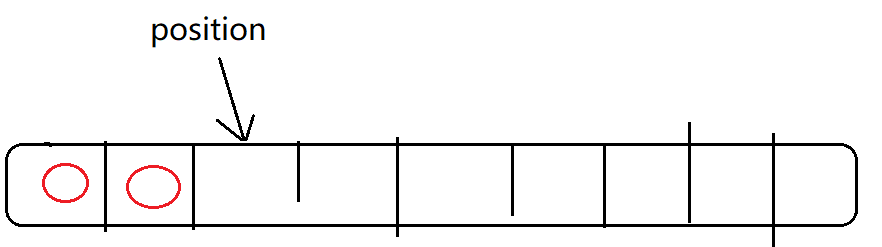


limit：buffer能够容纳的最大元素个数(limit及之后的位置 不能使用）

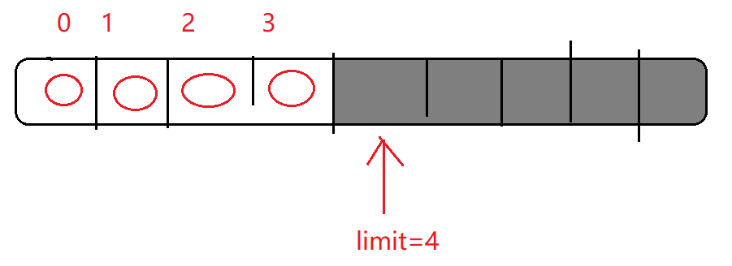

capacity：buffer的最大容量（相当于数组的Length），一旦创建后 不能改变。


mark:标记一个位置，当Poistion后移时可以通过reset（）回归到此mark的位置。

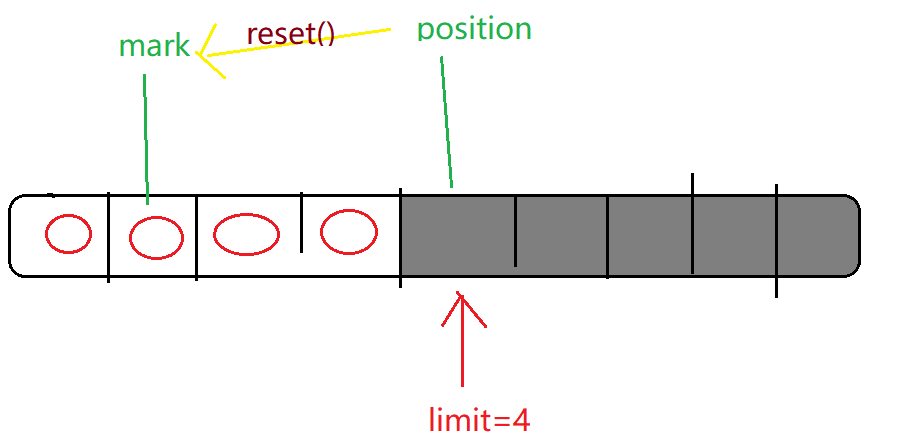

address: 堆外内存地址。

前四个属性的大小关系：

```
mark <= position <= limit <= capacity
```


## Buffer的方法

flip():将写模式转为读模式

```java
    public final Buffer flip() {
        limit = position;
        position = 0;
        mark = -1;
        return this;//链式写法.  buffer.flip().xx()
    }
```

实际应用：

**（1）写操作->读操作**：flip()

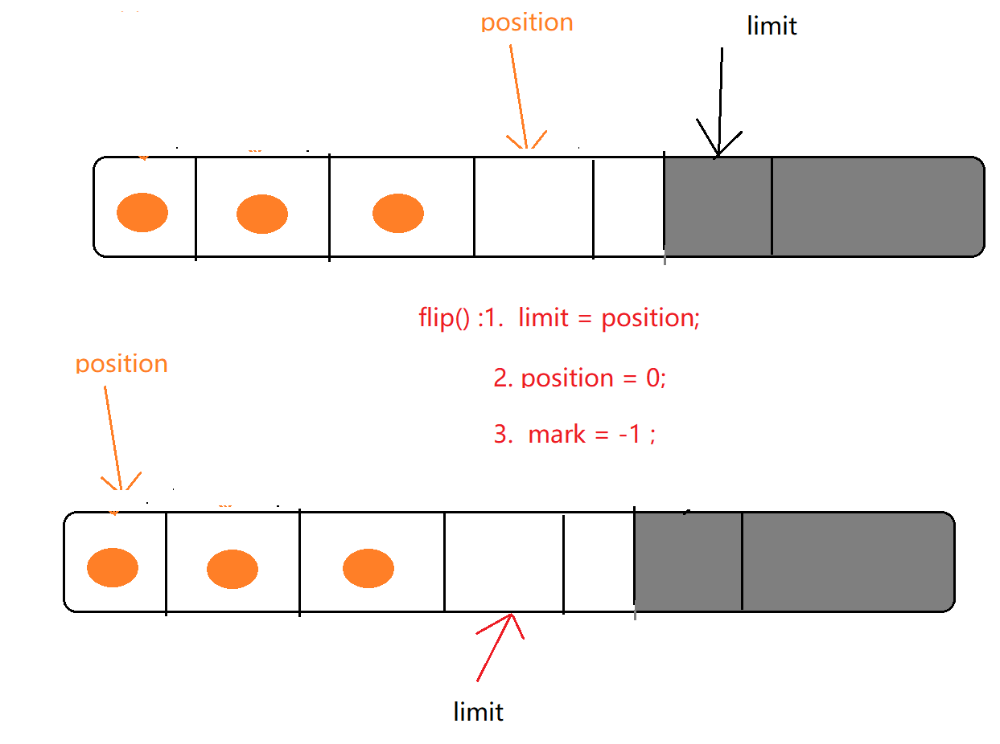

写操作put()                   读操作get()

buffer.put() ;

buffer.flip();//写操作->读操作

buffer.get()

（2）/（3）读操作->写操作   /   写操作 -> 写操作 clear()   ,即重新进行写操作 

```java
    public final Buffer clear() {
        position = 0;
        limit = capacity;
        mark = -1;
        return this;
    }

```

注意：clear()只是将标记归位，但元素值并没有删除，而是处于一种被“遗忘”的状态

（4）读->读:rewind() ,注意rewind()不会改变limit的值。因为 本次的操作是“读"到”读"，两次的模式是相同的。

```java
    public final Buffer rewind() {
        position = 0;
        mark = -1;
        return this;
    }
```

（5） mark()/reset()

buffer案例

```java
import java.nio.ByteBuffer;

/*
 * Created by 颜群
 */
public class NIODemo {

    public static  void test1(){
        ByteBuffer buffer = ByteBuffer.allocate(100);// new byte[100]
        System.out.println("position:" + buffer.position());
        System.out.println("limit:" + buffer.limit());
        System.out.println("capacity（一旦定义不可改变）:" + buffer.capacity());


        //put()
        System.out.println("put()...\n");
        buffer.put("hello".getBytes()   ) ;
        System.out.println("position:" + buffer.position());
        System.out.println("limit:" + buffer.limit());

        //切换模式  写->读：flip()
        System.out.println("flip()...\n");
        buffer.flip() ;
        System.out.println("position:" + buffer.position());
        System.out.println("limit:" + buffer.limit());

        //get()
        System.out.println("get()...\n");
        byte[] bs = new byte[ buffer.limit()];
        buffer.get( bs ) ;

        System.out.println("读取到的数据：" +new String( bs));
        System.out.println("position:" + buffer.position());
        System.out.println("limit:" + buffer.limit());
    }

    public static  void test2(){
        ByteBuffer buffer = ByteBuffer.allocate(8);
        for(int i=0;i<buffer.capacity();i++){
            buffer.put( (byte) i ) ;// 0 1 2 ... 7
        }

        buffer.position(2) ;
        buffer.limit(5);

        ByteBuffer sliceBuffer = buffer.slice();//获取原buffer的局部引用（局部范围：position - limit）
        for(int i=0;i<sliceBuffer.capacity();i++)
        {
            byte b = sliceBuffer.get(i);
            b += 100 ;
            sliceBuffer.put(i,b) ;
        }

        buffer.position(0) ;
        buffer.limit(  buffer.capacity())  ;

        while(buffer.hasRemaining()){ //迭代器
            System.out.println( buffer.get()  );
        }


    }

    public static  void test3(){

        ByteBuffer buffer = ByteBuffer.allocate(100);
        buffer.put("helloworld".getBytes()) ;//position:0 ->10
        buffer.mark();//mark: 10
        System.out.println("position:"+buffer.position());
        System.out.println("mark:"+buffer.mark().position());
        buffer.put("123".getBytes()) ; ////position:10 ->13

        System.out.println("position:"+buffer.position());
        buffer.reset() ;//将position恢复到mark的位置
        System.out.println("position:"+buffer.position());

        byte[] bs = new byte[5] ;
        buffer.get(bs ,  2 ,3) ;//三个参数：存放容器，从第几位开始，取几位

        System.out.println(bs[0]);
        System.out.println(bs[1]);
        System.out.println(bs[2]);
        System.out.println(bs[3]);
        System.out.println(bs[4]);
        System.out.println( new String(bs));

    }

    public static void main(String[] args) {
//        test1();
//        test2();
        test3();
    }
}

```

运行结果：

```

position:10
mark:10
position:13
position:10
0
0
49
50
51
123

```

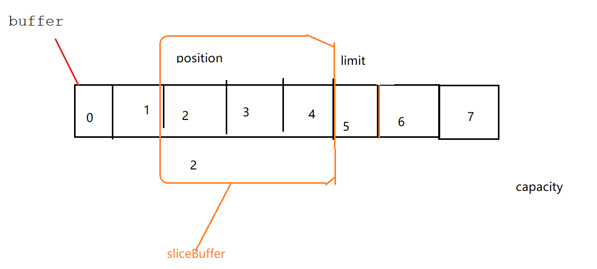


```java
    public static void test4(){
        ByteBuffer buffer = ByteBuffer.allocate(100);
        buffer.put("helloworld".getBytes()) ;
        //写->读
        buffer.flip() ;
        byte[] bs = new byte[ buffer.limit()] ;
        buffer.get( bs) ;
        System.out.println(new String(bs)   );

        //读->读
        buffer.rewind() ;
        buffer.get( bs) ;
        System.out.println(new String(bs));

        //clear():并没有真正的删除元素，只是将元素处于一个被 遗忘的状态
        buffer.clear();
        System.out.println(  (char)buffer.get(2) );//unicode (ascii)

    }
```

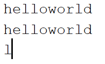

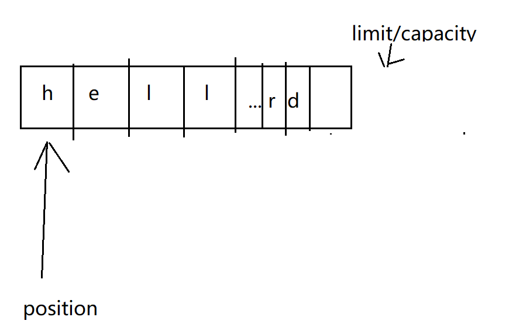

## Channel 通道

通道负责 对buffer中数据的传输，通道本身不存储数据，只负责对数据的传输。通道是双向的（不同于IO中是单向）。

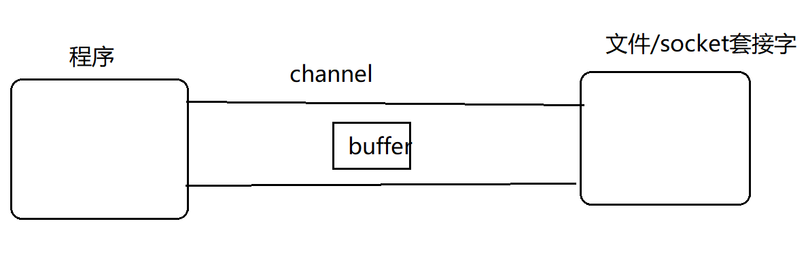


常见获取channel对象的方法：

```
FileChannel.open()  ->Channel        FileInputStream/FileOutputStream/RandomAccessFile:getChannel() ;        Socket/ServerSocket/DatagramSocket:getChannel()
```

作业：尝试使用 buffer和channel进行 文件复制

方式1：使用非直接缓冲区

```java
    //   尝试使用 buffer和channel进行 文件复制
//    使用非直接缓冲区
    public static void test6(){

        long start = System.currentTimeMillis();
        FileInputStream input = null ;
        FileOutputStream out = null ;
        FileChannel inChannel = null ;
        FileChannel outChannel = null ;
        try{


        ByteBuffer buffer = ByteBuffer.allocate(1024);

         input = new FileInputStream("d:/mvnrep.rar");
         out = new FileOutputStream("d:/mvnrep2.rar");

         inChannel = input.getChannel();
         outChannel = out.getChannel();

        while(inChannel.read(buffer  )  !=-1){//读
            buffer.flip() ;
            outChannel.write(buffer)  ;//写
            buffer.clear() ;
        }
            long end = System.currentTimeMillis();
            System.out.println("复制操作消费时间:" + (end-start));
        }catch (Exception e){
            e.printStackTrace();
        }finally {
            try{
            if(outChannel != null) outChannel.close();
            if(inChannel != null) inChannel.close();
            if(out != null) out.close();
            if(input != null) input.close();
            }catch (Exception e){
                e.printStackTrace();
            }
        }
    }
```

复制操作消费时间:4941


方式2：使用直接缓冲区  （本例代码，不建议使用。因为：让直接缓冲区发挥真正作用 必须借助于：零拷贝、内存映射等手段，而不能用本代码的方法）

```java
//    使用直接缓冲区 (本代码不建议使用)
    public static void test7(){
        long start = System.currentTimeMillis();
        FileInputStream input = null ;
        FileOutputStream out = null ;
        FileChannel inChannel = null ;
        FileChannel outChannel = null ;
        try{
            ByteBuffer buffer = ByteBuffer.allocateDirect(1024);//直接缓冲区

            input = new FileInputStream("d:/mvnrep.rar");
            out = new FileOutputStream("d:/mvnrep3.rar");

            inChannel = input.getChannel();
            outChannel = out.getChannel();

            while(inChannel.read(buffer  )  !=-1){//读
                buffer.flip() ;
                outChannel.write(buffer)  ;//写
                buffer.clear() ;
            }
            long end = System.currentTimeMillis();
            System.out.println("复制操作消费时间:" + (end-start));
        }catch (Exception e){
            e.printStackTrace();
        }finally {
            try{
                if(outChannel != null) outChannel.close();
                if(inChannel != null) inChannel.close();
                if(out != null) out.close();
                if(input != null) input.close();
            }catch (Exception e){
                e.printStackTrace();
            }
        }
    }
```

复制操作消费时间:4710


通过源码可知，DirectByteBuffer就是直接缓冲区（实现类）

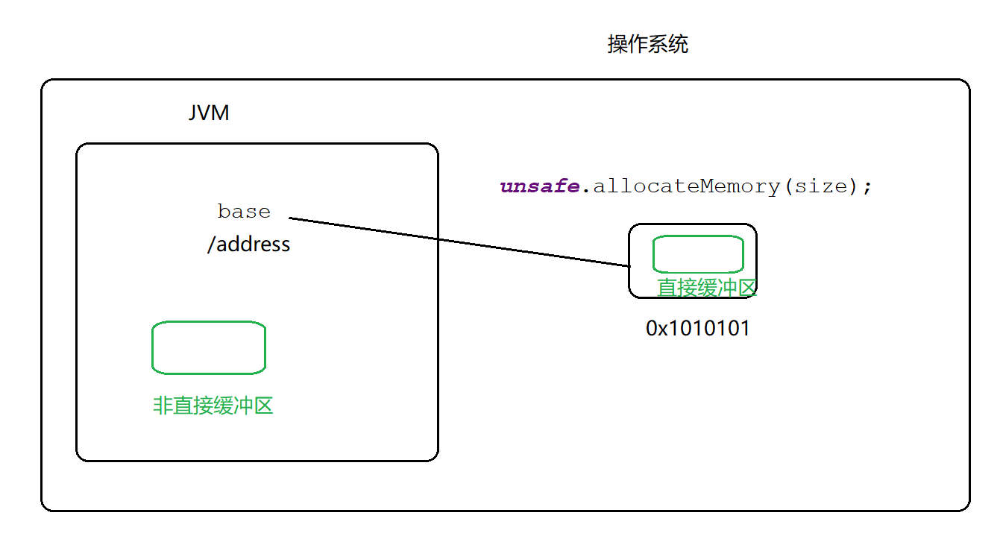


```
class DirectByteBuffer    extends MappedByteBuffer    implements DirectBuffer
```

MappedByteBuffer:内存映射文件（物理映射文件）

DirectBuffer：直接缓冲区


## 使用非直接缓冲区、直接缓冲区的流程区别

## 1使用非直接缓冲区实现：复制

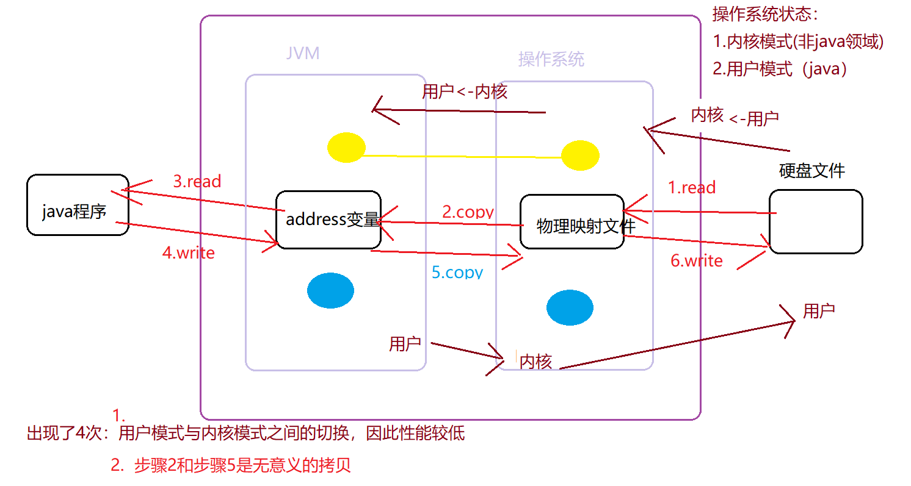


## 2使用非直接缓冲区实现：复制


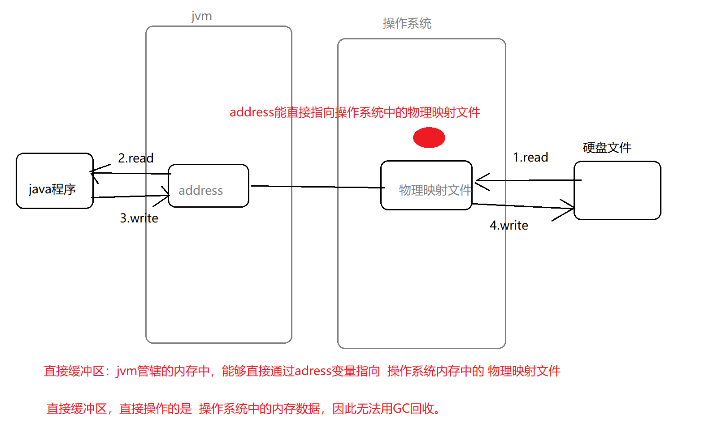

以上，也成为零拷贝

API层面： MappredByteBuffer类  、FileChannel中的 transferFrom()/transferTo()方法来实现零拷贝。


使用 零拷贝（直接缓冲区）实现文件的复制

```java
    //   尝试使用 buffer和channel进行 文件复制
//    使用直接缓冲区(零拷贝)
    public static void test8(){
        long start = System.currentTimeMillis();
        
        //channel buffer
        try {
            FileChannel inChannel = FileChannel.open(Paths.get("D:/mvnrep.rar") );
            FileChannel outChannel = FileChannel.open(Paths.get("D:/mvnrep2.rar") , StandardOpenOption.WRITE, StandardOpenOption.READ,StandardOpenOption.CREATE);

            //物理映射文件
            MappedByteBuffer inMappedBuf = inChannel.map(FileChannel.MapMode.READ_ONLY, 0, inChannel.size());
            MappedByteBuffer outMappedBuf = outChannel.map(FileChannel.MapMode.READ_WRITE, 0, inChannel.size());


            byte[] st = new byte[  inMappedBuf.limit()  ] ;
            inMappedBuf.get( st);
            outMappedBuf.put( st);
            inChannel.close();
            outChannel.close();
            long end = System.currentTimeMillis();
            System.out.println("直接缓冲区（物理映射文件）,花费时间："+ (end-start));

        }catch(Exception e){
                e.printStackTrace();
         }
    }
```

直接缓冲区（物理映射文件）,花费时间：785


物理映射文件：

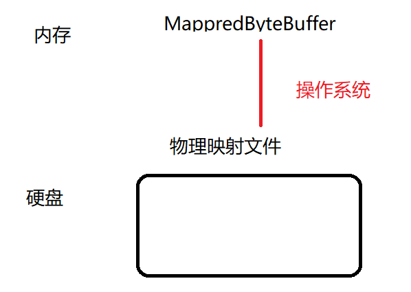


只需要修改MappedXxBuffer，操作系统会自动将此对象中的数据同步到硬盘文件中

```java
   public static void test9(){
        try{
            RandomAccessFile raf = new RandomAccessFile( "d:/a.txt","rw") ;
            FileChannel fileChannel = raf.getChannel();
            //只修改内存中的mappedByteBuffer
            MappedByteBuffer mappedByteBuffer  = fileChannel.map( FileChannel.MapMode.READ_WRITE, 0,raf.length());
            mappedByteBuffer.put(1,(byte)'X') ;
            mappedByteBuffer.put(4,(byte)'Y') ;
            //硬盘中的文件会自动修改（操作系统的功能）
            raf.close();
        }catch (Exception e){
            e.printStackTrace();
        }


    }
```


## 使用FileChannel中的 transferFrom()/transferTo()方法来实现零拷贝

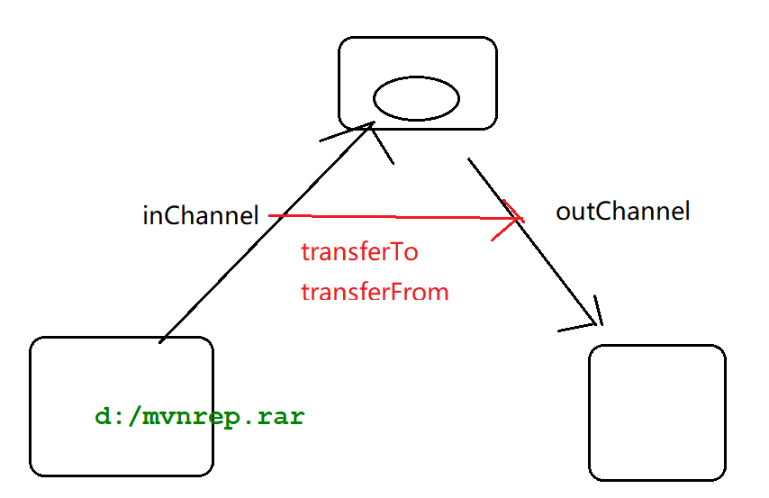

```java
    public static void test10(){
        long start = System.currentTimeMillis();
        try{
            FileChannel inChannel = FileChannel.open(Paths.get("d:/mvnrep.rar"));
            FileChannel outChannel = FileChannel.open( Paths.get("d:/mvnrep2.rar"),StandardOpenOption.WRITE,StandardOpenOption.READ,StandardOpenOption.CREATE );

            //零拷贝
            inChannel.transferTo( 0,inChannel.size(),outChannel ) ;
//          outChannel.transferFrom( 0,inChannel.size(),inChannel ) ;
            inChannel.close();
            outChannel.close();
            long end = System.currentTimeMillis();
            System.out.println("零拷贝时间："+  (end-start));

        }catch (Exception e){
            e.printStackTrace();
        }

    }
}
```

零拷贝时间：370

提示：零拷贝用到的 transferTo\transferFrom需要依赖于操作系统底层的支持（目前主流的基本都支持）

## NIO实现文件发送

IO发送文件

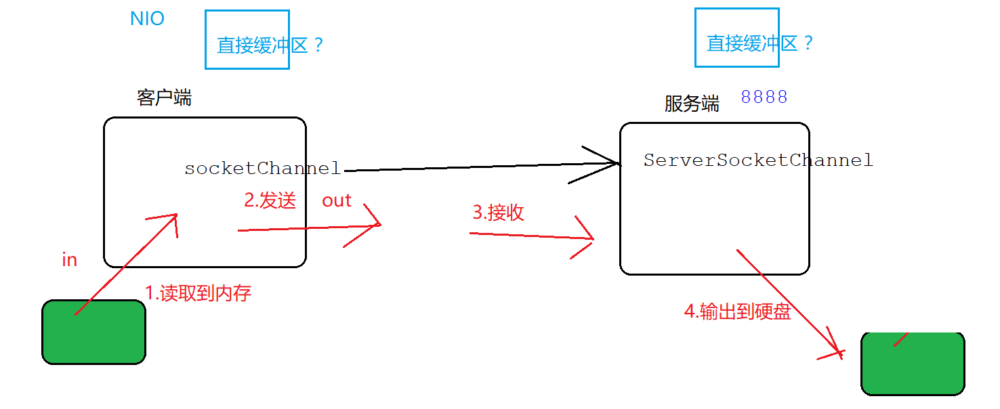

由于直接缓冲区处于JVM以外（在操作系统中内存） ，因此无法被GC及时回收。故，建议只在 那些不经常改变、 持续重用的项目中使用 直接缓冲区


```java

    public static void server() throws Exception {
        ServerSocketChannel serverSocketChannel = ServerSocketChannel.open();//类似于IO技术中的 ServerSocket
        serverSocketChannel.bind(  new InetSocketAddress(8888)) ;
        SocketChannel sChannel = serverSocketChannel.accept();
        System.out.println("客户端连接成功...");
        ByteBuffer buffer = ByteBuffer.allocate(1024);

        long start = System.currentTimeMillis();
        FileChannel outChannel = FileChannel.open(Paths.get("d:/123.rar"), StandardOpenOption.WRITE, StandardOpenOption.CREATE);

        while(sChannel.read(buffer ) != -1){ //3.接收
            buffer.flip();
            outChannel.write(buffer); //4.输出
            buffer.clear();
        }
        sChannel.close();
        outChannel.close();
        serverSocketChannel.close();
        long end = System.currentTimeMillis();
        System.out.println("接收："+(end-start));


    }

    public static void client()  throws Exception {
        long start  = System.currentTimeMillis();
        SocketChannel socketChannel = SocketChannel.open(  new InetSocketAddress( "127.0.0.1" ,8888) );
        FileChannel inFileChannel = FileChannel.open(Paths.get("D:/mvnrep.rar"), StandardOpenOption.READ);
        //buffer+channel
        ByteBuffer buffer = ByteBuffer.allocate(1024);

        while(   inFileChannel.read( buffer )  != -1){//1.读取
            buffer.rewind() ;
            socketChannel.write(  buffer) ;//2.发送
            buffer.clear() ;
        }

        if(inFileChannel!= null) inFileChannel.close();
        if(socketChannel!= null) socketChannel.close();
        long end  = System.currentTimeMillis();
        System.out.println("客户端：" + (end-start));

    }

    public static void client2() throws  Exception{
        long start  = System.currentTimeMillis();
        SocketChannel socketChannel = SocketChannel.open(  new InetSocketAddress( "127.0.0.1" ,8888) );
        FileChannel inFileChannel = FileChannel.open(Paths.get("D:/mvnrep.rar"), StandardOpenOption.READ);
        //使用直接缓冲区（零拷贝）
        inFileChannel.transferTo(0,  inFileChannel.size() ,socketChannel  ) ;  // a   transferFrom/transferTo  b
        long end  = System.currentTimeMillis();
        System.out.println("直接缓冲区方式（客户端）发送文件："+(end-start));

        inFileChannel.close();
        socketChannel.close();
    }
```


## 选择器：

传统IO方式的弊端

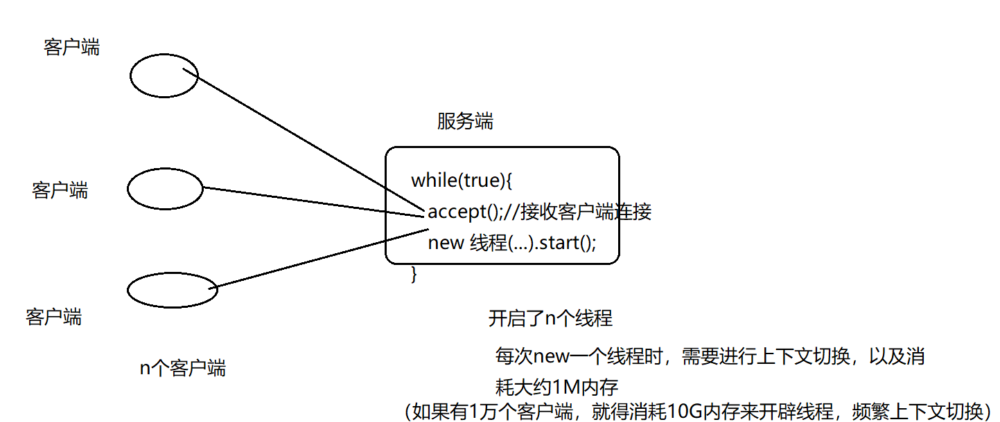


NIO如何解决以上 上下文切换、开辟线程内存问题？ 通过选择器，思路：多个用户可以用 “通道+缓存”  表示，当有多个用户访问时，选择器 可以根据时间，找那些特定（准备就绪）的用户 进行处理。

选择器：切换通道；谁准备好，指向谁。


案例：使用NIO实现“聊天室功能”

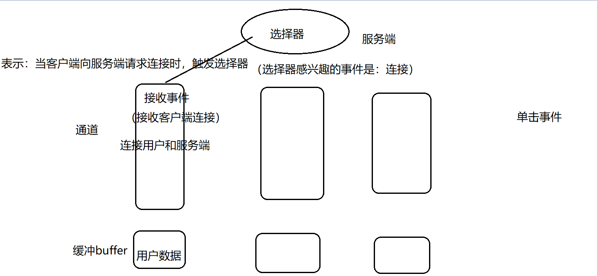


服务端

```java
package chat;

import com.sun.org.apache.bcel.internal.generic.Select;

import java.io.IOException;
import java.net.InetSocketAddress;
import java.net.ServerSocket;
import java.net.Socket;
import java.nio.ByteBuffer;
import java.nio.channels.*;
import java.nio.charset.Charset;
import java.util.HashMap;
import java.util.Iterator;
import java.util.Map;
import java.util.Set;

/*
 * Created by 颜群
 */
public class ChatServer {
    private static Map<String,SocketChannel> clientsMap = new HashMap();
    public static void main(String[] args) throws  Exception {

       int[] ports =  new int[]{7777,8888,9999} ;
       //创建一个选择器
        Selector selector = Selector.open();

        for(int port:ports){
           ServerSocketChannel serverSocketChannel = ServerSocketChannel.open();
           serverSocketChannel.configureBlocking(false) ;//通道的阻塞模式
           ServerSocket serverSocket = serverSocketChannel.socket();
           serverSocket.bind(  new InetSocketAddress(port));
            // 标识selector感兴趣的事件：接收客户端连接
           serverSocketChannel.register(selector, SelectionKey.OP_ACCEPT ) ;
       }

        while(true ){
            selector.select() ;//一直阻塞，直到选择器上有就绪的事件
            //selectedKeys(): 获取 通道 和选择器之间的事件。 获取 选择器 对通道的哪些事件感兴趣。
            Set<SelectionKey> keys = selector.selectedKeys();
            Iterator<SelectionKey> iterator = keys.iterator();

            while(iterator.hasNext()){//获取所有的事件
               SocketChannel clientChannel ;//客户端和服务端交互的通道
                SelectionKey selectedKey = iterator.next();//selectedKey:选择器和通道之间的 每一个感兴趣的事件
                if(selectedKey.isAcceptable()) {  //连接准备就绪
                    ServerSocketChannel   channel = (ServerSocketChannel)selectedKey.channel();
                    clientChannel = channel.accept() ;//连接就绪 的channel
                    clientChannel.configureBlocking(false) ;

                    //增加感兴趣的事件：读事件
                    clientChannel.register(selector, SelectionKey.OP_READ   ) ;
                    //给每个用于设置一个 唯一标志符  key(String) -value(SocketChannel)
                    //唯一标志符：是一个 key+四位随机数
                    String key = "key" + (int)(Math.random()*9000 +1000 ) ;
                    clientsMap.put(key, clientChannel ) ;
                }else if(selectedKey .isReadable() ){//读就绪
                    clientChannel =  (SocketChannel) selectedKey.channel() ;
                    ByteBuffer readBuffer = ByteBuffer.allocate(1024);
                    int result =-1 ;
                    String receive = null ;
                    try {
                        result = clientChannel.read(readBuffer);//将客户端发来的数据 存储到readBuffer中
                    }catch (IOException e){//正在读的时候，如果用户退出（断开连接）
                        //谁退出了？key  ,找到 退出的key   map(key, clientChannel )
                        String clientKey = getClientKey(clientChannel  )  ;
                        System.out.println("客户端："+clientKey+"退出聊天室");
                        clientsMap.remove(clientKey) ;
                        clientChannel.close();
                        selectedKey.cancel();
                        continue ;
                    }

                    if(result >0 ){
                        readBuffer.flip() ;
                        Charset charset = Charset.forName("utf-8") ;
                        receive =  String.valueOf(  charset.decode(readBuffer ).array()   ) ;
                        System.out.println(  clientChannel +":"+ receive);

                        if("connecting".equals(receive)){
                            receive = "新客户端上线" ;
                        }

                        //将本次 读通道中的数据，加入到其他通道中
                        selectedKey.attach(receive) ;

                        //感兴趣的事件：写事件
                        selectedKey.interestOps(  SelectionKey.OP_WRITE   )   ;
                    }
                //...
                }else if(selectedKey.isWritable()) {//写数据

                    clientChannel =   (SocketChannel) selectedKey.channel();
                    /*将接收到的消息 广播出去。  例如，张三在聊天室发了一句“hello"，服务端 需要将这个
                    "hello"再广播 所有的聊天室用户  。形式：    张三(key)： hello(SocketChannel)
                    */
                    String key = getClientKey( clientChannel ) ;
                    //广播发送给全部的聊天室用户
                    for(  Map.Entry<String,SocketChannel> entry: clientsMap.entrySet()){
                        SocketChannel eachClient = entry.getValue();//每个用户
                        ByteBuffer broadCastBuffer = ByteBuffer.allocate(1024) ;
                        broadCastBuffer.put((key+":"  + selectedKey.attachment() ).getBytes() ) ;
                        broadCastBuffer.flip() ;
                        eachClient.write( broadCastBuffer ) ;
                    }

                    selectedKey.interestOps(SelectionKey.OP_READ);

                }else{
                    System.out.println("other...");
                }
            }
            keys.clear();
        }
    }


    public static String getClientKey(SocketChannel  clientChannel  ){
        String key = null ;
        //n个人，n个clientChannel
        /*
                key1  :n个clientChannel-1
                key2  :n个clientChannel-2
                key13  :n个clientChannel-3
         */
        Set<Map.Entry<String, SocketChannel>> entries = clientsMap.entrySet();
        for( Map.Entry<String,SocketChannel> entry:entries){
            if(entry.getValue() ==clientChannel ){
                key = entry.getKey() ;
                break ;
            }
        }
        return key;
    }
}

```

客户端

```java
package chat;

import java.io.BufferedReader;
import java.io.InputStreamReader;
import java.net.InetSocketAddress;
import java.nio.ByteBuffer;
import java.nio.channels.SelectionKey;
import java.nio.channels.Selector;
import java.nio.channels.SocketChannel;
import java.util.Iterator;
import java.util.Set;

/*
 * Created by 颜群
 */
public class ChatClient {
    public static void main(String[] args) {
        try {
            SocketChannel socketChannel = SocketChannel.open();
            socketChannel.configureBlocking(false) ;
            Selector selector = Selector.open();
            //注册“连接事件”
            socketChannel.register(  selector  , SelectionKey.OP_CONNECT) ;

            int[] ports = {7777,8888,9999} ;
            int port = ports[ (int)(Math.random()*3) ] ;
            socketChannel.connect(new InetSocketAddress("127.0.0.1",port)) ;

            while(true){
                selector.select() ;
                //selectionKeys：包含了所有的事件
                Set<SelectionKey> selectionKeys = selector.selectedKeys();

                Iterator<SelectionKey> keyIterator = selectionKeys.iterator();
                while(keyIterator.hasNext()  ){

                    SelectionKey selectionKey = keyIterator.next();//每个事件
                    //真实的发生“连接事件”
                    if(selectionKey.isConnectable()){ //连接完毕？接收（读）、发送（写）
                        //buffer  + channel
                        ByteBuffer sendBuffer = ByteBuffer.allocate(1024);
                        SocketChannel clientChannel =  (SocketChannel)selectionKey.channel();


                        if(clientChannel.isConnectionPending()){//正在连接

                            if(clientChannel.finishConnect()){
                                System.out.println("连接服务端成功,连接的端口是："+port);
                                //向服务端 发送一条测试数据
                                sendBuffer.put("connecting".getBytes()) ;
                                sendBuffer.flip() ;
                                clientChannel.write(sendBuffer) ;

                            }
                        }
                        //在客户端看来，“写操作”不需要注册到通道中，再去使用?

                        //客户端，每次写操作，创建一个线程
                        new Thread( ()->{
                            try {
                                sendBuffer.clear();
                                //写数据： 接收用户从控制台输入的内容
                                InputStreamReader reader = new InputStreamReader(System.in);
                                BufferedReader bReader = new BufferedReader(reader);
                                String message = bReader.readLine();

                                sendBuffer.put(message.getBytes()) ;
                                sendBuffer.flip() ;
                                clientChannel.write( sendBuffer) ;

                                //发送数据
                            }catch (Exception e){
                                e.printStackTrace();
                            }

                        }    ) .start();


                        //发送数据（写）
                        clientChannel.register(  selector,SelectionKey.OP_READ) ;
                    }else if(selectionKey.isReadable()  ){//读
                        ByteBuffer readBuffer = ByteBuffer.allocate(1024);
                        SocketChannel clientChannel =  (SocketChannel)selectionKey.channel();
                        int len = clientChannel.read(readBuffer);//读
                        if(len>0){
                            String receive = new String(readBuffer.array(), 0, len);
                            System.out.println(receive);
                        }
                    }
                }

                selectionKeys.clear();
            }
        }catch (Exception e){
            e.printStackTrace();
        }
    }
}

```

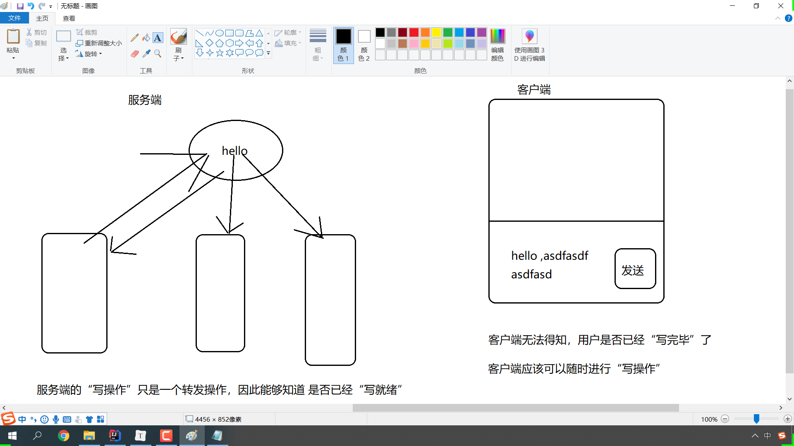


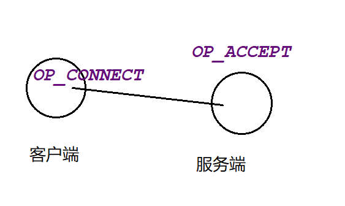


