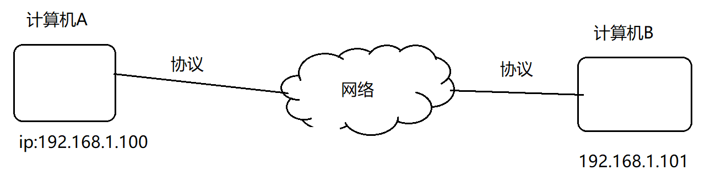
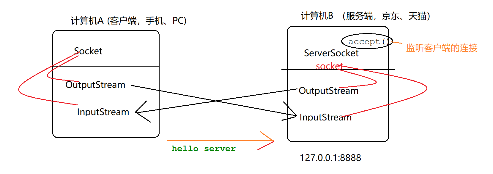
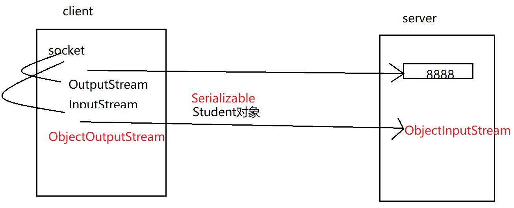
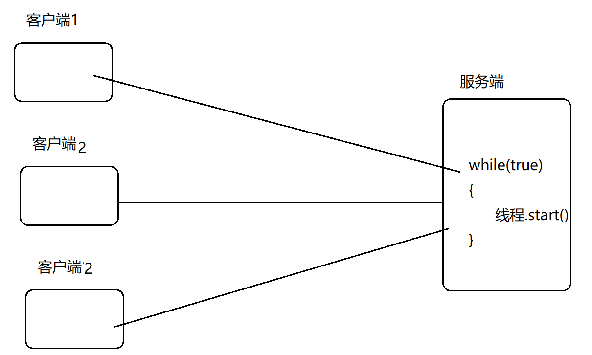
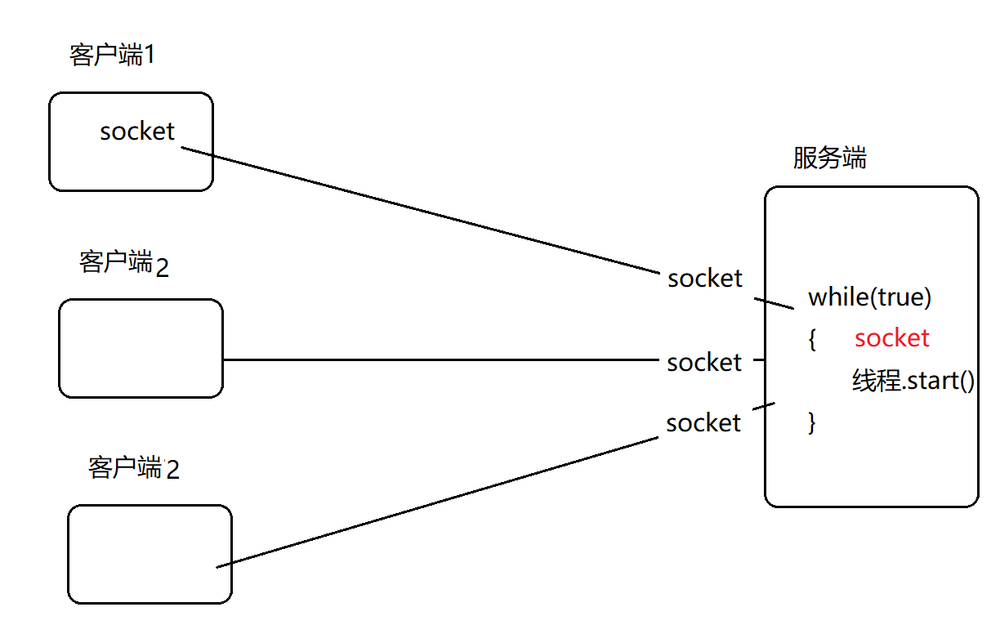
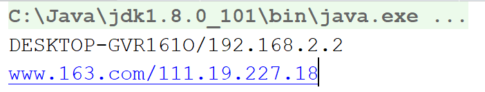
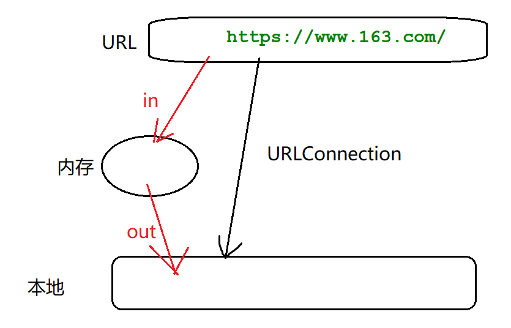

# 网络编程



ip地址：网络上的 唯一标识。

ip的组成：32位，由4个8位二进制组成  （每一位最大值是255，每一位十进制标识  0-255）

‭11000000‬.‭10101000‬.‭00000001‬.‭01100100‬  二进制不容易被记忆，改成十进制：192.168.1.100

192.168.300.101 错 （每一位最大值是255，每一位十进制标识  0-255）

协议： 为了让网络中不同计算机之间能够相互通信而建立的规则、标准、约定。本课程使用的TCP、UDP

- TCP协议：面向连接的、可靠的（不丢失、不重复、有序）、基于字节流的传输通信协议。传输速度相对慢。
- UDP协议：无连接的协议。在传输数据之前，客户端和服务端之间不建立和维护连接。提供不可靠的数据传输。传输速度相对快。


socket（套接字）：基于TCP协议的网络通信，可以提供双向安全连接的网络通信。**socket需要借助于数据流（字节流）来完成数据的传递工作**


可见：发送数据，OutputStream

接受数据，InputStream

本机默认ip：localhost     127.0.0.1

案例：

模板

1.客户端建立连接  ；服务端准备服务（ip[默认本机]:端口）

2.通过socket生成inputstream/outputstream（准备发送数据）

3.使用inputstream/outputstream进行发送、接受数据

4.关闭inputstream/outputstream、socket



服务端（ServerSocket）

```java
package demo01;

import java.io.*;
import java.net.ServerSocket;
import java.net.Socket;

/*
 * Created by 颜群
 */
public class MyServer {

    public static void main(String[] args) {
//        1.准备服务.ip:默认本机127.0.0.1,端口8888
        ServerSocket serverSocket = null ;
        Socket socket = null ;
        InputStream in = null ;
        BufferedReader reader = null ;
        OutputStream out = null ;
        try {
             serverSocket = new ServerSocket(8888) ;
            System.out.println("服务器启动");
            //准备完毕，可以监听客户端请求
             socket = serverSocket.accept();//一直阻塞，直到有客户端连接
            System.out.println("服务端检测到客户端连接成功！");
            

            //  2.通过socket生成inputstream/outputstream（准备发送数据）
             //3.使用inputstream/outputstream进行发送、接受数据
             in = socket.getInputStream();
            //带缓冲区的字符流（字节流-转换流-字符流）
             reader = new BufferedReader(new InputStreamReader(in));
            String info = null ;
            while(  (info=reader.readLine()) != null       ){
                System.out.println("I am server,接受到客户端信息是：" + info);
            }

            socket.shutdownInput();


            //服务端做出反馈
             out = socket.getOutputStream();
            out.write("welcome  client....".getBytes());

        socket.shutdownOutput();


        } catch (IOException e) {
            e.printStackTrace();
        }finally{
            try {
                // 4.关闭inputstream/outputstream、socket
               if(reader !=null) reader.close();
                if(out !=null) out.close();
                if(in !=null) in.close();
                if(socket !=null) socket.close();
                if(serverSocket !=null) serverSocket.close();
            } catch (IOException e) {
                e.printStackTrace();
            }
        }

    }
}

```

客户端（Socket）

```java
package demo01;

import java.io.*;
import java.net.Socket;

/*
 * Created by 颜群
 */
public class MyClient {

    public static void main(String[] args) {
        Socket socket = null ;
        OutputStream out = null ;
        InputStream in = null ;
        BufferedReader reader = null ;
        try {
             socket = new Socket("127.0.0.1",8888);
            System.out.println("客户端链接成功！");
             out = socket.getOutputStream();
            out.write( "hello server".getBytes()  );
            socket.shutdownOutput();

            //接收服务端的反馈
             in = socket.getInputStream();
             reader = new BufferedReader(new InputStreamReader(in));
            String info = null;
            while(   (info=reader.readLine()) != null ){
                System.out.println("I am client,接收到的服务端消息："+info);
            }

            socket.shutdownInput();
        } catch (IOException e) {
            e.printStackTrace();
        }finally{
            try {
               if(out!=null) out.close();
                if(in!=null) in.close();
                if(socket!=null) socket.close();
            } catch (IOException e) {
                e.printStackTrace();
            }

        }
    }
}

```

## 对象流

网络传递一个对象： 1.将要传递的对象序列化  2.使用对象流（ObjectInputStream/ObjectOutputStream）

对象



```java
package demo02;

import java.io.Serializable;

/*
 * Created by 颜群
 */
public class Student implements Serializable {//将要传递的对象序列化
    private int sid ;
    private String sname ;
    private int age ;

    public Student(){

    }
    public Student(int sid, String sname, int age) {
        this.sid = sid;
        this.sname = sname;
        this.age = age;
    }

    public int getSid() {
        return sid;
    }

    public void setSid(int sid) {
        this.sid = sid;
    }

    public String getSname() {
        return sname;
    }

    public void setSname(String sname) {
        this.sname = sname;
    }

    public int getAge() {
        return age;
    }

    public void setAge(int age) {
        this.age = age;
    }

    @Override
    public String toString() {
        return "Student{" +
                "sid=" + sid +
                ", sname='" + sname + '\'' +
                ", age=" + age +
                '}';
    }
}

```

服务端

```java
package demo02;

import java.io.IOException;
import java.io.InputStream;
import java.io.ObjectInputStream;
import java.net.ServerSocket;
import java.net.Socket;

/*
 * Created by 颜群
 */
public class MyServer {
    public static void main(String[] args) {
        ServerSocket serverScoket = null ;
        Socket socket = null ;
        InputStream in = null ;
        ObjectInputStream ois = null ;
        try {
             serverScoket = new ServerSocket( 8888) ;
             socket = serverScoket.accept();

            //接受客户端发来的对象
             in = socket.getInputStream();
            //对象流
             ois = new ObjectInputStream(in);
            try {
                Student student = (Student)ois.readObject();//读取对象
                System.out.println(student);
                socket.shutdownInput();
            } catch (ClassNotFoundException e) {
                e.printStackTrace();
            }


        } catch (IOException e) {
            e.printStackTrace();
        }finally{
            try {
               if(ois!=null) ois.close();
                if(in!=null)   in.close();
                if(socket!=null)  socket.close();
                if(serverScoket!=null)  serverScoket.close();
            } catch (IOException e) {
                e.printStackTrace();
            }

        }

    }
}

```

客户端

```java
package demo02;

import java.io.IOException;
import java.io.ObjectOutputStream;
import java.io.OutputStream;
import java.net.Socket;

/*
 * Created by 颜群
 */
public class MyClient {
    public static void main(String[] args) {
        Socket socket = null ;
        OutputStream out = null ;
        ObjectOutputStream oos = null ;
        try {
             socket = new Socket("localhost",8888) ;

            Student student = new Student(1001,"zs",23);

             out = socket.getOutputStream();
            //将OutputStream转为对象流
             oos = new ObjectOutputStream(out) ;
            oos.writeObject( student );//发送对象
            socket.shutdownOutput();


        } catch (IOException e) {
            e.printStackTrace();
        }
        finally{
            try {
                if(oos!=null) oos.close();
                if(out!=null)   out.close();
                if(socket!=null)  socket.close();
            }catch (IOException e) {
                e.printStackTrace();
            }

        }
    }
}

```

## 多客户端问题



思路：客户端代码不变；服务端：每当有一个客户端，就开启一个新线程去处理（每个线程专门处理一个客户端对象）。



服务端线程

```java
package demo03;

import java.io.*;
import java.net.Socket;

/*
 * Created by 颜群
 */
public class ServerThread  extends  Thread{

    Socket socket  ;
    public ServerThread(Socket socket){
      this.socket = socket;
    }

    @Override
    public void run() {
        InputStream in =null ;
        ObjectInputStream ois  = null ;
        OutputStream out = null ;
        try {
            //接受客户端数据（客户端—>服务端）
             in = socket.getInputStream();
             ois  = new ObjectInputStream(in) ;
            Student student =  (Student)ois.readObject() ;
            System.out.println(student);
            socket.shutdownInput();

            //给客户端反馈(服务端->客户端)
             out = socket.getOutputStream();
            out.write("已收到....".getBytes());

        } catch (IOException e) {
            e.printStackTrace();
        } catch (ClassNotFoundException e) {
            e.printStackTrace();
        }
        finally {
            try {
                out.close();
                ois.close();
                in.close();
                socket.close(); ;
            } catch (IOException e) {
                e.printStackTrace();
            }
        }

    }
}

```

服务端

```java
package demo03;

import java.io.IOException;
import java.net.ServerSocket;
import java.net.Socket;

/*
 * Created by 颜群
 */
public class MyServer {
    public static void main(String[] args) {
        try {
            ServerSocket serverSocket = new ServerSocket(8888) ;

            while(true) {
                Socket socket = serverSocket.accept();//阻塞，接受客户端请求
                ServerThread serverThread = new ServerThread(socket) ;
                serverThread.start();
            }

        } catch (IOException e) {
            e.printStackTrace();
        }
    }

}

```

客户端

```java
package demo03;

import java.io.IOException;
import java.io.InputStream;
import java.io.ObjectOutputStream;
import java.io.OutputStream;
import java.net.Socket;

/*
 * Created by 颜群
 */
public class MyClient {
    public static void main(String[] args) {
        Socket socket = null ;
        OutputStream out = null ;
        ObjectOutputStream oos = null ;
        try {
             socket = new Socket("localhost",8888) ;

            Student student = new Student(1001,"zs",23);

             out = socket.getOutputStream();
            //将OutputStream转为对象流
             oos = new ObjectOutputStream(out) ;
            oos.writeObject( student );//发送对象
            socket.shutdownOutput();

            //接受服务端的反馈
            InputStream in = socket.getInputStream();
            byte[] buf = new byte[100] ;
            in.read(buf) ;
            System.out.println("接收到的服务端反馈:" + new String(buf)      );


        } catch (IOException e) {
            e.printStackTrace();
        }
        finally{
            try {
                if(oos!=null) oos.close();
                if(out!=null)   out.close();
                if(socket!=null)  socket.close();
            }catch (IOException e) {
                e.printStackTrace();
            }

        }
    }
}

```


## UDP的实现

DatagramPacket（数据）：封装了数据报的数据、数据长度、目标地址和目标端口

DatagramScoket（收发器）：接收和发送DatagramPacket中封装好的数据

接收方

```java
package demo04;

import java.io.IOException;
import java.net.DatagramPacket;
import java.net.DatagramSocket;
import java.net.SocketException;

/*
 * Created by 颜群
 */
public class Receive {

    public static void main(String[] args) {
        DatagramSocket ds = null ;
        byte[] data = new byte[64] ;
        //准备接收数据的对象
        DatagramPacket dp = new DatagramPacket(data , data.length) ;
        //接收数据
        try {
             ds = new DatagramSocket(9999  );
            ds.receive( dp );

            //显示接收到的数据
            String receiveData  = new String(dp.getData(), 0, data.length);
            System.out.println("接收到的数据："+receiveData);
            System.out.println("显示发送方的信息：" +  dp.getAddress().getHostAddress() );


        } catch (SocketException e) {
            e.printStackTrace();
        } catch (IOException e) {
            e.printStackTrace();
        }
        finally {
            ds.close();
        }

    }
}

```

发送方

```java
package demo04;

import java.io.IOException;
import java.net.*;

/*
 * Created by 颜群
 */
public class Send {
    public static void main(String[] args) {
        DatagramSocket ds = null ;
        //创建一个InetAddress对象
        InetAddress ip = null ;
        try {
             ip = InetAddress.getByName("127.0.0.1");


        String msg = "helloserver.." ;
        DatagramPacket dp = new DatagramPacket(msg.getBytes(),msg.length(),ip,9999) ;
         ds = new DatagramSocket() ;
        ds.send(  dp );
        } catch (UnknownHostException e) {
            e.printStackTrace();
        } catch (SocketException e) {
            e.printStackTrace();
        } catch (IOException e) {
            e.printStackTrace();
        }finally{
            ds.close();
        }
    }
}

```

总结：发送数据使用的工具

tcp：字节流

udp:DatagramScoket

## 网络编程中一些工具类

InetAddress

```java
   public static void main(String[] args) {
        InetAddress host = null;
        try {
            //本机
            host = InetAddress.getLocalHost();
            System.out.println(host);
            //网络中任意一台
            InetAddress host163 = InetAddress.getByName("www.163.com");
            System.out.println(host163);
        } catch (UnknownHostException e) {
            e.printStackTrace();
        }

    }
```




 **URL/URLConnection**



以下示例，注意点：输入流  url-内存； 输出流：内存-本地 

```java
package demo05;

import java.io.FileOutputStream;
import java.io.IOException;
import java.io.InputStream;
import java.io.OutputStream;
import java.net.MalformedURLException;
import java.net.URL;
import java.net.URLConnection;

/*
 * Created by 颜群
 */
public class URLDemo {
    public static void main(String[] args) {
        InputStream in = null ;
        URLConnection urlConnection = null;
        OutputStream out = null ;
        try {
            URL url = new URL("https://www.163.com/") ;
             urlConnection = url.openConnection();
             in = urlConnection.getInputStream();

             out = new FileOutputStream("d:\\163.txt");
            byte[] buf = new byte[64] ;
            int len = -1 ;
            while(  (len = in.read(buf)) != -1 ){
                out.write(buf,0,len);
            }
        } catch (MalformedURLException e) {
            e.printStackTrace();
        }
        catch (IOException e) {
            e.printStackTrace();
        }finally{
            try {
               if(out!=null) out.close();
                if(in!=null)  in.close();
            } catch (IOException e) {
                e.printStackTrace();
            }


        }

    }
}

```


​     

