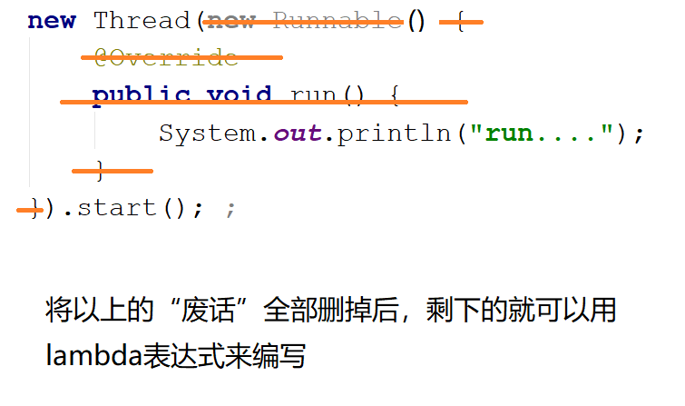
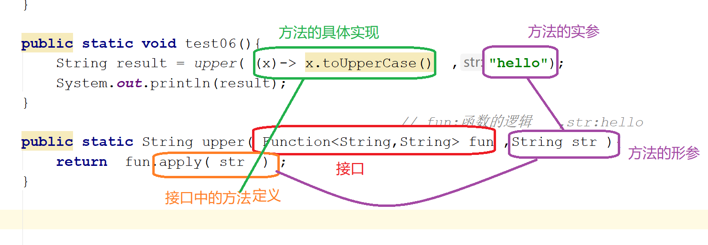
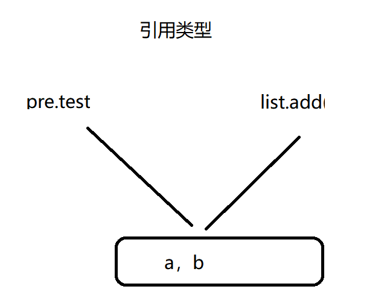

# JDK8

## lambda :简化代码

lambda   *λ*   组成  ：

- 逗号隔开的参数列表      (x,x,x)     ()
- 箭头符号   ->  
- 方法体 （λ代码块）

示例



```java
package lambda;
/*
 * Created by 颜群
 */
public class Demo01 {
    public static void test01(){
        new Thread(new Runnable() {
            @Override
            public void run() {
                System.out.println("run....");
            }
        }).start(); 
    }

    public static void test02(){
        new Thread(
//           ()  -> { System.out.println("run....");  }
             ()  ->  System.out.println("run....")
        ).start(); ;
    }

    public static void main(String[] args) {
//        test01() ;
          test02() ;

    }
}
```


```java
        new Thread(
                ()  ->  System.out.println("run....")
        ).start(); ;
```

以上述为例， new Thread(  )中是一个接口、抽象类。但是为了避免  不能区分 lambda到底是重写的哪个方法，语法上lambda要求 重写的 接口、抽象类中  有且只能有一个 抽象方法。

仔细观察，lambda重写的接口、抽象类中 会标识一个@FunctionalInterface，称为函数式接口。

函数式接口：标注@FunctionalInterface，有且只有一个 抽象方法。

**lambda表达式重写的 必须是 函数式接口（或者 只有一个抽象方法的抽象类）**

函数式接口要注意以下几点：

- 即使没有标注@FunctionalInterface，但是只有一个抽象方法，也称之为函数式接口
- 特殊情况：如果某个接口中有多个抽象方法，但只有1个抽象方法是本接口新定义的，其他抽象方法和Object中已有的方法重复，那么该接口仍然是函数式接口。

```java
package lambda;

/*
 * Created by 颜群
 */

@FunctionalInterface
public interface MyInterface  {//everything is an Object
    public abstract void a() ;//本接口新定义的抽象

    public abstract String toString() ;//和Object中重名(实际会调用Object中的toString())
    public abstract boolean equals(Object obj) ;//和Object中重名

    //重点：toString()和equals()看似是抽象方法，实则是 有方法体的具体方法
}

class MyInterfaceImpl implements  MyInterface{
    @Override
    public void a() {
        System.out.println("a...");
    }
}
class TestMyInterface{
    public static void main(String[] args) {

        MyInterfaceImpl impl = new MyInterfaceImpl();
        impl.a();
        impl.equals("")  ;
        impl.toString();
    }
}

```

MyInterface中的a()方法是 自己定义的，而其他equals()、toString()方法可以理解为 从Object中继承而来，因此 MyInterface虽然显示了3个抽象，但其实只有1个抽象。

()  { return }

函数式接口从哪来？

- JDK自带 (很多存在于java.util.function包中)

  ​	四大核心函数式接口

   - 有参，无返回值  （消费型）

     ```java
     @FunctionalInterface
     public interface Consumer<T> {
     
         void accept(T t);
         ...
     }
     ```

     

   - 无参，有返回值（供给型）

       ```java
  @FunctionalInterface
  public interface Supplier<T> {
  
      T get();
  }
      ```

  

   - 有参，有返回值  (函数型)

  ```java
  @FunctionalInterface
  public interface Function<T, R> {
  
      R apply(T t);
      ...
  }
  ```

  

   - 断言式接口 

   ```java
  
  @FunctionalInterface
  public interface Predicate<T> {
      boolean test(T t);
      ...
  }
   ```

- 自定义


## lambda表达式的使用方式


### 方式一

​       函数式接口  引用名 =  lambda表达式 ；

​		Predicate<Integer> p = num -> num < 10 ;

```java
    public static void test01(){
        //   boolean test(T t);
        Predicate<Integer> p = (num) ->  {return num < 10;} ;
        //Predicate<Integer> p = num ->  num < 10  ;
        System.out.println( p.test( 3  )   );
    }
```


```java
    public static void test02(){
        //相当于将 MyMath中的add()方法进行了具体的实现
//        MyMath math =  (int n1,int n2) -> {  return  n1+n2 ;} ;
        MyMath math =  (n1,n2) -> {  return  n1+n2 ;} ;
        System.out.println(   math.add(1,100  )       );
    }
```

示例

```java
package lambda;

import java.util.function.Consumer;
import java.util.function.Function;
import java.util.function.Predicate;
import java.util.function.Supplier;

/*
 * Created by 颜群
 */
public class Demo02 {

    public static void test01(){
        //   boolean test(T t);
//        Predicate<Integer> p = (num) ->  {return num < 10;} ;
        Predicate<Integer> p = num ->  num < 10  ;
        System.out.println( p.test( 3  )   );
    }

    public static void test02(){
        //相当于将 MyMath中的add()方法进行了具体的实现
//        MyMath math =  (int n1,int n2) -> {  return  n1+n2 ;} ;
         //lambda自带类型推断机制，因此参数的类型 可以省略
        MyMath math =  ( n1,n2) ->     n1+n2  ;
        System.out.println(   math.add(1,100  )       );
    }


    public static void test03(){
        // void accept(T t);
        Consumer<String> c = (x) ->  System.out.println("吃："+x) ;

        c.accept("苹果");
    }

    public static void test04(){

        Supplier<Integer> supplier = ()->  (int)(Math.random()*9000+1000) ;
        System.out.println(   supplier.get() );
    }


    public static void test05(){

        Function<String,String> f = (s) -> s.toUpperCase() ;
        System.out.println(  f.apply("hello world"));
    }

        public static void main(String[] args) {

        test05();
    }
}

```


### 方式二

```java
        new Thread(
                ()  ->  System.out.println("run....")
        ).start(); ;
```

将lambda表达式所代表的函数式接口，作为一个方法的参数存在。


理解：方法B( 方法A )：函数式编程。scala  javascript本身就支持函数式编程。

形式：方法( 函数式接口 )



```java
package lambda;

import java.util.function.Consumer;
import java.util.function.Function;
import java.util.function.Predicate;
import java.util.function.Supplier;

/*
 * Created by 颜群
 */
public class Demo02 {

    public static void test01(){
        //   boolean test(T t);
//        Predicate<Integer> p = (num) ->  {return num < 10;} ;
        Predicate<Integer> p = num ->  num < 10  ;
        System.out.println( p.test( 3  )   );
    }

    public static void test02(){
        //相当于将 MyMath中的add()方法进行了具体的实现
//        MyMath math =  (int n1,int n2) -> {  return  n1+n2 ;} ;
        MyMath math =  (n1,n2) ->     n1+n2  ;
        System.out.println(   math.add(1,100  )       );
    }


    public static void test03(){
        // void accept(T t);
        Consumer<String> c = (x) ->  System.out.println("吃："+x) ;

        c.accept("苹果");
    }

    public static void test04(){

        Supplier<Integer> supplier = ()->  (int)(Math.random()*9000+1000) ;
        System.out.println(   supplier.get() );
    }


    public static void test05(){
        Function<String,String> f = (s) -> s.toUpperCase() ;
        System.out.println(  f.apply("hello world"));
    }

    public static void test06(){
        String result = upper( (x)-> x.toUpperCase()  ,"hello");
        System.out.println(result);
    }
                                                // fun:函数的逻辑   ,str:hello
    public static String upper( Function<String,String> fun ,String str ){
        return  fun.apply( str  ) ;
    }

    public static void test07(){
        myPredicate( (x) -> x>18   ,  10);

    }
    public static void myPredicate(Predicate<Integer> pre,  Integer num   ){
        System.out.println(   pre.test( num ) );
    }


        public static void main(String[] args) {

        test07();
    }
}

```


## JDK8其他新特性简介

### 接口 的默认方法与静态方法  

在Java 8中，可以使用default关键字在接口中定义默认方法，并提供默认的实现。之后，该接口的所有实现类都会默认地使用该实现方法。当然，实现类也可以对该默认方法进行重写。例如：

 ```java
public interface MyInterface {
    default String myFunction() {
        return "hello world";
    }
}
 ```

此外，还可以在接口中定义静态方法，并提供默认实现。例如：

 ```java
public interface MyInterface {
     static String myFunction() {
        return "hello world";
     }
}
 ```

### 方法引用  

Java 8还允许使用::来引用一个已经存在的方法，其语法如下：

 类名::方法名

 注意：只写方法名即可，不需要写括号。

具体地讲，共有以下四种类型的引用。 

| 类    型                         | 示    例                             |
| -------------------------------- | ------------------------------------ |
| 引用静态方法                     | ContainingClass::staticMethodName    |
| 引用某个对象的实例方法           | ContainingObject::instanceMethodName |
| 引用某个类型的任意对象的实例方法 | ContainingType::methodName           |
| 引用构造方法                     | ClassName::new                       |

```java
        ArrayList<String> list = new ArrayList<>() ;
      //  list.add(...);   参数：String，返回值:boolean

        Predicate<String> pre = list::add ;   // pre.test(  ):参数：String，返回值:boolean
        pre.test("a") ;
        pre.test("b") ;

        System.out.println(list);

```




### 重复注解  

自从Java 5引入了注解以后，注解就被广泛应用于各个框架之中。但Java 5引入的注解存在一个问题：在同一个地方不能多次使用同一个注解。而Java 8就打破了这个限制，引入了重复注解的概念，允许在同一个地方多次使用同一个注解。

在Java 8中使用@Repeatable注解定义重复注解，代码示例如下：

 ```java
@Repeatable(Authorities.class)
public @interface Authority {
     String role();
}

public @interface Authorities {
    Authority[] value();
}

public class RepeatAnnotationUseNewVersion {

    @Authority(role="Admin")
    @Authority(role="Manager")
    public void doSomeThing(){ }

}
 ```


在创建重复注解Authority时，加上@Repeatable并指向用于存储的注解Authorities。之后，在使用的时候，就可以重复使用Authority注解。

### 其他

Java 8 还提供了Nashorn引擎便于在JVM上运行JavaScript代码，提供了新的Date API，提供了对高并发的新支持，类依赖分析器jdeps……


