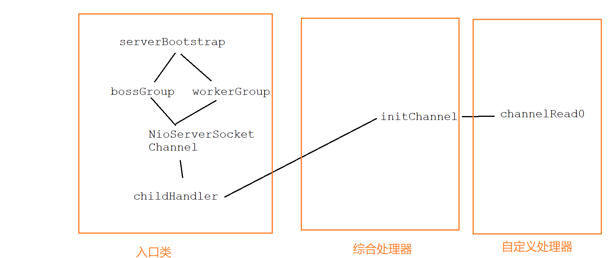
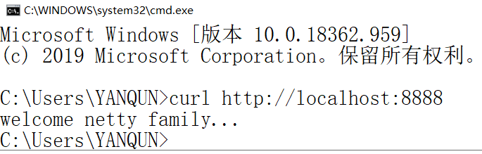
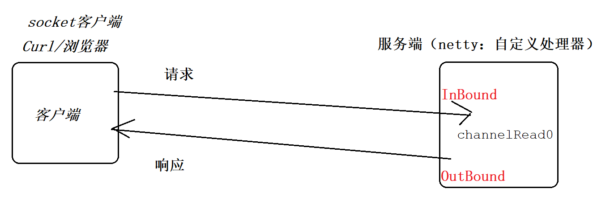
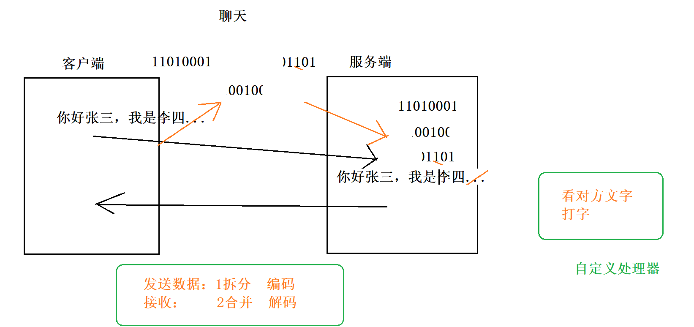
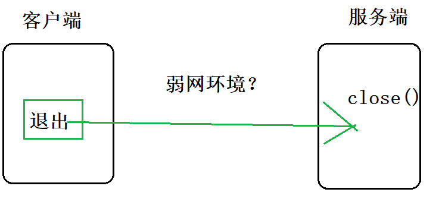
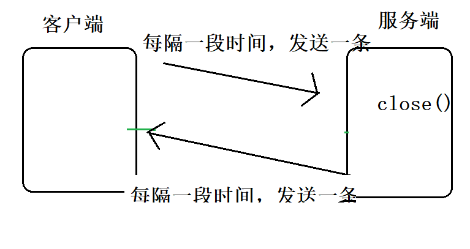
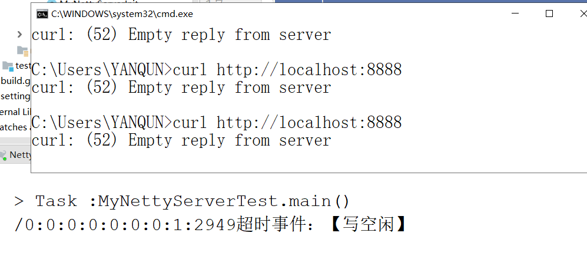
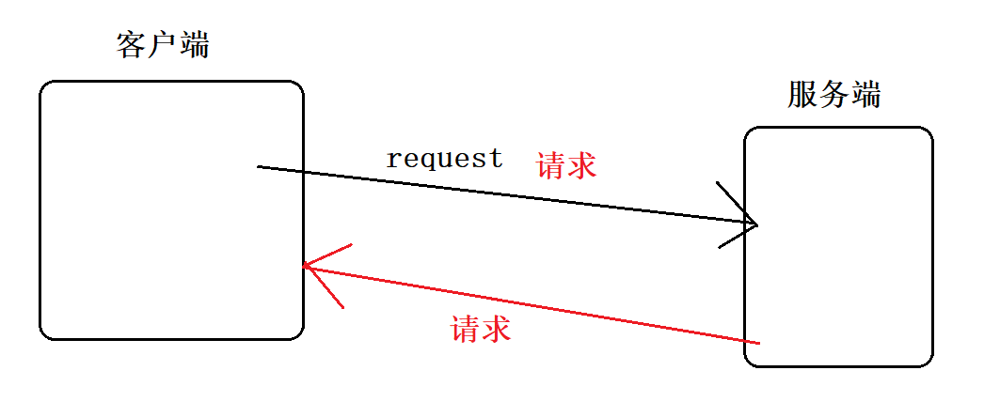
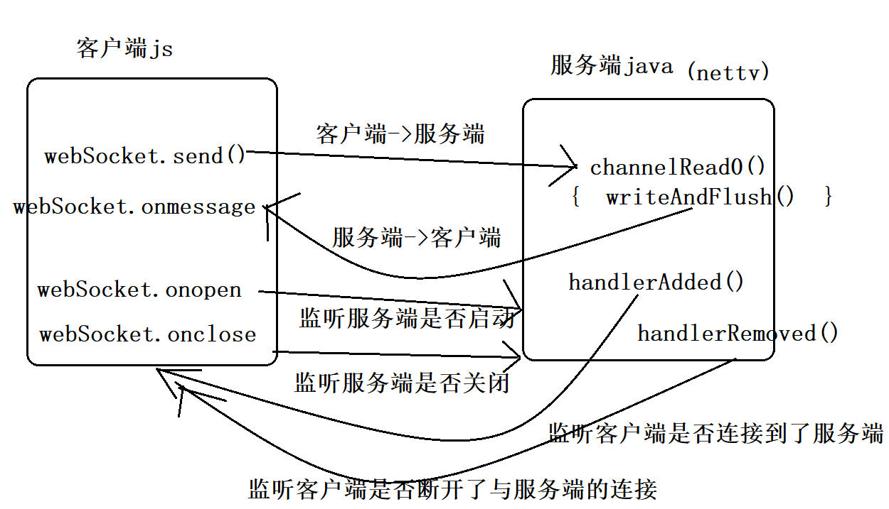
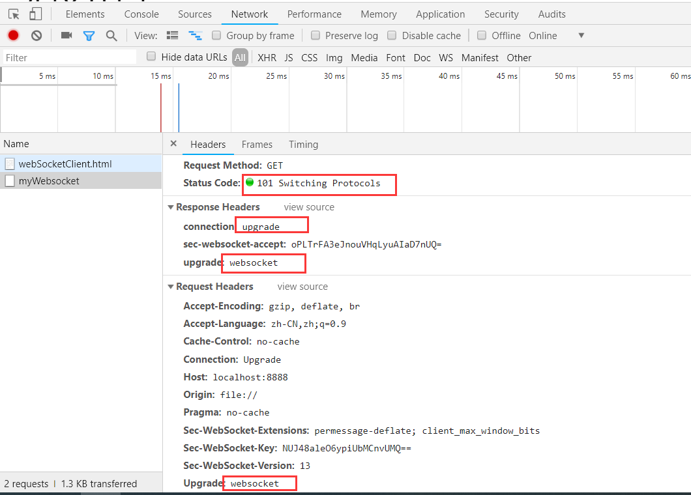

# netty

前置课程：NIO

重要性：

hadoop  spark  dubbo  等众多知名的框架，阿里巴巴、facebook、twtitter等知名公司都使用到了netty作为底层框架。

稳定性：netty4.x 

netty.io

jboss公司的项目

核心：netty是一个异步的、基于事件驱动模式的网络应用框架。


## 搭建netty开发环境

1.安装Jdk

2.下载安装gradle

(1)下载gradle-5.3-all.zip

（2）环境变量： GRADLE_HOME ：上一步gradle解压后的根目录

（3）PATH:  %GRADLE_HOME%\bin

（4）curl： 下载windows版curl，只需要将curl.exe所在目录配置到path中即可。

3.创建netty工程

4.增加netty依赖

build.gradle

```xml
plugins {
    id 'java'
}

group 'com.yanqun'
version '1.0-SNAPSHOT'

sourceCompatibility = 1.8
targetCompatibility = 1.8

repositories {
//    mavenCentral()
    maven{ url 'http://maven.aliyun.com/nexus/content/groups/public'}
}

dependencies {
    testCompile group: 'junit', name: 'junit', version: '4.12'
    compile group: 'io.netty', name: 'netty-all', version: '4.1.50.Final'
}

```

## 第一个netty的hello world

模板化代码：类似JDBC

具体的模板流程(以服务端为例)

 - 入口类/主程序类

   	- 配置一些参数 

 - 内置初始化器（处理器）

   	- 调用一些内置的类

 - 自定义初始化器（处理器）

   	- 编写一些自定义的类

netty强大的核心：

​	netty内部提供了非常强大的类库（内置初始化器），每个初始化器都可以完成一个 小的功能。因此，以后在开发时，我们第一步需要先将 需要完成的功能 分解成若干部；第二步 只需要在netty类库中寻找，看哪些已有类能够帮助我们直接实现； 第三步，如果某个功能netty没有提供，则编写自定义初始化器

总结： 分解功能 ->在类库中找 ->如果还些找不到，自定义编写

   

实现：

第一步：入口类

```java
package helloworld;

import io.netty.bootstrap.ServerBootstrap;
import io.netty.channel.ChannelFuture;
import io.netty.channel.EventLoopGroup;
import io.netty.channel.nio.NioEventLoopGroup;
import io.netty.channel.socket.nio.NioServerSocketChannel;

/*
 * Created by 颜群
 */
public class NettyServerTest {//入口类

    public static void main(String[] args) {

        //创建事件循环组 （master -slaver）
        EventLoopGroup bossGroup =  new NioEventLoopGroup() ;//接收客户端连接，并分发给workerGroup
        EventLoopGroup workerGroup =  new NioEventLoopGroup() ;//真正的处理连接
        //启动
        ServerBootstrap serverBootstrap = new ServerBootstrap();
        try {
            ChannelFuture channelFuture = serverBootstrap.group(bossGroup, workerGroup).channel(NioServerSocketChannel.class)

                    //综合（内置+自定义）初始化器
                    .childHandler(new NettyServerInit())

                    .bind(8888)
                    .sync();
            channelFuture.channel().closeFuture().sync() ;
        } catch (InterruptedException e) {
            e.printStackTrace();
        }finally{
            bossGroup.shutdownGracefully();
            workerGroup.shutdownGracefully() ;
        }

    }

}

```

第二步：编写综合初始化器（内置+自定义的）

```java
package helloworld;

import io.netty.channel.ChannelHandlerContext;
import io.netty.channel.ChannelInitializer;
import io.netty.channel.ChannelPipeline;
import io.netty.channel.SimpleChannelInboundHandler;
import io.netty.channel.socket.SocketChannel;
import io.netty.handler.codec.http.HttpObject;
import io.netty.handler.codec.http.HttpServerCodec;

/*
 * Created by 颜群
 */
//综合（内置+自定义）初始化器
public class NettyServerInit extends ChannelInitializer<SocketChannel> {
    //当连接注册到channel时，执行此方法
    @Override
    protected void initChannel(SocketChannel ch) throws Exception {
        ChannelPipeline pipeline = ch.pipeline();
        //内置初始化器 （编码初始化器：HttpServerCodec）
        pipeline.addLast( "HttpServerCodec",new HttpServerCodec()  )  ;

        //自定义初始化器（NettyServerHandler）
        pipeline.addLast("NettyServerHandler",new NettyServerHandler());
    }
}

```

第三步：编写自定义初始化器

```java
package helloworld;

import io.netty.buffer.ByteBuf;
import io.netty.buffer.Unpooled;
import io.netty.channel.ChannelHandler;
import io.netty.channel.ChannelHandlerContext;
import io.netty.channel.SimpleChannelInboundHandler;
import io.netty.handler.codec.http.*;
import io.netty.util.CharsetUtil;

/*
 * Created by 颜群
 */
public class NettyServerHandler extends SimpleChannelInboundHandler<HttpObject> {
    //doGet  doPost
    @Override
    protected void channelRead0(ChannelHandlerContext ctx, HttpObject msg) throws Exception {
        if(msg instanceof HttpRequest){
            //定义响应内容
            ByteBuf content = Unpooled.copiedBuffer("welcome netty family...", CharsetUtil.UTF_8);
            //封装响应对象
            DefaultFullHttpResponse response = new DefaultFullHttpResponse(HttpVersion.HTTP_1_1, HttpResponseStatus.OK, content);
            response.headers().set(HttpHeaderNames.CONTENT_TYPE,"text/plain") ;
            response.headers().set(HttpHeaderNames.CONTENT_LENGTH  , content.readableBytes() ) ;//不是content.readByte()

            ctx.writeAndFlush(response) ;

        }
    }
}

```

流程



​	




步骤：

​	Test -Init + Handler

说明：浏览器在发起请求时，会默认请求图标favicon.ico文件，因此会比curl多发出一次请求。


分析：

自定义处理器依次继承：

SimpleChannelInboundHandler->ChannelInboundHandlerAdapter->ChannelInboundHandler->ChannelHandler

另一条继承链：ChannelHandler<- ChannelOutboundHandler



继承链中的各个方法

netty遵循了事件回调机制：类似于ajax/javascript/html：在不同的阶段，会自动的执行一些方法，生命周期方法。


通过curl请求netty服务端，多次的请求结果是一致的


2次请求：

正常请求内容：浏览器会保存请求状态。

​	初始化和销毁工作只执行一次（Http1.1,Keep-alive持续连接机制，第一次访问结束后 并不会立刻关闭连接）

请求favicon.ico：

	- 第二次请求时，会结束上次一对favicon.ico的请求。
	- 每次请求 都是一个完整的回路


## 案例：点对点聊天




服务端

1.入口类

```.java
package dot2dot;

import io.netty.bootstrap.ServerBootstrap;
import io.netty.channel.ChannelFuture;
import io.netty.channel.EventLoopGroup;
import io.netty.channel.nio.NioEventLoopGroup;
import io.netty.channel.socket.nio.NioServerSocketChannel;

/*
 * Created by 颜群
 * 入口类->初始化器 ->自定义处理器
 */
public class MyNettyServerTest {

    public static void main(String[] args) {

        //创建事件循环组 （master -slaver）
        EventLoopGroup bossGroup =  new NioEventLoopGroup() ;//接收客户端连接，并分发给workerGroup
        EventLoopGroup workerGroup =  new NioEventLoopGroup() ;//真正的处理连接
        //启动
        ServerBootstrap serverBootstrap = new ServerBootstrap();
        try {
            ChannelFuture channelFuture = serverBootstrap.group(bossGroup, workerGroup)
                    .channel(NioServerSocketChannel.class)

                    //综合（内置+自定义）初始化器
                    .childHandler(new MyNettyServerInit())

                    .bind(8888)
                    .sync();
            channelFuture.channel().closeFuture().sync() ;
        } catch (InterruptedException e) {
            e.printStackTrace();
        }finally{
            bossGroup.shutdownGracefully();
            workerGroup.shutdownGracefully() ;
        }

    }

}

```

2.初始化器

```java
package dot2dot;

import io.netty.channel.ChannelInitializer;
import io.netty.channel.ChannelPipeline;
import io.netty.channel.socket.SocketChannel;
import io.netty.handler.codec.LengthFieldBasedFrameDecoder;
import io.netty.handler.codec.LengthFieldPrepender;
import io.netty.handler.codec.string.StringDecoder;
import io.netty.handler.codec.string.StringEncoder;
import io.netty.util.CharsetUtil;

/*
 * Created by 颜群
 *
 * netty自带类库解决
 */
public class MyNettyServerInit extends ChannelInitializer<SocketChannel> {
    @Override
    protected void initChannel(SocketChannel ch) throws Exception {

        //合并、解码

        ChannelPipeline pipeline = ch.pipeline();
        //解码
        pipeline.addLast("LengthFieldBasedFrameDecoder",new LengthFieldBasedFrameDecoder(Integer.MAX_VALUE,0,8,0,8 )) ;
        //合并
        pipeline.addLast("LengthFieldPrepender", new LengthFieldPrepender(8)) ;

        //统一乱码
        pipeline.addLast("StringDecoder",new StringDecoder(CharsetUtil.UTF_8));
        pipeline.addLast("StringEncoder",new StringEncoder(CharsetUtil.UTF_8));

        pipeline.addLast("MyNettyServerHandler",new MyNettyServerHandler()) ;


    }
}

```

3.自定义处理器

```java
package dot2dot;

import io.netty.channel.ChannelHandlerContext;
import io.netty.channel.SimpleChannelInboundHandler;

import java.util.Scanner;

/*
 * Created by 颜群
 * 自定义功能：聊天
 */
public class MyNettyServerHandler extends SimpleChannelInboundHandler<String> {
    @Override
    protected void channelRead0(ChannelHandlerContext ctx, String msg) throws Exception {
        //接收消息
        System.out.println("服务端 接收到了"+ctx.channel().remoteAddress()+",消息是："+msg);

        //发送消息
        System.out.println("请输入内容：");
        String send = new Scanner(System.in).nextLine() ;
        ctx.channel().writeAndFlush(send) ;
    }
}

```


客户端

1.入口类

```java
package dot2dot;

import io.netty.bootstrap.Bootstrap;
import io.netty.bootstrap.ServerBootstrap;
import io.netty.channel.ChannelFuture;
import io.netty.channel.EventLoopGroup;
import io.netty.channel.nio.NioEventLoopGroup;
import io.netty.channel.socket.nio.NioServerSocketChannel;
import io.netty.channel.socket.nio.NioSocketChannel;

/*
 * Created by 颜群
 * 入口类->初始化器 ->自定义处理器
 */
public class MyNettyClientTest {

    public static void main(String[] args) {

        //创建事件循环组
        EventLoopGroup eventLoopGroup =  new NioEventLoopGroup() ;

        //启动
       Bootstrap bootstrap = new Bootstrap();
        try {
            bootstrap.group(eventLoopGroup)
                    .channel(NioSocketChannel.class)
                    //综合（内置+自定义）初始化器
                    .handler(new MyNettyClientInit());

            ChannelFuture channelFuture = bootstrap.connect("127.0.0.1", 8888).sync();
            channelFuture.channel().closeFuture().sync() ;//future模式

        } catch (InterruptedException e) {
            e.printStackTrace();
        }finally{
            eventLoopGroup.shutdownGracefully();
        }

    }

}

```


2.初始化器

```java
package dot2dot;

import io.netty.channel.ChannelInitializer;
import io.netty.channel.ChannelPipeline;
import io.netty.channel.socket.SocketChannel;
import io.netty.handler.codec.LengthFieldBasedFrameDecoder;
import io.netty.handler.codec.LengthFieldPrepender;
import io.netty.handler.codec.string.StringDecoder;
import io.netty.handler.codec.string.StringEncoder;
import io.netty.util.CharsetUtil;

/*
 * Created by 颜群
 */
public class MyNettyClientInit extends ChannelInitializer<SocketChannel> {
    @Override
    protected void initChannel(SocketChannel ch) throws Exception {

        //合并、解码
        ChannelPipeline pipeline = ch.pipeline();
        //解码
        pipeline.addLast("LengthFieldBasedFrameDecoder",new LengthFieldBasedFrameDecoder(Integer.MAX_VALUE,0,8,0,8 )) ;
        //合并
        pipeline.addLast("LengthFieldPrepender", new LengthFieldPrepender(8)) ;

        //统一乱码
        pipeline.addLast("StringDecoder",new StringDecoder(CharsetUtil.UTF_8));
        pipeline.addLast("StringEncoder",new StringEncoder(CharsetUtil.UTF_8));

        pipeline.addLast("MyNettyClientHandler",new MyNettyClientHandler()) ;


    }
}

```


3.自定义处理器

```java
	package dot2dot;

import io.netty.channel.ChannelHandlerContext;
import io.netty.channel.SimpleChannelInboundHandler;

import java.util.Scanner;

/*
 * Created by 颜群
 */
public class MyNettyClientHandler extends SimpleChannelInboundHandler {
    @Override
    protected void channelRead0(ChannelHandlerContext ctx, Object msg) throws Exception {

        //接收消息
        System.out.println("客户端 接收到了"+ctx.channel().remoteAddress()+",消息是："+msg);

        //发送消息
        System.out.println("请输入内容：");
        String send = new Scanner(System.in).nextLine() ;
        ctx.channel().writeAndFlush(send) ;
    }

    //为了 避免 客户端和服务端 都在等待对方发送第一条消息，就需要  有人（客户端）主动发送第一条消息


    //当连接成功时，会触发channelActive()方法
    @Override
    public void channelActive(ChannelHandlerContext ctx) throws Exception {
        ctx.writeAndFlush("开始聊天吧...") ;
    }
}

```

案例：点对多点/点对端/ 聊天室

Netty - NIO

参照：**亿级流量Java高并发与网络编程实战**

只看代码：扫码，在公众号回复“资料”


端口冲突的处理办法：

查看端口冲突的PID:    netstat -ano|findstr 8888  ，结果18484

结束进程taskkill /pid 18484 /f


## 使用netty实现心跳机制



在弱网环境中，事件驱动的机制 会失效。使用心跳机制解决。



心跳机制：远端的双方，每隔一段时间 会1接收对方的消息 2给对方法消息；如果一方长时间 接收不到 对方的消息，就可以认为对方处于异常环境，此时就可以切断对方的连接

netty提供的心跳机制处理器：IdleStateHandler

服务端代码

入口类

```java
package heartbeat;

import io.netty.bootstrap.ServerBootstrap;
import io.netty.channel.ChannelFuture;
import io.netty.channel.EventLoopGroup;
import io.netty.channel.nio.NioEventLoopGroup;
import io.netty.channel.socket.nio.NioServerSocketChannel;

/*
 * Created by 颜群
 * 入口类->初始化器 ->自定义处理器
 */
public class MyNettyServerTest {

    public static void main(String[] args) {

        //创建事件循环组 （master -slaver）
        EventLoopGroup bossGroup =  new NioEventLoopGroup() ;//接收客户端连接，并分发给workerGroup
        EventLoopGroup workerGroup =  new NioEventLoopGroup() ;//真正的处理连接
        //启动
        ServerBootstrap serverBootstrap = new ServerBootstrap();
        try {
            ChannelFuture channelFuture = serverBootstrap.group(bossGroup, workerGroup)
                    .channel(NioServerSocketChannel.class)

                    //综合（内置+自定义）初始化器
                    .childHandler(new MyNettyServerInit())

                    .bind(8888)
                    .sync();
            channelFuture.channel().closeFuture().sync() ;
        } catch (InterruptedException e) {
            e.printStackTrace();
        }finally{
            bossGroup.shutdownGracefully();
            workerGroup.shutdownGracefully() ;
        }

    }

}

```

初始化器

```java
package heartbeat;

import io.netty.channel.ChannelInitializer;
import io.netty.channel.ChannelPipeline;
import io.netty.channel.socket.SocketChannel;
import io.netty.handler.codec.LengthFieldBasedFrameDecoder;
import io.netty.handler.codec.LengthFieldPrepender;
import io.netty.handler.codec.string.StringDecoder;
import io.netty.handler.codec.string.StringEncoder;
import io.netty.handler.timeout.IdleStateHandler;
import io.netty.util.CharsetUtil;

/*
 * Created by 颜群
 *
 */
public class MyNettyServerInit extends ChannelInitializer<SocketChannel> {
    @Override
    protected void initChannel(SocketChannel ch) throws Exception {


        ChannelPipeline pipeline = ch.pipeline();
        //netty自带的处理器
        //三个参数：readerIdleTimeSeconds、writerIdleTimeSeconds、allIdleTimeSeconds
        pipeline.addLast( "",  new IdleStateHandler(30,5,7));
        //自定义处理器
        pipeline.addLast("MyNettyServerHandler",new MyNettyServerHandler()) ;


    }
}

```

自定义处理器

```java
package heartbeat;

import io.netty.channel.ChannelHandlerContext;
import io.netty.channel.SimpleChannelInboundHandler;
import io.netty.handler.timeout.IdleStateEvent;

import java.util.Scanner;

/*
 * Created by 颜群
 * 自定义功能：聊天
 */
public class MyNettyServerHandler extends SimpleChannelInboundHandler<Object> {
    @Override
    protected void channelRead0(ChannelHandlerContext ctx, Object msg) throws Exception {
        //接收客户端 主动发来的消息
    }

    //可以用于处理心跳机制的方法
    @Override
    public void userEventTriggered(ChannelHandlerContext ctx, Object evt) throws Exception {
        //用于心跳机制的 数据类型
        if(evt instanceof IdleStateEvent){
            String eventType = null ;
            IdleStateEvent event = (IdleStateEvent)evt ;
            //获取具体的超时事件
            switch (event.state() ){
                case READER_IDLE:
                    eventType = "读空闲" ;
                    break ;
                case WRITER_IDLE:
                    eventType = "写空闲" ;
                    break ;
                case ALL_IDLE:
                    eventType = "读写空闲" ;
                    break ;
            }
            System.out.println( ctx.channel().remoteAddress() +"超时事件：【"+ eventType+"】");
            ctx.channel().close() ;

        }
    }
}

```

客户单通过curl模拟



## 使用Netty实现websocket通信

传统的http请求：

1.客户端发起请求，服务端接收并作出响应。每次请求，都是由客户端发起的，是**单向请求**

2.物理层、数据链路层 、*网络层* 、传输层(TCP协议) 、会话层 、表示层 、应用层（http协议）

TCP协议 连接是经过三次握手，关闭是经过四次握手。

每一次客户端向服务端发起请求，然后交互，都会经过三次握手 和四次握手。每次客户端与服务端通信，都必须 建立连接、通信、关闭连接


webscoket优点：

1.支持客户端 和服务端的双向通信 （全双工通信）



2.支持长连接通信：第一次通信时需要建立连接，之后在一定时间内如果再次通信，则无需重新建立建立。

流程示意图

重点：客户端和服务端是等价的，二者的功能相同



如何实现？

入口类 - 初始化器 - 自定处理器

netty难在哪？难在积累

​	看官方API文档

​    看书籍《netty实战》等

初始化器 （使用Netty内置类）- 自定处理器（自己编码）

一个功能：分解成5个小功能  = 3个netty自带的类 + 2个自定义类

netty端

```java
package ws.dot2dot;

import io.netty.bootstrap.ServerBootstrap;
import io.netty.channel.ChannelFuture;
import io.netty.channel.EventLoopGroup;
import io.netty.channel.nio.NioEventLoopGroup;
import io.netty.channel.socket.nio.NioServerSocketChannel;

/*
 * Created by 颜群
 * 入口类->初始化器 ->自定义处理器
 */
public class MyNettyServerTest {

    public static void main(String[] args) {

        //创建事件循环组 （master -slaver）
        EventLoopGroup bossGroup =  new NioEventLoopGroup() ;//接收客户端连接，并分发给workerGroup
        EventLoopGroup workerGroup =  new NioEventLoopGroup() ;//真正的处理连接
        //启动
        ServerBootstrap serverBootstrap = new ServerBootstrap();
        try {
            ChannelFuture channelFuture = serverBootstrap.group(bossGroup, workerGroup)
                    .channel(NioServerSocketChannel.class)

                    //综合（内置+自定义）初始化器
                    .childHandler(new MyNettyServerInit())

                    .bind(8888)
                    .sync();
            channelFuture.channel().closeFuture().sync() ;
        } catch (InterruptedException e) {
            e.printStackTrace();
        }finally{
            bossGroup.shutdownGracefully();
            workerGroup.shutdownGracefully() ;
        }

    }

}

```


```java
package ws.dot2dot;

import io.netty.channel.ChannelInitializer;
import io.netty.channel.ChannelPipeline;
import io.netty.channel.socket.SocketChannel;
import io.netty.handler.codec.LengthFieldBasedFrameDecoder;
import io.netty.handler.codec.LengthFieldPrepender;
import io.netty.handler.codec.http.HttpObjectAggregator;
import io.netty.handler.codec.http.HttpServerCodec;
import io.netty.handler.codec.http.websocketx.WebSocketServerProtocolHandler;
import io.netty.handler.codec.string.StringDecoder;
import io.netty.handler.codec.string.StringEncoder;
import io.netty.util.CharsetUtil;

/*
 * Created by 颜群
 *
 * netty自带类库解决
 */
public class MyNettyServerInit extends ChannelInitializer<SocketChannel> {
    @Override
    protected void initChannel(SocketChannel ch) throws Exception {

        //netty自带的类
        ChannelPipeline pipeline = ch.pipeline();
        //服务端解析器
        pipeline.addLast("HttpServerCodec", new HttpServerCodec()) ;
        //组装工具类：可以将多个请求、响应进行组装的工具类
        pipeline.addLast("HttpObjectAggregator", new HttpObjectAggregator(4096)) ;
        //localhost:8888/myWebsocket
        pipeline.addLast("WebSocketServerProtocolHandler",new WebSocketServerProtocolHandler("/myWebsocket"));

        //自定义
        pipeline.addLast("MyNettyServerHandler",new MyNettyServerHandler()) ;


    }
}

```

自定义处理器

```java
package ws.dot2dot;

import io.netty.channel.ChannelHandlerContext;
import io.netty.channel.SimpleChannelInboundHandler;
import io.netty.handler.codec.http.websocketx.TextWebSocketFrame;

import java.util.Scanner;

/*
 * Created by 颜群
 * 自定义功能：聊天
 */
public class MyNettyServerHandler extends SimpleChannelInboundHandler<TextWebSocketFrame> {
    @Override
    protected void channelRead0(ChannelHandlerContext ctx, TextWebSocketFrame msg) throws Exception {
        //接收消息
        System.out.println("server接收到的客户端消息：" + msg.text());
        //向客户端发出响应
        ctx.channel().writeAndFlush(new TextWebSocketFrame("hello client...")) ;
    }


    //监听是否有客户端链接上了
    @Override
    public void handlerAdded(ChannelHandlerContext ctx) throws Exception {
        System.out.println("有客户端连接上了："+ctx.channel().id());
    }

    //监听是否有客户端断开了
    @Override
    public void handlerRemoved(ChannelHandlerContext ctx) throws Exception {
        System.out.println("有客户端断开了："+ctx.channel().id());
    }
}

```


js端

```js
<!DOCTYPE html>
<html lang="en">
    <head>
        <meta charset="UTF-8">
        <title>Title</title>
        <script type="text/javascript">
            var webSocket = new WebSocket("ws://localhost:8888/myWebsocket") ;


            //向服务端发送消息
            function sendMessage(msg){
                if(webSocket.readyState == webSocket.OPEN)
                        webSocket.send(msg) ;
            }

            //接收服务端消息
            webSocket.onmessage = function(event){
                document.getElementById("tip").innerText = "接收的消息：" + event.data ;
            }


            //监听服务端是否开启
            webSocket.onopen= function(event){
                document.getElementById("tip").innerText ="连接开启" ;
            }

            //监听服务端是否关闭
            webSocket.onclose= function(event){
                document.getElementById("tip").innerText ="连接关闭" ;
            }


        </script>

    </head>


    <body>

        <form>
            <textarea name="message"></textarea>

            <input type="button" onclick="sendMessage(this.form.message.value)" value="发送"/>
        </form>


      <div id="tip"></div>
    </body>
</html>
```





三大步：难点 就在于 寻找一些 netty自带的工具类。

如果能找到：  netty自带工具类  + 自定义类

如果找不到：  相当于 没用netty

找到一部分： netty自带的一些工具类  + 自定义类 