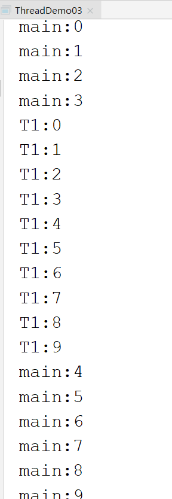

# 多线程

从软件或硬件上多个线程并发执行的技术。

进程和线程的关系：

- 进程：应用程序的执行实例；有独立的内存空间 和系统资源

- 线程：将进程可以进一步细分 为线程  ；CPU调度和分派的最小单位

  举例，QQ是一个进程，QQ又可以细分多个功能（接收消息、发送消息），每个功能都可以通过一个线程来实现。

多线程：前提，研究的单核CPU

多线程：**宏观并行，微观串行**

单核CPU中，不存在真正的”并行“概念， 多个线程实际是在交替的占用CPU，而并不是真正”并行执行“

多线程的好处：

​	多线程可以充分的利用CPU资源，提高效率；

> 补充：多线程并不是 越多越好，原因： 每开启一个线程 会占用1M左右的内存，因此太多的线程会占用 大量的内存资源。 单线程有时候 性能也非常不错，例如NodeJs、Netty、NIO都是基于单线程的 多路复用技术，性能不比多线程差。

多线程 并不是绝对的可以提高效率。


我们一直在使用的main（）就是一个线程，并且是主线程

```java
public class Test {
    public static void main(String[] args) {
        //获取当前线程
       Thread thread =  Thread.currentThread() ;
       //获取线程名字
        System.out.println(thread.getName());
        //设置线程名字
        thread.setName("hello");

        System.out.println(thread.getName());
    }
}

```

在java中可以通过以下两种  基础方式 创建线程：

- 继承java.lang.Thread类

- 实现java.lang.Runnable接口


多个线程之间 是在“争夺”资源。举个例子，如果A和B连个线程去争夺cpu使用权，如果争夺了200次。那么这200次中的某一次 是被A还是B占用，可以理解随机的。


线程在执行时两个最重要的方法：

- 将线程的执行逻辑（线程要做的事情）写在run()中
- 启动线程，是通过start()启动。  start() = 准备资源 + 调用run()   。线程的启动不能使用run.

通过thread实现多线程

```java

public class ThreadDemo01  extends Thread{

    //线程的执行方法
    @Override
    public void run() {
        for(int i=0;i<100;i++){
            System.out.println(   Thread.currentThread().getName()+":"+i  );
        }
    }

    public static void main(String[] args) {
        ThreadDemo01 t1 = new ThreadDemo01();
        t1.setName("t1");
        ThreadDemo01 t2 = new ThreadDemo01();
        t2.setName("t2");

        t1.start();
        System.out.println("--------");
        t2.start();
    }
}

```

通过RUnnable实现多线程

```java
public class ThreadDemo02 implements Runnable {

    //线程执行的方法
    @Override
    public void run() {
        for(int i=0;i<100;i++){
            System.out.println(   Thread.currentThread().getName()+":"+i  );
        }
    }

    //Runnable方式仍然是借用Thread来实现的多线程
    public static void main(String[] args) {
        ThreadDemo02 t1 = new ThreadDemo02();
        ThreadDemo02 t2 = new ThreadDemo02();


        //启动线程需要使用start()方法，但是Runnable没有提供start（）,如何解决？
        //Thread有start()   Runnable没有start()
        //Runnable ->Thread
        //Thread(Runable )
        Thread th1 = new Thread(  t1);
        Thread th2 = new Thread(  t2);
        th1.setName("T1");
        th2.setName("T2");
        th1.start();

        th2.start();


    }
}

```

推荐使用Runnable实现多线程。因为现在的主流是 面向接口开发，即建议尽量使用接口 而不要使用继承。


Thread t = new Thread(Runnable对象);

Thread t = new Thread(Runnable对象，线程名字);

设置线程的优先级setPriority( 1- 10)，优先级只是一个建议，但不能100%保证。

线程的休眠

```java
            try {
                Thread.sleep(3000);//单位是 毫秒
            } catch (InterruptedException e) {
                e.printStackTrace();
            }
```


是否所有的线程都是通过start()启动？不是，main()

依赖关系：强制执行、线程的礼让

- 强制执行  join:强制执行调用join()的线程，阻塞当前正在执行的线程

```java
public class ThreadDemo03 implements Runnable {

    //Th1线程执行的方法
    @Override
    public void run() {
        for(int i=0;i<10;i++){
            System.out.println(   Thread.currentThread().getName()+":"+i  );
        }
    }

    //线程th1:执行“ T1:数字”
    //线程main：执行“ main:数字”
    public static void main(String[] args) throws InterruptedException {
        ThreadDemo03 t1 = new ThreadDemo03();
        Thread th1 = new Thread(t1,"T1") ;
        th1.start();


        //main线程
        for(int i=0;i<10;i++){
            System.out.println(   Thread.currentThread().getName()+":"+i  );
            if(i==3){
                th1.join(); //main线程正在执行时（执行到i=3时）， th1强制抢夺执行
            }
        }


    }
}

```




- 线程的礼让 :yield()，礼让仅仅是一种 尽可能事件，并不一定会100%执行

  ```java
  public class ThreadDemo03 implements Runnable {
  
      //Th1线程执行的方法
      @Override
      public void run() {
          for(int i=0;i<10;i++){
              System.out.println(   Thread.currentThread().getName()+":"+i  );
              if(i == 3){
                  Thread.yield();
                  System.out.println("礼让....");
              }
          }
      }
  
      //线程th1:执行“ T1:数字”
      //线程main：执行“ main:数字”
      public static void main(String[] args) throws InterruptedException {
          ThreadDemo03 t1 = new ThreadDemo03();
          Thread th1 = new Thread(t1,"T1") ;
          th1.start();
  
  
          ThreadDemo03 t2 = new ThreadDemo03();
          Thread th2 = new Thread(t2,"T2") ;
          th2.start();
      }
  }
  
  ```

  


