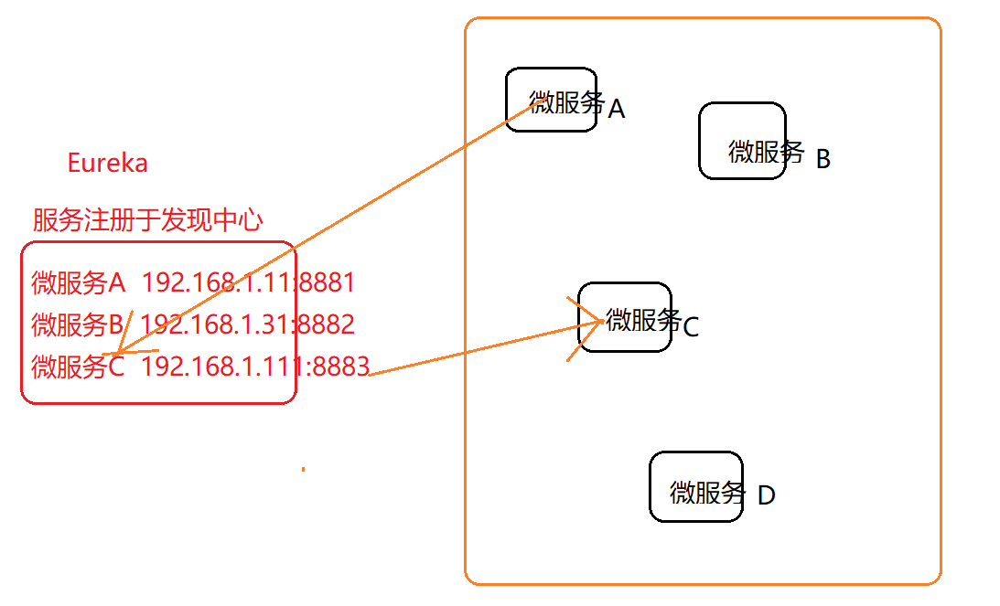
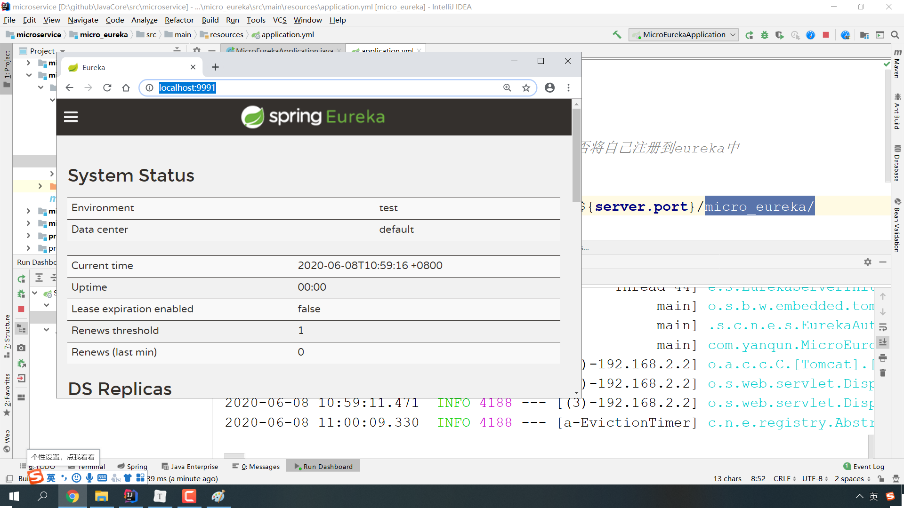
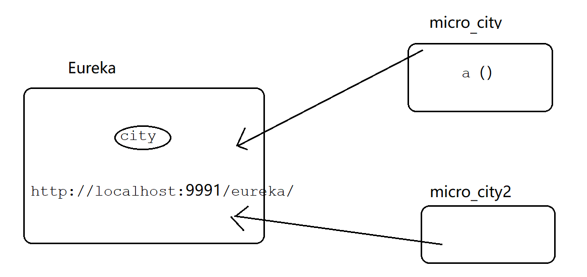
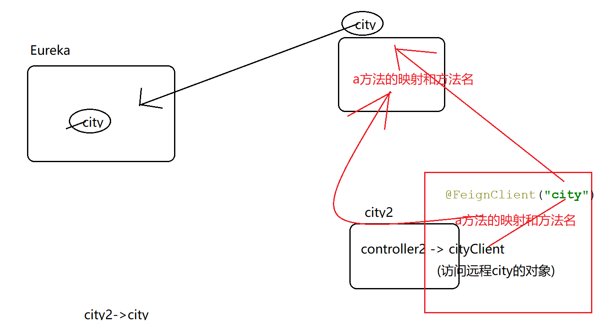
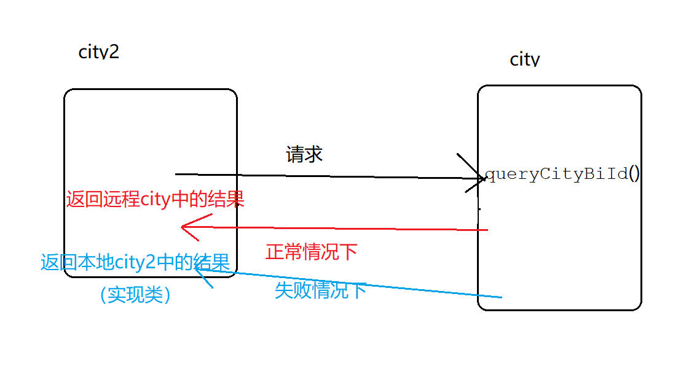
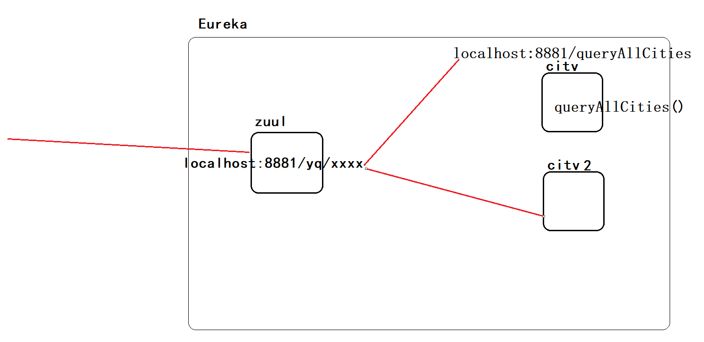
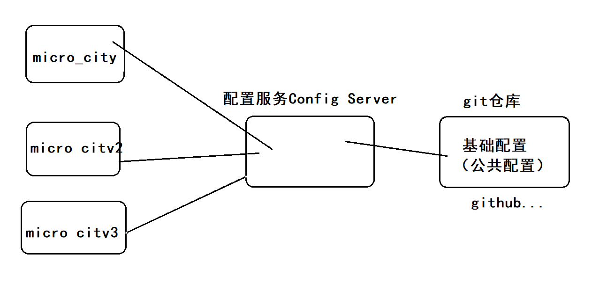

# Spring Cloud

Spring Cloud自身发展不稳定（a.部分组件停止更新 ；b.其他技术竞争非常厉害）


本次学习版本：官方原生的Spring Cloud，原因如下：

1.标准： Servlet   struts1  struts2  springmvc 

2.更新迭代，需要大量时间。Spring Cloud，目前企业的主流。

3.技术本身不是最重要， 重要的是思想。

4.哪个是最新的？ Eureka :zookeeper   nacos    consul 


## Spring Cloud内容

spring boot：微服务构建框架

spring cloud:微服务治理框架


Spring Cloud包含了一系列技术： 

服务注册与发现：Eureka

熔断器（服务熔断）：Hystrix 

服务调用：Fegin/Ribbon

服务网关:Zuul

消息总线:Bus

分布式配置:Config 


### 搭建环境

版本问题：spring boot - spring cloud 

将spring cloud依赖 引入父工程

```xml
               <!-- 引入spring cloud-->
             <dependency>
                 <groupId>org.springframework.cloud</groupId>
                 <artifactId>spring-cloud-dependencies</artifactId>
                 <version>Greenwich.RELEASE</version>
                 <type>pom</type>
                 <scope>import</scope>
             </dependency>
```


引入Eureka环境



### eureka

新建 子工程：eureka服务

引入依赖

```xml
        <dependency>
            <groupId>org.springframework.cloud</groupId>
            <artifactId>spring-cloud-starter-netflix-eureka-server</artifactId>
        </dependency>


```

配置文件

application.yml

```xml
server:
  port: 9991
eureka:
  client:
    register-with-eureka: false  #是否将自己注册到eureka中
    fetch-registry: false
    service-url:
      defaultZone: http://localhost:${server.port}/micro_eureka/

```


编写代码

```java
@EnableEurekaServer//启动eureka服务
@SpringBootApplication
public class MicroEurekaApplication {

    public static void main(String[] args) {
        SpringApplication.run(MicroEurekaApplication.class, args);
    }

}

```

访问

http://localhost:9991/




1.引入依赖

要将micro_city/micro_city2放入 eureka注册中心

```xml
       <dependency>
            <groupId>org.springframework.cloud</groupId>
            <artifactId>spring-cloud-starter-netflix-eureka-server</artifactId>
        </dependency>
```


2.配置文件


```xml
eureka:
  client:
    service-url:
      defaultZone: http://localhost:9991/eureka/
```


3.编写代码

给要加入Eureka的项目增加一个注册  

@EnableEurekaClient


测试：

先启动服务

再启动客户端


说明：可能存在一种现象，我们编写的xml/yml等配置文件，在运行时不会被放入classes文件。解决方案：

通过mvn强行打入classes。

```xml
  <build>
        <resources>
            <resource>
                <directory>src/main</directory>
                <includes>
                    <include>**/*.xml</include>
                    <include>**/*.yml</include>
                </includes>
                <filtering>false</filtering>

            </resource>


        </resources>
    </build>
```

### Feign

多个微服之间 的相互访问。Feign

micro_city2  -> micro_city

操作：micro_city2

1.依赖

```xml
    <dependency>
        <groupId>org.springframework.cloud</groupId>
        <artifactId>spring-cloud-starter-openfeign</artifactId>
    </dependency>
```


2.配置

spring boot/cloud底层已经配置过了，省略

3.编码

```
@EnableDiscoveryClient
@EnableFeignClients
```


city2  ->CityClient    -> city（queryCityBiId）



为了简化代码，暂时注释掉city中的dao访问。



city2 ->controller - > cityClient ->    city的controller->     city


### Ribbon

city2(消费者、客户端)   ->  city（生产者、服务端）

实现步骤：

city2

1.引入依赖

```xml
    <dependency>
        <groupId>org.springframework.cloud</groupId>
        <artifactId>spring-cloud-starter-netflix-eureka-client</artifactId>
    </dependency>

    <dependency>
        <groupId>org.springframework.cloud</groupId>
        <artifactId>spring-cloud-starter-netflix-eureka-ribbon</artifactId>
    </dependency>

    <dependency>
        <groupId>org.springframework.cloud</groupId>
        <artifactId>spring-cloud-starter-netflix-eureka-config</artifactId>
    </dependency>

```

2.配置

```xml
eureka:
  client:
    service-url:
      defaultZone: http://localhost:9991/eureka/
  instance:
    instance-id: city2Id

```

3.编码


city2 -> 远程对象- >city

远程对象： RestTemplate  ，将该对象 放入IoC容器

```java
/*
 * Created by 颜群
 */
//将远程访问对象 放入IoC容器
@Configuration
public class ConfigBean {

    @Bean
    @LoadBalanced//负载均衡
    public RestTemplate getRestTemplate(){
        return  new RestTemplate() ;
    }
}

```


(city2 -> controller) ->远程对象->  (controller - >city)   

```java
    //远程访问city中的方法(ribbon)
    @GetMapping("/findCityByIdRibbon/{id}")
    public Message findCityByIdRibbon(@PathVariable("id") Integer id){
        System.out.println("ribbon调用远程方法");
        //返回值 = getForObject( 映射地址，返回值类型，参数)
//        return  restTemplate.getForObject( "http://city/queryCityBiId/"  , Message.class,id  );//方法的返回值，就是远程访问方法的返回值
        return  restTemplate.getForObject( "http://city/queryCityBiId/"+id  , Message.class  );//方法的返回值，就是远程访问方法的返回值
//        restTemplate.getForEntity() ;
    }

```


### 熔断器 与服务雪崩


Feign+Hystrix

具体实现：

1.引入依赖

​	不用额外引入依赖。（因为Feign内部已经支持Hystrix）

2.配置

​	开启Hystrix

​    A(开启)->B

city2(开启)->city

```xml
#开启熔断
feign:
  hystrix:
    enabled: true

```


3.编码

city2 -> 远程对象(CityClient) ->city 

新建CityClient的实现类：

```java
/*
 * Created by 颜群
 */
@Component
public class CityClientImpl implements  CityClient {

    @Override
    public Message queryCityBiId(Integer id) {
        return new Message(false, StatusCode.ERROR, "请求失败，触发了本地熔断");
    }

    @Override
    public Message addCity(City city) {
        return  new Message(false, StatusCode.ERROR, "请求失败，触发了本地熔断");
    }
}

```


开启熔断注解

CityClient接口

```java
@FeignClient(value="city" ,  fallback = CityClientImpl.class)
public interface CityClient {
    @GetMapping("queryCityBiId/{id}")
    public Message queryCityBiId(@PathVariable("id") Integer  id) ;

    @PostMapping("addCity")
    public Message addCity(@RequestBody City city) ;
}

```

测试

1.正常  eureka、city、city2

2.熔断:将city关闭后，再试


## 路由网关 Zuul

Zuul：映射

可以给 真实服务地址 做一个 虚拟映射，后续客户端只能通过 虚拟的映射地址 来访问我们真实的服务，可以保护我们的真实的服务。



创建网关服务micro_zuul

1.引入依赖

```xml
  <dependencies>


        <dependency>
            <groupId>org.springframework.cloud</groupId>
            <artifactId>spring-cloud-starter-netflix-zuul</artifactId>
        </dependency>
        <dependency>
            <groupId>org.springframework.cloud</groupId>
            <artifactId>spring-cloud-starter-netflix-eureka-server</artifactId>
        </dependency>

        <dependency>
            <groupId>org.springframework.cloud</groupId>
            <artifactId>spring-boot-starter-web</artifactId>
        </dependency>


    </dependencies>
```


2.配置

application.yml

```.xml
eureka:
  client:
    service-url:
      defaultZone: http://localhost:9991/eureka/

spring:
  application:
    name: zuul
server:
  port: 10001

zuul:
  prefix: /yq
  ignored-services: "*"
  # ignored-services: "city"
  routes:
    city:
      path: /mycity/**

```


3.编码

```java
@EnableEurekaServer//启动eureka服务
@SpringBootApplication
@EnableZuulProxy
public class MicroZuulApplication {

    public static void main(String[] args) {
        SpringApplication.run(MicroZuulApplication.class, args);
    }

}
```


访问：

http://localhost:10001/yq/mycity/queryCities

http://localhost:10001：Zuul的地址

city:微服务在Eureka中的名字

queryCities：要访问真实服务的地址


## 分布式配置中心 Spring cloud Config

之前的微服务缺点：

1.项目-打包jar->运维，如果发现问题 需要返工。

2.很多微服务项目 的配置文件，存在着重复。



本例： micro_zuul ->Config Server -> gitHub

步骤1：

在github上建立 共配置的仓库：micro_config_rep

步骤2：

config约定，github上的配置文件命名必须是：A-B.yml /properties

将 原项目中的 配置文件A-B.yml，上传到github的micro_config_rep中

步骤3：

创建config项目

（1）引入依赖

```xml
        <dependency>
            <groupId>org.springframework.cloud</groupId>
            <artifactId>spring-cloud-config-server</artifactId>
        </dependency>
```

(2)配置

application.yml

```xml
spring:
  application:
    name: config
  cloud:
    config:
      server:
        git:
          uri: https://github.com/coding-technology/micro_config_rep.git
server:
  port: 10010

```


（3）编码

```java
@EnableConfigServer
@SpringBootApplication
public class MicroConfigApplication {

    public static void main(String[] args) {
        SpringApplication.run(MicroConfigApplication.class, args);
    }

}

```


步骤4：改造本地的微服务 micro_zuul

(1)引入依赖

```xml

        <dependency>
            <groupId>org.springframework.cloud</groupId>
            <artifactId>spring-cloud-starter-config</artifactId>
        </dependency>

```

(2)配置

说明：建议将云端的配置命名 bootstrap.yml/properties，  bootstrap的优先级高于application.


（3）编码：省略