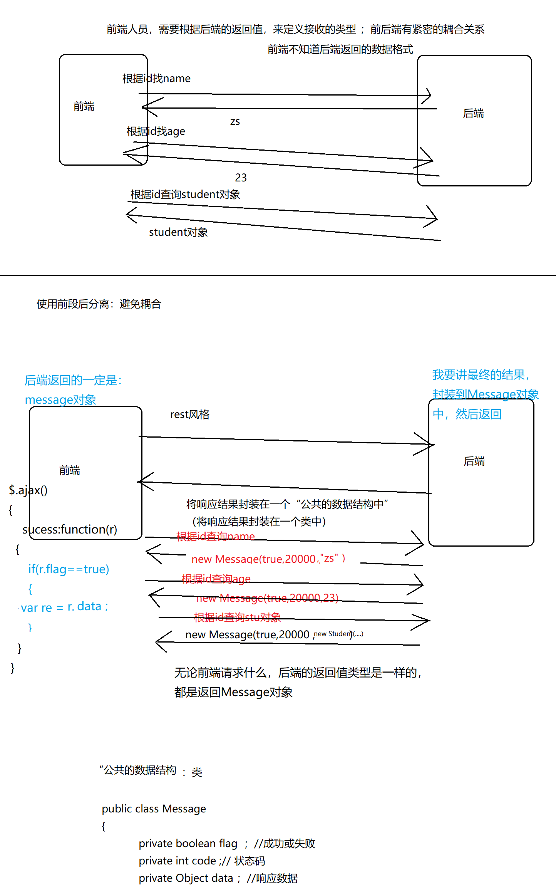
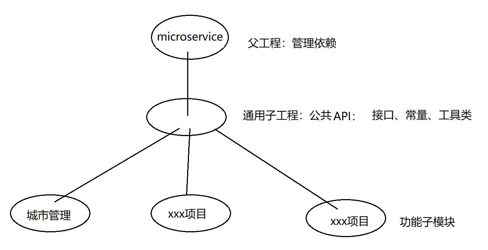
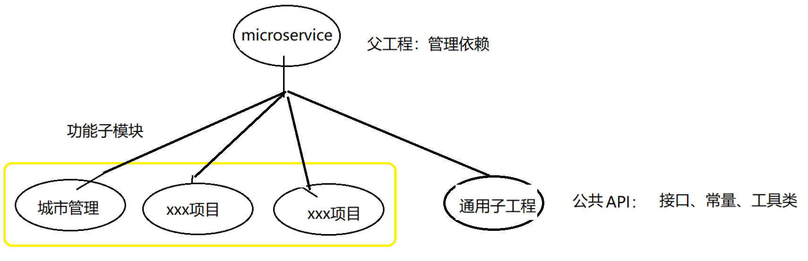
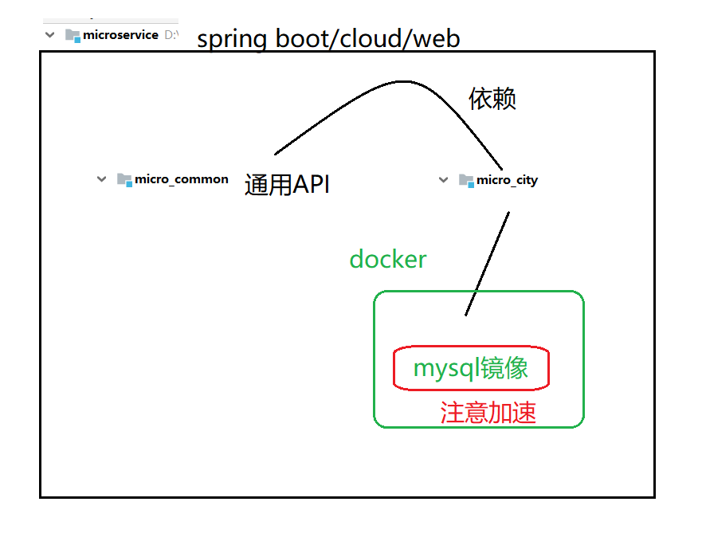
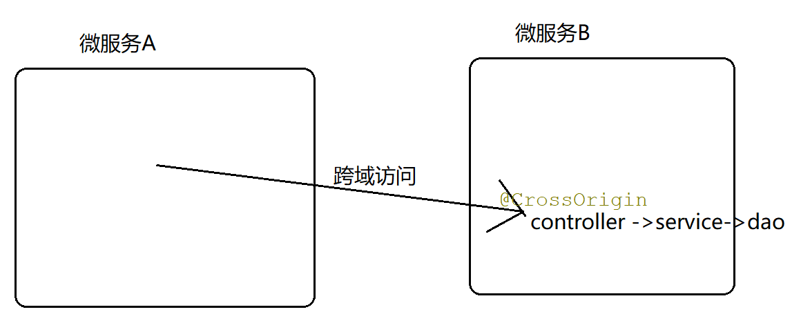
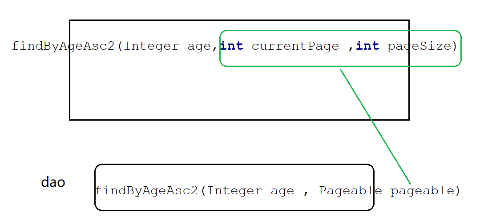
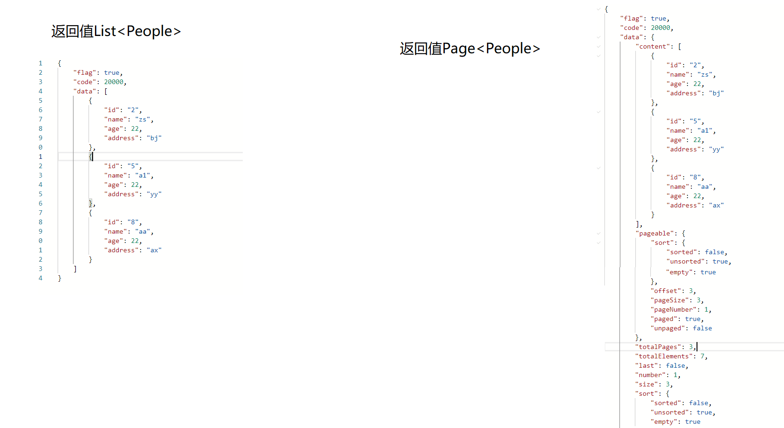
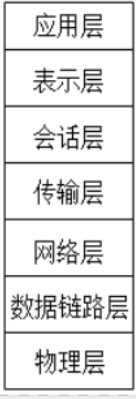
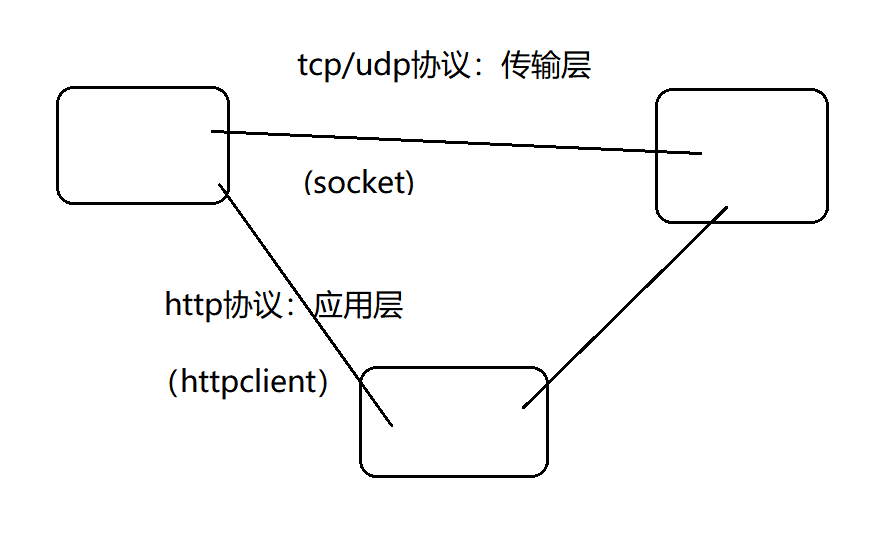
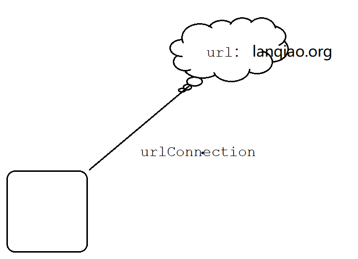

# 微服务

前置基础：java基础（javase ，数据库，ssm ,spring boot基础  ，mvn, git）

课程内容： spring boot高级、spring cloud 、容器化技术(docker相关)


选型：

1.尽可能的包含目前大部分主流的微服务技术

2.前沿、尽可能使用 之前课程没有出现的技术。例如，用jpa 取代mybatis，例如mysql取代oracle


授课方式：

案例，不是项目。

案例：为了学技术。 写的代码，可能不能实现某一个功能，而是为了学习。

项目：为了实现功能。 要求代码统一、技术统一，每一行代码 都是为了做一个“功能”


大体的代码：

spring全家桶

控制器：springmvc  （servlet）

数据访问：springdata + jpa  (jdbc)


基于前后端分离  ： 

1.采用rest风格开发。 （1）发送的请求支持 get查  post增  delete删  put改 等四种请求方式。

（2）支持ant写法，  http://localhost:8888/findById/1/zs  (ant写法)

​                                     http://localhost:8888/findById?id=1 & name=zs 

2.(重点) 前端和后端共同维护一个共用的“数据结构”，从而实现 前端、后端各自独立开发，互不干涉。



### 项目结构

方案一： 将通用子工程作为 功能子模块的父工程




方案二： 将通用子工程 和 功能子模块，作为平级的工程，然后 用各个功能子模块 引入 通用子模块（本次采用）



父工程：microservice: pom.xml

通用子工程：micro_common

功能子模块1：城市管理 （ssm  + spring boot）

提示：1如果A是B的父工程。 那么当 手工删除B工程（子工程）之后，还需要手工的在 A（父工程）中，将B的module删除

提示2：建立spring boot项目时，有两种选择：

（1）创建maven项目，然后再pom中 手工引入 starter的依赖

（2）直接创建spring boot项目，可以在创建项目时 直接选择好starter

（3）项目名、类名、变量名：可以使用下划线（micro_city）；springboot中的yaml文件，不能有下划线，但可以有-   （micro-city.yml）

访问数据库,  jdbc,mybatis ,mysql

处理请求映射 web  (相当于引入spring mvc)


## 使用docker 准备数据库


docker优势：可以通过几行命令，就可以实现 各种服务的部署功能。


docker基于Linux（一般建议centos7），centos7详见以前课程。

进入centos7后，查看系统内核：uname -r，要求内核版本>=3.10

小结：docker使用的环境：centos7，并且uname >=3.10


准备docker容器：

1.下载docker

yum -y install docker

2.启动

systemctl start docker

开启自启

systemctl enable docker


在docker容器中 安装各个服务镜像。(mysql)

docker pull 镜像名字:版本号

准备工作：如何得知   镜像名字:版本号

（1）网站hub.docker.com，去里面搜索 Mysql，就能看到 mysql的各个版本号

（2）docker search mysql

通过以上方法，可以得知服务的版本号  （可以去各个服务器的官网，查看版本号）


给docker加速：

（1）通过加速网站

registry.docker-cn.com

daocloud.io/library

其他网站

(2)

在docker下载mysql :

docker pull mysql:5.5.61

加速：

docker pull  registry.docker-cn.com/mysql:5.5.61

docker pull daocloud.io/library/mysql:5.5.61


检查安装的镜像:

docker ps -a


安装：

docker run -di --name=micro_mysql -p 3306:3306 -e MYSQL_ROOT_PASSWORD=root123 daocloud.io/library/mysql:5.5.61

docker ps -a

启动mysql:

docker start  2b9f9ca5c2be

停止

docker stop  2b9f9ca5c2be

删除

docker rm  2b9f9ca5c2be


尝试：

使用navicate远程连接 centos7中 docker里的Mysql服务


测试工具：

postman


回顾：

mapper接口前的@Mapper 和@MapperScan(value="com.yanqun.micro_city.mapper") ，二选一即可。


在使用maven时，如果a依赖了b项目，但是无法import b中的api，解决方案：先将 b进行install，然后再import


通过本案例可以发现，以前较为复杂的ssm整合配置文件，都不需要编写了，因为spring boot已经内部帮我们配置过了。




在springboot中 使用ssm时需要的依赖：jdbc,mysql,mybatis, web

在idea中，要将所有的xml等配置文件 放入到resources中


使用配置文件的mybatis时，出现 invalidate  found...(找不到mapper.xml映射文件)，解决：

1.重启

2.如果重启后仍然失败，尝试通过Maven技术，强制保留mapper.xml

```xml
    <build>
        <resources>
            <resource>
                <directory>src/main/java</directory>
                <includes>
                    <include>**/*.xml</include>
                </includes>
                <filtering>false</filtering>
            </resource>
        </resources>
    </build>

```

做了一些尝试：

增加了一些注解 和一些配置。  

spring boot自动装配，帮我们配置一些东西 。 如果某些自动装配失效，那么可以尝试手工装配。


- micro_city:springboot+ssm +注解
- micro_city2:springboot+ssm +SQL映射文件
- micro_city3: springboot+ssm + 外部配置文件/配置类


micro_city3、micro_city4:不适用springboot的部分自动装配功能；而使用我们自定义的 配置文件、配置类

（1）外部配置文件：micro_city3

重点：要引入外部配置文件，需要在springboot入口类上加注解：

```java
@ImportResource(locations={"classpath:applicationContext.xml"})
@SpringBootApplication
public class MicroCityApplication {

    public static void main(String[] args) {
        SpringApplication.run(MicroCityApplication.class, args);
    }

}
```

问题总结：

1.springboot启动时，必须有 appication.properties/yaml

2.如果创建的是spring boot项目，项目在创建时会自动 创建一个入口类、测试类；我们直接在测试类中写方法即可。但是，如果是手工自己编写的测试类，并且这个测试类 和入口类 没有遵循maven约定，则需要 手工给测试类 指定 要测试的是哪个类。

```java

@SpringBootTest(classes = MicroCityApplication.class)
@RunWith(SpringRunner.class)
public class MiCro_CIty3_Test {
    ...
}
```


（2）配置类：micro_city4

```java
package micro_city4;

import micro_city4.dao.CityDao;
import micro_city4.entity.City;
import micro_city4.service.CityService;
import org.springframework.context.annotation.Bean;
import org.springframework.context.annotation.Configuration;

/*
 * Created by 颜群
 */
@Configuration
public class MyConfiguration {//配置类

    @Bean
    public CityService cityService(){
        CityService cityService = new CityService();
        CityDao cityDao = new CityDao();
        cityService.setCityDao(  cityDao    );
        return cityService ;
    }
}


```

说明：配置类 由于会在启动时被@SpringBootApplication扫描，因此 无需再家 @importReource...


  ## Spring全家桶开发

新建mvn项目时，不要和本地仓库中 的项目名冲突


引入依赖（不需要引入jdbc）

```java
  <dependencies>
        <dependency>
            <artifactId>micro_common</artifactId>
            <groupId>com.yanqun</groupId>
            <version>1.0-SNAPSHOT</version>
        </dependency>

        <dependency>
            <groupId>mysql</groupId>
            <artifactId>mysql-connector-java</artifactId>
        </dependency>

        <!-- jpa ,已经自带了类似jdbc功能，因此不需要单独再引入jdbc-->
        <dependency>
            <groupId>org.springframework.boot</groupId>
            <artifactId>spring-boot-starter-data-jpa</artifactId>
        </dependency>

    </dependencies>
```


编写dao，只需要继承2个接口

```java
/*
 * Created by 颜群
 * jpa使用方式一：继承JpaRepository<People,String> , JpaSpecificationExecutor<People>;需要写任何代码
 *
 * JpaRepository ：提供了基本的增删改查
 * JpaSpecificationExecutor：较为复杂的条件查询
 */
public interface PeopleDao extends JpaRepository<People,String> , JpaSpecificationExecutor<People> {
}

```


## 细节问题

1. mvn下载的时候网络问题，下载失败。下次如何继续下载？

   （1）下载失败的删除了 ：进入本地仓库，批量删除以前下载失败的依赖（下载失败的后缀，.lastUpdated）：for /r %i in (*.lastUpdated) do del %i

    （2）重新下载

2. 改变依赖出现的依赖

   开始A->B, 后来中途 改变了依赖，    A-> C  ,出现各种问题。

   解决？

   第一步：清除之前的依赖模块，mvn clean

   第二步：安装新的依赖, mvn install

 3.数据库方言： 各个数据库的底层执行细节、优化细节有所区别。指定方言可以让程序更加高效。

4.单词拼错、符号写错

​	 	(1)用默认字体，不要用艺术字、不要斜体

​       （2）使用比较工具 BCompare.exe


5.MySQL表名的大小写问题

​    windows/linux  

​    windows:不区分大小写，tb_people ==  tb_PEOPLE 

​     linux:区分大小写  ，  tb_people  !=   tb_PEOPLE   


Oracle表名的大小写问题，在windows/linux都不区分大小写


6.引擎

   mysql默认支持:InnoDB

  建表时指定MyISAM引擎 ：

create table xx(id int,name varchar) engine=MyISAM

   

7.序列化问题

 Serializable在微服务中的重要作用：

​    1.序列化、反序列化。   内存<->硬盘  ，

2. 网络传输。在网络中传输的对象，必须已经实现了Serializable
3. 复合主键  。


8.跨域问题

微服系统中，如果微服务A 要远程访问微服务B.

举例，前端是在 ajax  ，部署在http协议，192.168.1.123:8888 ；后端是 spring +ssm ，部署在http协议，，192.168.1.123:8881

不同微服务之间，如果网络访问协议、IP、端口有任何一个不一致，都称之为 跨域访问。

浏览器等客户端/服务，为了保证安全性，一般默认不支持跨域。如果要跨域，需要进行一些处理。在sporingboot中非常简单，要实现跨域，只需要加一个注解即可@CrossOrigin




9.编写代码时的流程

pom.xml -> application.yaml/application.properties ->entity- >dao ->service ->controller

分页




## 使用JPQL实现增删改

1.@Query + Modifying 

2. （建议在service上加） @Transactional

说明：JPA实现CRUD有很多方式， 如果是需要自己编写JPAL或者SQL，则必须加Transactional；如果是调用JPA内部自带的一些方法 ，则不需要加 @Transactional

```java
   @Modifying
    @Query("update People  set age=age+1 where id =?1")
    public int updatePeople(String id) ;

    @Modifying
    @Query("update People  set age=?2 where id =?1")
    public int updatePeople2( String id,Integer age);


    @Modifying
    @Query("update People p set  p.age = :#{#people.age}  , p.address=:#{#people.address}   where p.id =:#{#people.id}")
    public int updatePeople3(@Param("people") People people );//28  ,shanghai

```

如果没有加@Transactional注解，则报异常：

```
javax.persistence.TransactionRequiredException: Executing an update/delete query
	at org.hibernate.query.internal.AbstractProducedQuery.executeUpdate(AbstractProducedQuery.java:1586) ~[hibernate-core-5.3.7.Final.jar:5.3.7.Final]
	
```

```java
    @Query(nativeQuery = true , value="select  name from tb_people where id =? ")
    public String findNameById(String id) ;

    @Query(nativeQuery = true,value="select * from tb_people where name = ? and age =? ")
    public List<People> findPeopleByNameAndAge(String name ,int age);

    @Query(nativeQuery = true,value="select * from tb_people where age in (:ages) order by age")
    public Page<People> findPeopleByAges(@Param("ages") List<Integer> ages   , Pageable pageable);
//    public  List<People> findPeopleByAges(@Param("ages") List<Integer> ages   , Pageable pageable);

```




**使用原生SQL查询多表**

select a.name,count(1) from tb_address a inner join tb_people p on a.id = p.address group by a.name


在使用group by时， select 后的字段 要么在group by后面，要么是 分组函数。

bj  6
xa  4

List<Object[]>


JPA继承的两个接口 JpaRepository<Address,String>, JpaSpecificationExecutor<Address>

其中的泛型，是指  如果使用JPA自带的方法（方式一、方式二） ，则必须指定泛型。


## httpclient



osi网络七层模式。

根据七层模型，tcp/udp（socket）属于第四层。除此以外，还经常会使用 第七层的应用层进行网络连接。在第七层，可以使用http协议进行网络传输。

可以使用httpclient，实现 用编码 进行http协议的访问。



httpclient独立使用

Springboot整合httpclient

Jsoup：解析html

httpclient+Jsoup ->实现爬虫

httpclient：实现基于http协议的网络访问

独立使用httpclient


在使用HttpClient时，对于参数传递，get和Post形式可以混用。 ?、list都可以实现。

localhost?a=b

如果传递的对象是一个实体类？

public void savePeople(People peple){}


如何使用httpclient发送请求时，携带一个“实体对象”类型的参数。

原理？

将 试题对象转成 json。

Person per = new Person(1,"zs",23)


httpclient ->(per ) ->lanqiao.cn

httpclient ->({ id:1, name:zs, age:23   }}) ->lanqiao.cn

需要将对象转为json: jastjson

引入fastjson:1.将jar引入工程，  2加入dependency

```
fastjson.jar
```

2.编码

WebLog框架

理解为框架：httpclient：获取网页的html代码   +   Jsoup：解析html     => 爬虫

底层技术：URLConnection ：获取网页的html代码     +   正则表达式/字符串解析      => 爬虫 


演示 URLConnection  + 正则表达式/字符串解析 实现一个简单爬虫（仅作了解）


演示 URLConnection比httpclient麻烦。


以后，如果爬取a网站，但发现无法爬取；则建议更换网址、网址终止爬取。不要再强行、或者通过一些其他手段 技术性爬取，否则可能面临法律纠纷。





