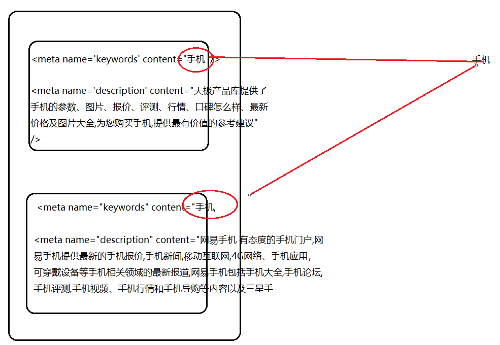
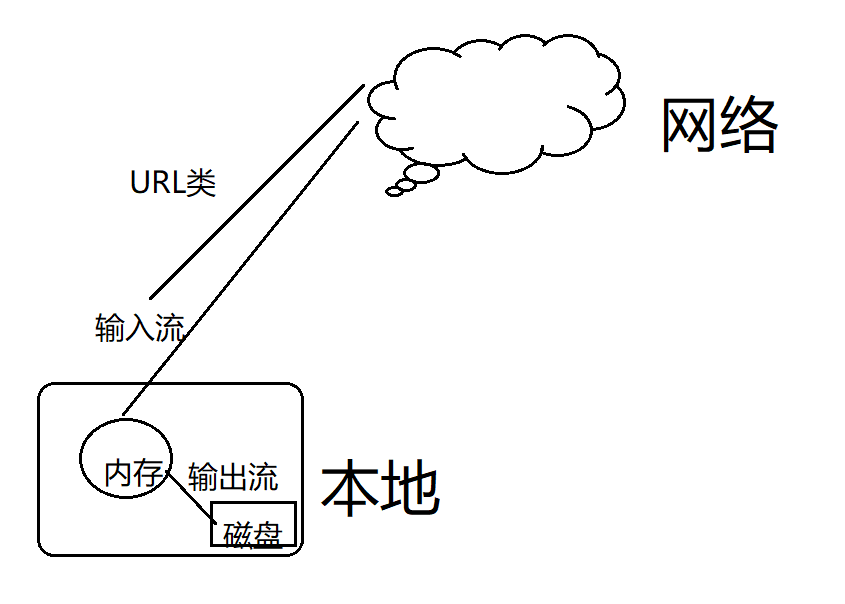

# 爬虫


## HttpClient

httpclient:发送基于http协议的请求

Jsoup:解析Html源代码


第一个httpclient案例：

1.引入依赖（jar）：

(1) mvn：

```java
        <!-- 引入httpclient依赖-->
        <dependency>
            <groupId>org.apache.httpcomponents</groupId>
            <artifactId>httpclient</artifactId>
            <version>4.5.6</version>
        </dependency>
```

(2)httpclient-4.5.6.jar

2.写代码

```java
import org.apache.http.HttpEntity;
import org.apache.http.client.methods.CloseableHttpResponse;
import org.apache.http.client.methods.HttpGet;
import org.apache.http.impl.client.CloseableHttpClient;
import org.apache.http.impl.client.HttpClients;
import org.apache.http.util.EntityUtils;

import java.io.IOException;

/*
 * Created by 颜群
 */
public class HttpClientDemo01 {
    public static void main(String[] args){
        CloseableHttpClient httpClient = HttpClients.createDefault();
        HttpGet httpGet = new HttpGet("http://www.lanqiao.cn/");
        HttpEntity entity = null ;
        CloseableHttpResponse response = null ;
        try {
            //发送http请求 （1.请求类型 get\post    2.网站）
             response = httpClient.execute(httpGet);
            //判断是否得到了 正常的影响
            if (response.getStatusLine().getStatusCode() == 200) {
                //获取响应数据

                 entity = response.getEntity();//响应数据
                //将响应数据以Html源码形式显示
                String html = EntityUtils.toString(entity, "UTF-8");

                System.out.println(entity);
                System.out.println(html);

            }

        }catch (Exception e){
            e.printStackTrace();
        }finally {

            try {
               if(response!=null) response.close();
              if(httpClient!=null)  httpClient.close();
            } catch (IOException e) {
                e.printStackTrace();
            }
        }
    }
}

```

使用httpclient发送post请求

```java
import org.apache.http.HttpEntity;
import org.apache.http.client.methods.CloseableHttpResponse;
import org.apache.http.client.methods.HttpPost;
import org.apache.http.impl.client.CloseableHttpClient;
import org.apache.http.impl.client.HttpClients;
import org.apache.http.util.EntityUtils;

import java.io.IOException;

/*
 * Created by 颜群
 */
public class HttpClientDemo02 {
    public static void main(String[] args){
        CloseableHttpClient httpClient = HttpClients.createDefault();
        HttpPost httpPost = new HttpPost("http://www.lanqiao.cn/");
        HttpEntity entity = null ;
        CloseableHttpResponse response = null ;
        try {
            //发送http请求 （1.请求类型 get\post    2.网站）
             response = httpClient.execute(httpPost);
            //判断是否得到了 正常的影响
            if (response.getStatusLine().getStatusCode() == 200) {
                //获取响应数据

                 entity = response.getEntity();//响应数据
                //将响应数据以Html源码形式显示
                String html = EntityUtils.toString(entity, "UTF-8");

                System.out.println(entity);
                System.out.println(html);

            }

        }catch (Exception e){
            e.printStackTrace();
        }finally {

            try {
               if(response!=null) response.close();
              if(httpClient!=null)  httpClient.close();
            } catch (IOException e) {
                e.printStackTrace();
            }
        }
    }
}

```


请求时 如何传参？

id:1

name:zhangsan

age:23

get: www.lanqiao.cn ?id=1&name=zhangsan&age=23

post：请求体中


案例：使用Post并且带参数访问

```java
import org.apache.http.HttpEntity;
import org.apache.http.client.entity.UrlEncodedFormEntity;
import org.apache.http.client.methods.CloseableHttpResponse;
import org.apache.http.client.methods.HttpPost;
import org.apache.http.impl.client.CloseableHttpClient;
import org.apache.http.impl.client.HttpClients;
import org.apache.http.message.BasicNameValuePair;
import org.apache.http.util.EntityUtils;

import java.io.IOException;
import java.util.ArrayList;
import java.util.List;

/*
 * Created by 颜群
 */
public class HttpClientDemo02 {
    public static void main(String[] args){
        CloseableHttpClient httpClient = HttpClients.createDefault();
        HttpPost httpPost = new HttpPost("http://dasai.lanqiao.cn/pages/dasai/news.html");
        HttpEntity result = null ;
        CloseableHttpResponse response = null ;
        try {

            /*
                id:1
                name:zhangsan
                age:23
             */
//            NameValuePair (实现类BasicNameValuePair)
            BasicNameValuePair param1 = new BasicNameValuePair("id","19");
//            BasicNameValuePair param2 = new BasicNameValuePair("name","zhangsan");
//            BasicNameValuePair param3 = new BasicNameValuePair("age","23");
            List<BasicNameValuePair> params = new ArrayList<>() ;
            params.add(param1);
//            params.add(param2);
//            params.add(param3);

            UrlEncodedFormEntity httpEntity = new UrlEncodedFormEntity(params,"UTF-8");
            //设置请求的参数
            httpPost.setEntity(  httpEntity);//参数类型是HttpEntity (具体实现类UrlEncodedFormEntity)


            //发送http请求 （1.请求类型 get\post    2.网站）
             response = httpClient.execute(httpPost);
            //判断是否得到了 正常的影响
            if (response.getStatusLine().getStatusCode() == 200) {
                //获取响应数据

                 result = response.getEntity();//响应数据
                //将响应数据以Html源码形式显示
                String html = EntityUtils.toString(result, "UTF-8");

                System.out.println(result);
                System.out.println(html);

            }

        }catch (Exception e){
            e.printStackTrace();
        }finally {

            try {
               if(response!=null) response.close();
              if(httpClient!=null)  httpClient.close();
            } catch (IOException e) {
                e.printStackTrace();
            }
        }
    }
}

```


get方式传参：

```
HttpGet httpGet = new HttpGet("http://dasai.lanqiao.cn/pages/dasai/news.html?id=19");
```

就已经将id=19放在了参数里面


httpclient对象池/连接池


一些常见的httpclient api使用

```java
import org.apache.http.HttpEntity;
import org.apache.http.client.config.RequestConfig;
import org.apache.http.client.methods.CloseableHttpResponse;
import org.apache.http.client.methods.HttpGet;
import org.apache.http.impl.client.CloseableHttpClient;
import org.apache.http.impl.client.HttpClients;
import org.apache.http.impl.conn.PoolingHttpClientConnectionManager;
import org.apache.http.util.EntityUtils;

import java.io.IOException;

/*
 * Created by 颜群
 */
public class HttpClientDemo03 {
    public static void main(String[] args){
        //每次都是new一个新的httpClient对象
//        CloseableHttpClient httpClient = HttpClients.createDefault();


        //创建连接池
        PoolingHttpClientConnectionManager pool = new PoolingHttpClientConnectionManager();
        pool.setMaxTotal(100);//设置连接池中 最多可以存放100个httpClient连接
        pool.setDefaultMaxPerRoute(20);//最多有20个httpclient对象可以访问同一个网站

        //从连接池中获取httpClient对象
        CloseableHttpClient httpClient =  HttpClients.custom().setConnectionManager( pool).build() ;

        HttpGet httpGet = new HttpGet("http://dasai.lanqiao.cn/pages/dasai/news.html?id=19");
        HttpEntity entity = null ;
        CloseableHttpResponse response = null ;

        RequestConfig requestConfig = RequestConfig.custom().setConnectTimeout(3000) //创建连接
                .setConnectionRequestTimeout(5000)//连接服务器时间
                .setSocketTimeout(10000).build();//数据传输时间


        httpGet.setConfig( requestConfig  );

        try {
            //发送http请求 （1.请求类型 get\post    2.网站）
             response = httpClient.execute(httpGet);
            //判断是否得到了 正常的影响
            if (response.getStatusLine().getStatusCode() == 200) {
                //获取响应数据
                 entity = response.getEntity();//响应数据
                //将响应数据以Html源码形式显示
                String html = EntityUtils.toString(entity, "UTF-8");

                System.out.println(entity);
                System.out.println(html);

            }

        }catch (Exception e){
            e.printStackTrace();
        }finally {

            try {
               if(response!=null) response.close();
              if(httpClient!=null)  httpClient.close();
            } catch (IOException e) {
                e.printStackTrace();
            }
        }
    }
}

```


 使用Spring Boot整合HttpClient

(1)父工程：管理公共依赖

```java
    <dependencyManagement>
         <dependencies>
             <dependency>
                 <!-- 引入spring boot starter-->
                 <groupId>org.springframework.boot</groupId>
                 <artifactId>spring-boot-starter-parent</artifactId>
                 <version>2.1.3.RELEASE</version>
                 <type>pom</type>
                 <scope>import</scope>
             </dependency>
...
        
        <dependency>
            <!-- 引入spring mvc-->
            <groupId>org.springframework.boot</groupId>
            <artifactId>spring-boot-starter-web</artifactId>
        </dependency>
         </dependencies>
         
       


     </dependencyManagement>

```


(2)子工程：HttpClient依赖

(3)HttpClient配置文件/配置类

(4)编写代码

（5）测试时，如果是使用main（）方法测试，则无需修改

但，如果使用controller测试，需要增加web依赖。


##  Jsoup：解析html代码

HttpClient从网上将某个网页的html源码下载到本地；再用Jsoup对下载后的html源码进行解析，从而实现爬虫效果

使用层面：类似jquery、css、xml的选择操作

案例

1.引入jsoup依赖

引入 commons-io依赖


2.解析html

解析的网页素材

```html
<!DOCTYPE html>
<html ng-app="lanqiaoApp">
    <head>
        <meta http-equiv="Content-Type" content="text/html; charset=utf-8" />
		<meta http-equiv="X-UA-Compatible" content="IE=edge" />		
		<meta name="renderer" content="webkit">		
		<meta name="keywords" content="" />
		<meta name="description" content="" />
		<title>大赛新闻</title>	
          <!-- lanqiao logo start -->
          <link rel="icon" type="image/x-icon" href="http://static.lanqiao.cn/common/image/favicon.ico?v=6.1" />
          <link rel="shortcut icon" type="image/x-icon" href="http://static.lanqiao.cn/common/image/favicon.ico?v=6.1" />
    </head>
  	<body>
     	<link rel="stylesheet" type="text/css" href="http://static.lanqiao.cn/account/css/login_sub.css" />
   

   <div class="navigation">
			<a class="home" href="http://www.lanqiao.org/"></a>
			<ul class="menu">
				<li class="link act">
				
				
				
				<a href="/pages/dasai/index.html" id="dasaiId">蓝桥杯大赛</a>
				
				
				</li>
				
				
				<li class="link"><a target="_blank" href="/pages/dasai/curren_item.html">本届赛事</a></li>
				<li class="link">
					<a href="javascript:;">关于大赛</a>
					<ul id="myulID">
                      	<li>
							<a target="_blank" href="/pages/dasai/news.html?id=19">大赛新闻</a>
						</li>
						
                      	<li><a target="_blank" href="/pages/dasai/notes.html?id=20">大赛通知</a></li>
						
                      	<li><a target="_blank" href="/pages/dasai/news_detail.html?id=614">大赛章程</a></li>
                      	<li><a target="_blank" href="/pages/dasai/news_detail.html?id=622">奖项设置</a></li>
                      	<li><a target="_blank" href="/pages/dasai/news_detail.html?id=623">竞赛科目</a></li>
                   
					</ul>
				</li>

				<li class="link"><a target="_blank" href="http://lx.lanqiao.cn/">练习系统</a></li>
				<!-- <li class="link"><a target="_blank" href="http://www.lanqiao.org/">大蓝桥</a></li> -->
				<li class="link"><a target="_blank" href="/pages/dasai/tell_ours.html">联系我们</a></li>
				<li class="link"><a target="_blank" href="http://www.lanqiaobei.cn/">ENGLISH</a></li>	
				<li class="link newsHead" id="newsHead" style="display:none;">
					<a href="/pages/account/message.html"><span class="newsNum" id="newsNum"></span>
						<div class="news-msg" myname="mynews" id="news-msg">有新的消息1</div>
						<div class="news-msg2" myname="mynews2" id="news-msg">有新的消息2</div>
						<div class="news-msg2" myname="mynews2" id="news-msg">有新的消息3</div>
				

				</a>
				</li>
				
				
				<li id="login_normal" class="account" style="display: none;">
					<a href="javascript:void(0);" id="btnShowTeacherLogin">院校入口</a> <<>	<span>ssssssssssss</span>			
					<a href="javascript:void(0);" id="btnShowLoginDialog">学生登录</a>	
					<a href="javascript:void(0);" id="btnShowStuReg">学生注册</a>
					
				</li>					
				<li id="login_logined" class="user" style="display: none;">
					<div class="head">
						 <span style="display:none;">999</span>
						 
						<p></p>
					</div>						
					<ul id="login_dpdown_teacher" identityId="2" >
						<li><a href="/pages/dasai/college_auth.html">院校认证</a></li>								
						<li authStatus="4"><a href="/api/org_apply/org_apply_match_li_">大赛管理</a></li>
						<!-- <li authStatus="4"><a href="/pages/dasai/college_allstu.html?matchCategoryId=1&matchFlowId=3">大赛管理</a></li> -->
					
					</ul>
					<ul id="login_logined_stu"  identityId="1" >
						<li><a href="/pages/dasai/stupersonalauth.html">个人认证</a></li>								
						<li authStatus="4"><a  href="/pages/dasai/personal_my_dasai.html">我的大赛</a></li>
						<li authStatus="4"><a  href="/api/stu/award/li">获奖查询</a></li>
						<li authStatus="4"><a href="/pages/dasai/order/myorder.html">我的订单</a></li>						
						<li><a href="/pages/account/message.html#/">我的消息</a></li>
						<li><a  href="/pages/account/stu_address.html">我的地址</a></li>						
						<!-- <li><a href="/pages/account/myaccount_headimg.html">账号设置</a></li> -->
						<!-- <li><a href="/pages/account/myaccount_setting.html">账号设置</a></li>-->
						<!-- 
						<li><a target="_blank" href="http://main.lanqiao.cn/api/pages/account">账号设置</a></li> 
 						-->
						<li class="quit"><a href="javascript:void(0);">退出</a></li>
					</ul>
				</li>				
			</ul>
		</div>
		<a  href="/api/third/weixinregister" target="_blank"><span id="weixin_login_a_to"></span></a>
		<!-- 微课banner开始 -->
	
		<div class="slider weike-banner">
		    <div class="bd">
		        <ul>
		        	<li >
		            	<a href="http://weike.lanqiao.cn/" style="background:url(http://static.lanqiao.cn/dasai/images/weike/alink_20190221.png) no-repeat"></a>
		            </li>
		            <!-- 
		        	<li>
		            	<a target="_blank" href="http://weike.lanqiao.cn/setmeal/showSetmeal.do?nnid=10154">
							<span class="weike-banner-img">
								<span id="weike-banner-time" class="weike-banner-time"></span>
							</span>				
							
						</a>
		            </li>
		             -->
		            <!-- 
		            <li >
		            	<a href="/pages/dasai/activities/zb/zb.html" style="background:url(http://static.lanqiao.cn/dasai/images/weike/alink_190117.jpg) no-repeat"></a>
		            </li>
		             -->
		        </ul>
		    </div>
		    <div class="hd">
		        <ul></ul>
		    </div>
		</div>
	<div class="lq-news">
			<div class="top-line"></div>
			<div class="wrap1130" id="news_list" >
				<div  id="force">
				</div>
				<div class="news-list" id="news_id">
					<div id="news">
						
					</div>
					<div class="news-pager clearfix" id="page">
						
					</div>
				</div>
			</div>
		</div>
		<div class="footer">
			<div class="bg1">
				<div class="clearfix wrap">
					<div class="item item1">
						<input type="text" name="uname" value=""/>
						
						<span id="helloID" hello="word1" >HELLO WORLD1</span>
						
						
						<span hello="word2" > </span>
						
						
						<div><a href="/pages/dasai/about_ours.html" target="_blank">关于我们</a></div>
						<div><a href="/pages/account/user_protocol.html" target="_blank">用户协议</a></div>
						
					</div>
					<div class="item item2">
						<p class="p1">支持单位</p>
						<p class="p2">主办单位：</p>
						<p class="p2">工业和信息化部人才交流中心</p>
						<p class="p2">技术支持：</p>
						<p class="p2">国信蓝桥教育科技（北京）股份有限公司</p>
					</div>
					<div class="item item3">
						<p class="p1">联系我们</p>
						<p class="p2">地址：北京市海淀区万寿路27号工业和信息化部大院8号楼10层 </p><!--  邮编: 100846 -->
						<p class="p2">电话：4006-588-662     <!-- 传真：010-68208666 --> </p>
						<p class="p2">Email：lanqiao@lanqiao.org</p>
						<!-- <p class="p2">商务合作：010-68208668  sunll@lanqiao.org</p> -->
						<p class="p2">商务合作：010-68208626  liyp@lanqiao.org</p>
					</div>
					<div class="item item4">
						
						<p>扫一扫关注蓝桥公众号</p>
					</div>
				</div>
			</div>
			<div class="bg2">
				<div class="clearfix wrap">
					<p class="p1"><a href="http://www.beian.miit.gov.cn" style="color:#666666">京ICP备11024192号</a></p>
					<p class="p2">京公网安备&ensp;11010802020352号</p>
				</div>
			</div>
		</div>
</html>

```

解析代码

```java
package com.yanquan;

import org.apache.commons.io.FileUtils;
import org.jsoup.Jsoup;
import org.jsoup.nodes.Document;
import org.jsoup.nodes.Element;

import java.io.File;

/*
 * Created by 颜群
 */
public class JsoupDemo01 {
    public static void main(String[] args) throws Exception{
       //将html文件的内容读取到内存    commons-io

        String lanqiaoHtml = FileUtils.readFileToString(new File("d:/lanqiao.txt"), "UTF-8");
        //解析  (lanqiao.txt -> String ->Document)
        Document document = Jsoup.parse(lanqiaoHtml);
    //jquery ,xml
        Element title = document.getElementsByTag("title").first();
        Element dasaiId = document.getElementById("dasaiId");

        System.out.println(   title.text()        );
        System.out.println(   dasaiId.text()        );

    }
}

```

选择方式 ：select

```java
package com.yanquan;

import org.apache.commons.io.FileUtils;
import org.jsoup.Jsoup;
import org.jsoup.nodes.Attribute;
import org.jsoup.nodes.Attributes;
import org.jsoup.nodes.Document;
import org.jsoup.nodes.Element;
import org.jsoup.select.Elements;

import java.io.File;
import java.util.Iterator;

/*
 * Created by 颜群
 */
public class JsoupDemo01 {
    public static void main(String[] args) throws Exception{
       //将html文件的内容读取到内存    commons-io

        String lanqiaoHtml = FileUtils.readFileToString(new File("d:/lanqiao.txt"), "UTF-8");
        //解析  (lanqiao.txt -> String ->Document)
        Document document = Jsoup.parse(lanqiaoHtml);
        //jquery ,xml
        //标签选择器
        Element title = document.getElementsByTag("title").first();
        //id选择器
        Element dasaiId = document.getElementById("dasaiId");
        // 属性选择器
        Element hello1 = document.getElementsByAttribute("hello").first();


        System.out.println(hello1);
        System.out.println(hello1.text());
        //attr()可以拿到一切属性
        System.out.println(  hello1.attr("hello"));  ;
        System.out.println(  hello1.attr("id"));  ;
        // hello1.xxx()//只能获取一些常见的html内置属性

        System.out.println(  hello1.id() );

        System.out.println("-------");
        Attributes attributes = hello1.attributes();//获取当前元素的全部属性
        Iterator<Attribute> iterator = attributes.iterator();
        while(iterator.hasNext()){
            Attribute attribute = iterator.next();
            System.out.println( attribute.getKey());
            System.out.println(attribute.getValue());
        }


        System.out.println("-------");
        
        
        


        Element hello2 = document.getElementsByAttributeValue("hello", "word2").first();


        //类选择器class
//        news-msg
        Element last = document.getElementsByClass("news-msg").last();


        System.out.println(   title.text()        );
        System.out.println(   dasaiId.text()        );
        System.out.println(   last.text()        );
        System.out.println(   hello1.text()        );
        System.out.println(   hello2.text()        );

        System.out.println("-----jsoup选择器,select--------");
        Elements metas = document.select("meta");//标签
        for(Element element: metas){
            System.out.println(element.attr("name"));
        }

        //#id
        Elements selectId = document.select("#dasaiId");
        System.out.println(selectId.text());

        //.class
        Elements selectClasses = document.select(".news-msg");
        for(Element element:selectClasses){
            System.out.println(element.text());
        }
        System.out.println("****");
        //属性  []
        Elements selectAttrs = document.select("[myname]");
        for(Element element:selectAttrs){
            System.out.println(element.text());
        }

        Elements selectAttrs2 = document.select("[myname=mynews2]");
        for(Element element:selectAttrs2){
            System.out.println(element.text());
        }

        //复合选择器
        //交集选择器：直接拼起来写
        Elements selectJJ = document.select(".news-msg[myname=mynews2]");
        System.out.println(selectJJ.toString());
        System.out.println("***---");
        //并集选择器: , 。特殊：个别选择器 和jquery用法不一致，例如jsoup中不支持，并集
        Elements selectBJ = document.select("[myname=mynews],news-msg2");
        System.out.println(selectBJ+"特殊情况：jsoup中不能像jq那样使用,实现并集");

        System.out.println("////");
        //后代:空格
        Elements elementsHD = document.select("#myulID li");
        System.out.println(elementsHD.toString());
        System.out.println("////2222");

        Elements elementsHD2 = document.select("#myulID a");
        System.out.println(elementsHD2.toString());

        //子代:>
        System.out.println("////333");
        Elements elementsZD = document.select("#myulID>li");
        System.out.println(elementsZD.toString());
        System.out.println("////444");

        Elements elementsZD2 = document.select("#myulID>a");//a是#myulID的孙子代，不是直接子代，因此无法通过子代选择器选中
        System.out.println(elementsZD2.toString());

        System.out.println("////555");
        //全选
        Elements selectQX = document.select("#login_normal>*");
        System.out.println(selectQX);
    }
}

```


## Jsoup的加载方式

```
Jsoup.parse(html字符串);
Jsoup.parse(文件/输入流);
Jsoup.parse(URL地址);
```

加载字符串

```java
        Document document = Jsoup.parse("<html><head><meta http-equiv=\"Content-Type\" content=\"text/html; charset=utf-8\" /><meta http-equiv=\"X-UA-Compatible\" content=\"IE=edge\" /><title>蓝桥</title><meta name=\"baidu-site-verification\" content=\"oymzMRHnc0\" /><meta name=\"360-site-verification\" content=\"7e9fc70fd0b9dc188a9f5b583b5f577a\" /></head><body><div class=\"header clearfix\"><div class=\"nav fl\"><a href=\"http://www.lanqiao.org/\"></a><a class=\"act\" href=\"##\" target=\"_blank\">首页</a><a href=\"http://dasai.lanqiao.cn/\" target=\"_blank\">蓝桥杯</a><a href=\"http://www.lanqiaohr.com/\" target=\"_blank\">我要找工作</a></div><div class=\"fr\"><span><i class=\"icon-phone\"></i>4006-588-662</span></div></div><!--头部--></div></div></div></div><!--我要学习--><div class=\"box\"></div><!--蓝桥掘金--></div><!--主体内容--></body></html>");
        Element title = document.getElementsByTag("title").first();
        System.out.println(  title.text());
```

以上的推荐写法：

```java
String lanqiaoHtml = FileUtils.readFileToString(new File("d:/lanqiao.txt"), "UTF-8");
      Document document = Jsoup.parse(lanqiaoHtml);
```

加载文件/流

```java
        Document document2 = Jsoup.parse(new File("D:/lanqiao.txt"), "UTF-8");
        String title2 = document2.title();
        System.out.println(title2);

        Document document3 = Jsoup.parse(new FileInputStream(  new File("D:/lanqiao.txt")), "UTF-8","");
        String title3 = document3.title();
        System.out.println(title3);
```

直接加载URL地址

```java
       System.out.println("--44--");
        Document document4 = Jsoup.parse(new URL("http://www.lanqiao.cn/"),5000);
        String title4 = document4.title();
        System.out.println(title4);

        System.out.println("--555--");
        Document document5 = Jsoup.connect("http://www.lanqiao.cn/").get();
           //功能类似URLConnection
        System.out.println( document5.title());
```

注意：URLConnection和Jsoup都可以从网络中直接将HTML源码下载到本地，但是却无法更加细致的设置一些线程池、连接池等复杂操作。因此一般在实际开发中，使用HttpClient下载，而只用Jsoup进行解析操作。

## 爬虫案例

爬虫的作用： 搜索引擎、大数据的 数据  ->获取海量数据

搜索引擎



某个新曲 评价：轻松、愉快、恐怖


爬虫法律问题： 爬取时，一定要先咨询公司的法务人员。一定要遵守法律法规。   爬虫本身可能属于擦边球，稍不注意 可能就违法了。

一定要禁止：

1.不要大规模爬取数据，对对方的服务器造成过大影响，网络攻击。

2.非法获利。一定不要用于灰色产业、敏感行业。凡是和利润有关的，都比较敏感。

3.违法经营者意志。个人隐私数据、密码、付费数据，加了“反爬标识” 或者已经有了 反爬的技术手段。

4.遵循robots协议（ 搜索引擎）。只爬取协议允许爬的数据。


创建爬虫项目：添加依赖  httpclient+jsoup

pom.xml

```java
<?xml version="1.0" encoding="UTF-8"?>
<project xmlns="http://maven.apache.org/POM/4.0.0"
         xmlns:xsi="http://www.w3.org/2001/XMLSchema-instance"
         xsi:schemaLocation="http://maven.apache.org/POM/4.0.0 http://maven.apache.org/xsd/maven-4.0.0.xsd">
    <parent>
        <artifactId>microservice</artifactId>
        <groupId>com.yanqun</groupId>
        <version>1.0-SNAPSHOT</version>
    </parent>
    <modelVersion>4.0.0</modelVersion>

    <artifactId>project_crawler</artifactId>


    <dependencies>
        <!-- 引入httpclient依赖-->
        <dependency>
            <groupId>org.apache.httpcomponents</groupId>
            <artifactId>httpclient</artifactId>
            <version>4.5.6</version>
        </dependency>
        <!-- 引入fastjson-->
        <dependency>
            <groupId>com.alibaba</groupId>
            <artifactId>fastjson</artifactId>
            <version>1.2.47</version>
        </dependency>

        <!-- jsoup -->
        <dependency>
            <groupId>org.jsoup</groupId>
            <artifactId>jsoup</artifactId>
            <version>1.11.3</version>
        </dependency>
        <!-- io -->
        <dependency>
            <groupId>org.apache.commons</groupId>
            <artifactId>commons-lang3</artifactId>
            <version>3.9</version>
        </dependency>

        <dependency>
            <groupId>commons-io</groupId>
            <artifactId>commons-io</artifactId>
            <version>2.6</version>
        </dependency>
    </dependencies>

</project>
```


爬虫：

获取数据、解析数据、存储数据（一般建议存储到NoSQL数据库）

httpclient、jsoup

``` java
package com.yanqun;
import com.yanqun.entity.Course;
import org.apache.http.HttpEntity;
import org.apache.http.client.methods.CloseableHttpResponse;
import org.apache.http.client.methods.HttpGet;
import org.apache.http.impl.client.CloseableHttpClient;
import org.apache.http.impl.client.HttpClients;
import org.apache.http.util.EntityUtils;
import org.jsoup.Jsoup;
import org.jsoup.nodes.Document;
import org.jsoup.nodes.Element;
import org.jsoup.select.Elements;

import java.io.IOException;
import java.util.ArrayList;
import java.util.List;

/*
 * Created by 颜群
 */
public class crawlerDemo {
    public static String getData() {
        CloseableHttpClient httpClient = HttpClients.createDefault();
        //仅有一页数据
        HttpGet httpGet = new HttpGet("https://www.lanqiao.cn/paths/");

        //有多页数据
//        String htmlCommon = "https://www.bilibili.com/video/BV18s411u7EH?p=" ;
//        for(int i=1;i<100;i++){
//            HttpGet httpGet2 = new HttpGet(htmlCommon+i);
//            //解析
//        }

        HttpEntity entity = null;
        CloseableHttpResponse response = null;
        try {
            //发送http请求 （1.请求类型 get\post    2.网站）
            response = httpClient.execute(httpGet);
            //判断是否得到了 正常的影响
            String html = "" ;
            if (response.getStatusLine().getStatusCode() == 200) {
                //获取响应数据
                entity = response.getEntity();//响应数据
                //将响应数据以Html源码形式显示
                 html = EntityUtils.toString(entity, "UTF-8");
            }
            return html;
        } catch (Exception e) {
            e.printStackTrace();
            return null;
        } finally {
            try {
                if (response != null) response.close();
                if (httpClient != null) httpClient.close();
            } catch (IOException e) {
                e.printStackTrace();
            }
        }
    }

    public static  List<Course>  parseData(String html){
        List<Course> cs = new ArrayList<>() ;
        Document document = Jsoup.parse(html);
        Elements courses = document.select(".learn-path-container>div");
        for(Element course:courses){
            String courseName = course.select("a>div").first().text() ;
            String courseNum = course.select("a>div").last().text() ;//91门课程
            if(courseNum.indexOf("门") >-1){
                int num =  Integer.parseInt( courseNum.substring(0,courseNum.indexOf("门")));
                String imgPath  = course.select("a>img").attr("src");
//                System.out.println(courseName);
//                System.out.println(num);
//                System.out.println(imgPath);
                Course c = new Course(courseName,num,imgPath) ;
                cs.add(c) ;
            }
        }
        return cs ;
    }

    public static void main(String[] args) {
        //获取数据
        String html = getData() ;
//        System.out.println(html);

        //解析数据
        List<Course> courses = parseData(html);
        System.out.println("解析后的效果");
        System.out.println(courses);
        //存储数据
        //使用Jdbc、框架技术 进行存储

    }
}
```


运行结果

```
解析后的效果
[Course{name='新手入门', num=6, imgPath='https://dn-simplecloud.shiyanlou.com/1487741005890.png'}, Course{name='计算机专业课', num=45, imgPath='https://dn-simplecloud.shiyanlou.com/course/1582622893410_计算机专业课封面.png'}, Course{name='Java 研发工程师', num=41, imgPath='https://dn-simplecloud.shiyanlou.com/course/1552356927768_【路径】-【Java研发工程师】.png'}, Course{name='PHP 研发工程师', num=34, imgPath='https://dn-simplecloud.shiyanlou.com/1487741188918.png'}, Course{name='机器学习工程师', num=44, imgPath='https://dn-simplecloud.shiyanlou.com/uid/c7edc0e1f2cfc8f40d1b699aaa32766b/1501840618053.png'}, Course{name='SDN 网络工程师', num=7, imgPath='https://dn-simplecloud.shiyanlou.com/uid/c7edc0e1f2cfc8f40d1b699aaa32766b/1501839495188.png'}, Course{name='R 数据分析师', num=13, imgPath='https://dn-simplecloud.shiyanlou.com/uid/c7edc0e1f2cfc8f40d1b699aaa32766b/1501837346458.png'}, Course{name='Web 前端工程师', num=28, imgPath='https://dn-simplecloud.shiyanlou.com/course/1552356125250_【路径】-【Web前端工程师】.png'}, Course{name='Linux 研发工程师', num=31, imgPath='https://dn-simplecloud.shiyanlou.com/1487741227106.png'}, Course{name='Node.js 研发工程师', num=10, imgPath='https://dn-simplecloud.shiyanlou.com/1487738611078.png'}, Course{name='MongoDB 工程师', num=5, imgPath='https://dn-simplecloud.shiyanlou.com/1487741270557.png'}]

```

下载图片的工具类



​```java
package com.yanqun;
import com.yanqun.entity.Course;
import org.apache.http.HttpEntity;
import org.apache.http.client.methods.CloseableHttpResponse;
import org.apache.http.client.methods.HttpGet;
import org.apache.http.impl.client.CloseableHttpClient;
import org.apache.http.impl.client.HttpClients;
import org.apache.http.util.EntityUtils;
import org.jsoup.Jsoup;
import org.jsoup.nodes.Document;
import org.jsoup.nodes.Element;
import org.jsoup.select.Elements;
import java.io.File;
import java.io.FileOutputStream;
import java.io.IOException;
import java.io.InputStream;
import java.net.URL;
import java.net.URLConnection;
import java.util.ArrayList;
import java.util.List;


public class crawlerDemo {
    public static String getData() {
        CloseableHttpClient httpClient = HttpClients.createDefault();
        //仅有一页数据
        HttpGet httpGet = new HttpGet("https://www.lanqiao.cn/paths/");
        //有多页数据
//        String htmlCommon = "https://www.bilibili.com/video/BV18s411u7EH?p=" ;
//        for(int i=1;i<100;i++){
//            HttpGet httpGet2 = new HttpGet(htmlCommon+i);
//            //解析
//        }
        HttpEntity entity = null;
        CloseableHttpResponse response = null;
        try {
            //发送http请求 （1.请求类型 get\post    2.网站）
            response = httpClient.execute(httpGet);
            //判断是否得到了 正常的影响
            String html = "" ;
            if (response.getStatusLine().getStatusCode() == 200) {
                //获取响应数据
                entity = response.getEntity();//响应数据
                //将响应数据以Html源码形式显示
                 html = EntityUtils.toString(entity, "UTF-8");
            }
            return html;
        } catch (Exception e) {
            e.printStackTrace();
            return null;
        } finally {
            try {
                if (response != null) response.close();
                if (httpClient != null) httpClient.close();
            } catch (IOException e) {
                e.printStackTrace();
            }
        }
    }
    public static  List<Course>  parseData(String html){
        List<Course> cs = new ArrayList<>() ;
        Document document = Jsoup.parse(html);
        Elements courses = document.select(".learn-path-container>div");
        for(Element course:courses){
            String courseName = course.select("a>div").first().text() ;
            String courseNum = course.select("a>div").last().text() ;//91门课程
            if(courseNum.indexOf("门") >-1){
                int num =  Integer.parseInt( courseNum.substring(0,courseNum.indexOf("门")));
                String imgPath  = course.select("a>img").attr("src");

                //截取图片后缀
                String suffix = imgPath.substring(  imgPath.lastIndexOf(".")   ) ;

                //下载图片到本地
              downloadFile(imgPath,"d://imgs",courseName+suffix);
//                System.out.println(courseName);
//                System.out.println(num);
//                System.out.println(imgPath);
                Course c = new Course(courseName,num,imgPath) ;
                cs.add(c) ;
            }
        }
        return cs ;
    }

    //下载工具
    public static void downloadFile(String urlStr,String diretory,String fileName){
        FileOutputStream out = null ;
        InputStream in = null ;
        try {
            //网络图片 以输入流方式 传入本地
            URL url = new URL(urlStr);
            URLConnection urlConnection = url.openConnection();
             in = urlConnection.getInputStream();
            byte[] buf = new byte[100] ;

            File dir = new File(diretory);
            if(!dir.exists()){
                dir.mkdir() ;
            }

             out = new FileOutputStream(diretory +"\\"+  fileName);
            int len = -1 ;
             while( (len = in.read(buf) ) !=-1 ){
                    out.write(buf,0,len);
            }

        }catch (Exception e){
            e.printStackTrace();
        }finally{

            try {
                out.close();
                in.close();
            } catch (IOException e) {
                e.printStackTrace();
            }

        }
    }

    public static void main(String[] args) {
        //获取数据
        String html = getData() ;
//        System.out.println(html);

        //解析数据
        List<Course> courses = parseData(html);
        System.out.println("解析后的效果");
        System.out.println(courses);

        //存储数据
        //使用Jdbc、框架技术 进行存储
    }
}


```


## webmagic

webmagic = httpclient +jsoup

webmagic 更加强大（支持多线程、支持分布式）、更加方便。

webmagic 由以下四部分组成

- Downloader：下载资源
- PageProcess：解析
- Scheduler：管理、去重（如果爬取时出现了网络等问题，就需要重新去爬虫，因此可能会造成爬取的数据重复）
- Pipeline：流程控制 ,流向（控制台、文件、数据库）


引入webamagic依赖：

如果是新工程：

```xml
<dependency>
    <groupId>us.codecraft</groupId>
    <artifactId>webmagic-core</artifactId>
    <version>0.7.3</version>
</dependency>
<dependency>
    <groupId>us.codecraft</groupId>
    <artifactId>webmagic-extension</artifactId>
    <version>0.7.3</version>
</dependency>
```

如果项目中包含了spring boot，则需要处理

```xml
<dependency>
    <groupId>us.codecraft</groupId>
    <artifactId>webmagic-core</artifactId>
    <version>0.7.3</version>

    <exclusions>
        <exclusion>
            <groupId>org.slf4j</groupId>
            <artifactId>slf4j-log4j12</artifactId>
        </exclusion>
    </exclusions>
</dependency>

<dependency>
    <groupId>us.codecraft</groupId>
    <artifactId>webmagic-extension</artifactId>
    <version>0.7.3</version>
</dependency>
```

有些框架springboot 内部包含了日志slf4j-log4j12；而slf4j-log4j12和webmagic相互冲突。

示例

```java
package com.yanqun;

import us.codecraft.webmagic.Page;
import us.codecraft.webmagic.Site;
import us.codecraft.webmagic.Spider;
import us.codecraft.webmagic.processor.PageProcessor;

/*
 * Created by 颜群
 */
public class WebMagicDemo  implements PageProcessor {
    private Site site = Site.me().setRetryTimes(3).setSleepTime(1000).setTimeOut(10000);
    public static void main(String[] args) {
        //webmagic对于爬取https协议的网站 ，存在bug
        Spider.create( new WebMagicDemo() ).addUrl("http://webmagic.io/") .  run();
    }

    @Override
    public void process(Page page) {
        System.out.println(  page.getHtml() );//获取网页源码
    }

    @Override
    public Site getSite() {
        return site;
    }


}

```

使用xpath解析

```java
package com.yanqun;

import us.codecraft.webmagic.Page;
import us.codecraft.webmagic.Site;
import us.codecraft.webmagic.Spider;
import us.codecraft.webmagic.processor.PageProcessor;

/*
 * Created by 颜群
 */
public class WebMagicDemo  implements PageProcessor {
    private Site site = Site.me().setRetryTimes(3).setSleepTime(1000).setTimeOut(10000);
    public static void main(String[] args) {
        //webmagic对于爬取https协议的网站 ，存在bug
        Spider.create( new WebMagicDemo() ).addUrl("http://weike.lanqiao.cn/") .  run();
    }

    @Override
    public void process(Page page) {
        System.out.println( page.getHtml().xpath("//div[@class=classList]/div[3]/a/div/img") );//获取网页源码
        //解析  xpath
    }

    @Override
    public Site getSite() {
        return site;
    }

}

```


pipeline

```java
    public static void main(String[] args) {
        //webmagic对于爬取https协议的网站 ，存在bug
        Spider.create( new WebMagicDemo() ).addUrl("http://weike.lanqiao.cn/")

        .addPipeline( new ConsolePipeline())
        .addPipeline( new FilePipeline("e:/data"))//文件夹
          . run();

    }
```


