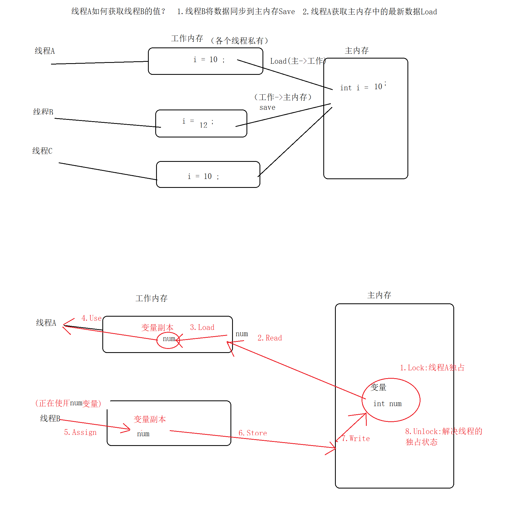
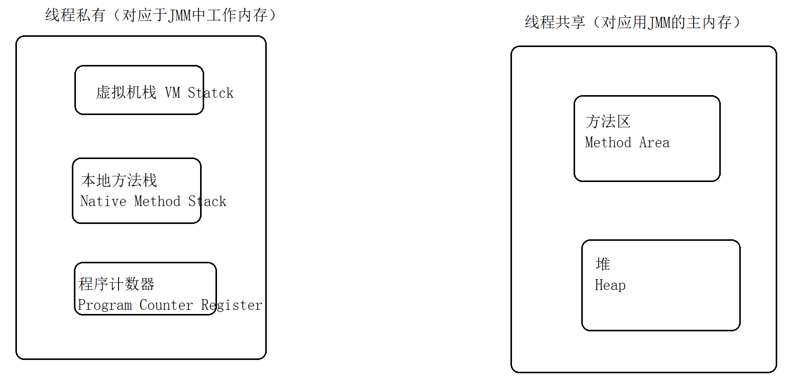
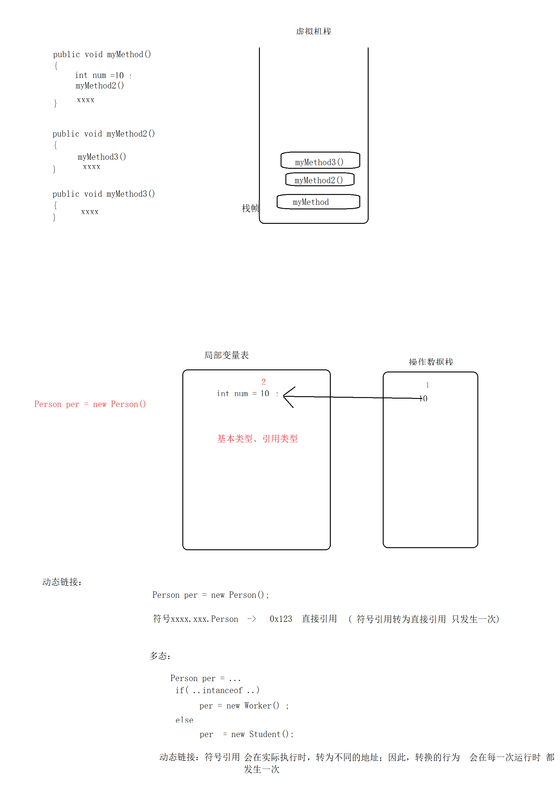
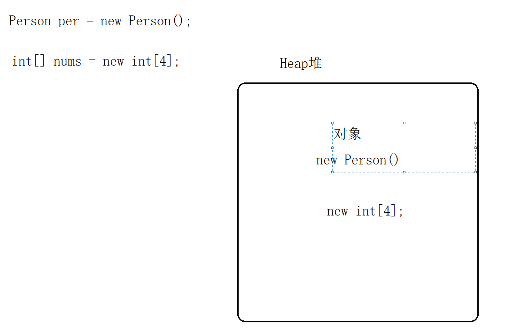
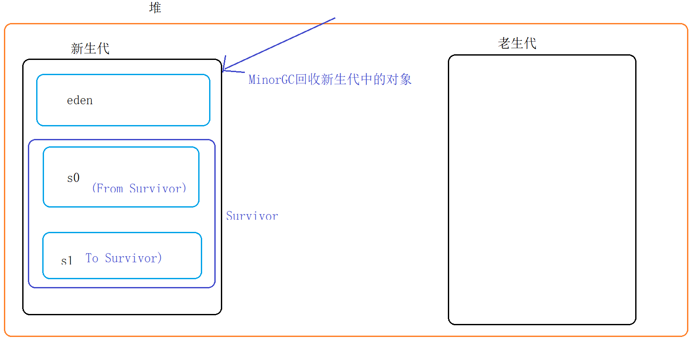

# JVM： java virtua Machine

jdk中包含了jvm和“屏蔽操作系统差异的组件”

- jvm各个操作系统之上是一致的
- “屏蔽操作系统差异的组件：在各个PC上各不相同（联想下载jdk，不同系统 需要下载不同版本的jdk）


## 类的生命周期

生命周期： 类的加载->连接->初始化->使用->卸载

-  类的加载

  查找并加载类的二进制数据（class文件）

  硬盘上的class文件 加载到jvm内存中

- 连接 ：确定类与类之间的关系  ； student.setAddress( address ); 

  - 验证

    .class 正确性校验

  - 准备

    static静态变量分配内存，并赋初始化默认值值

    static int num =  10 ;  在准备阶段，会把num=0，之后（初始化阶段）再将0修改为10

    在准备阶段，JVM中只有类，没有对象。

    初始化顺序： static ->非static ->构造方法

    public class Student{

    ​	static int age ; //在准备阶段，将age = 0 ;

    ​	String name ; 

    }

    

  - 解析:把类中符号引用，转为直接引用

    前期阶段，还不知道类的具体内存地址，只能使用“com.yanqun.pojo.Student ”来替代Student类，“com.yanqun.pojo.Student ”就称为符号引用；

    在解析阶段，JVM就可以将 “com.yanqun.pojo.Student ”映射成实际的内存地址，会后就用 内存地址来代替Student，这种使用 内存地址来使用 类的方法 称为直接引用。

 - 初始化：给static变量 赋予正确的值

static int num =  10 ;  在连接的准备阶段，会把num=0，之后（初始化阶段）再将0修改为10

 - 使用： 对象的初始化、对象的垃圾回收、对象的销毁
 - 卸载


jvm结束生命周期的时机：

- 正常结束
- 异常结束/错误  
- System.exit()
- 操作系统异常


## JVM内存模型（Java Memoery Model，简称JMM）

JMM:用于定义（所有线程的共享变量， 不能是局部变量）变量的访问规则

JMM将内存划分为两个区： 主内存区、工作内存区

- 主内存区 ：真实存放变量
- 工作内存区：主内存中变量的副本，供各个线程所使用


注意：1.各个线程只能访问自己私有的工作内存（不能访问其他线程的工作内存，也不能访问主内存）

2.不同线程之间，可以通过主内存 简介的访问其他线程的工作内存


完整的研究：不同线程之间交互数据时 经历的步骤：

1.Lock:将主内存中的变量，表示为一条线程的独占状态

2.Read：将主内存中的变量，读取到工作内存中

3.Load：将2中读取的变量拷贝到变量副本中

4.Use：把工作内存中的变量副本，传递给线程去使用

5.Assign:把线程正在使用的变量，传递给工作内存中的变量副本中

6.Store:将工作内存中变量副本的值，传递到主内存中

7.Write：将变量副本作为一个主内存中的变量进行存储

8.Unlock:解决线程的独占状态



JVM要求以上的8个动作必须是原子性的;jvm但是对于64位的数据类型（long double）有些非原子性协议。说明什么问题：在执行以上8个操作时，可能会出现 只读取（写入等）了半个long/double数据，因此出现错误。如何避免？ 1.商用JVM已经充分考虑了此问题，无需我们操作  2.可以通过volatile避免此类问题（读取半个数据的问题）   volatile double num ;

## volatile 

概念：JVM提供的一个轻量级的同步机制

作用：

1.防止JVM对long/double等64位的非原子性协议进行的误操作（读取半个数据）

2.可以使变量对所有的线程立即可见（某一个线程如果修改了 工作内存中的变量副本，那么加上volatile 之后，该变量就会立刻同步到其他线程的工作内存中）

3.禁止指令的“重排序”优化


原子性 ： num = 10 ;

非原子性： int num = 10 ; -> int num ;   num =10 ;


重排序：排序的对象就是 原子性操作，目的是为了提高执行效率，优化

```java
int a  =10 ; //1    int a ; a = 10 ;
int b ;//2
b = 20 ;//3
int c = a * b ;//4
```

重排序“不会影响**单线程**的执行结果”，因此以上程序在经过重排序后，可能的执行结果：1,2,3,4 ；2,3,1,4

```java
//2 3 1 4
int b ;
b = 20 ;
int a  =10 ;
int c = a * b ;
```


```java
package com.yanqun;
//双重检查式的懒汉式单例模式
public class Singleton {
    private static Singleton instance = null ;//单例
    private Singleton(){}
    public static Singleton getInstance(){
        if(instance == null){
            synchronized (Singleton.class){
                if(instance == null){
                    instance = new Singleton() ;//不是一个原子性操作
                }
            }
        }
        return instance ;
    }
}


```

以上代码可能会出现问题，原因 instance = new Singleton() 不是一个原子性操作，会在执行时拆分成以下动作：

1.JVM会分配内存地址、内存空间

2.使用构造方法实例化对象

3.instance = 第1步分配好的内存地址

根据重排序的知识，可知，以上3个动作在真正执行时 可能1、2、3，也可能是1、3、2

如果在多线程环境下，使用1、3、2可能出现问题：

假设线程A刚刚执行完以下步骤（即刚执行 1、3，但还没有执行2）

1正常0x123 ,  ...

3instance=0x123

此时，线程B进入单例程序的if，直接会得到Instance对象（注意，此instance是刚才线程A并没有new的对象）,就去使用该对象，例如instance.xxx() 则必然报错。解决方案，就是 禁止此程序使用1 3 2 的重排序顺序。解决：

```
  private volatile static Singleton instance = null ;//单例
```

volatile是通过“内存屏障”防止重排序问题：

1.在volatile写操作前，插入StoreStore屏障

2.在volatile写操作后，插入StoreLoad屏障

3.在volatile读操作后，插入LoadLoad屏障

4.在volatile读操作后，插入LoadStore屏障


***volatile***是否能保证原子性、保证线程安全？不能！

要想保证原子性/线程安全，可以使用原子包java.util.cocurrent.aotmic中的类，该类能够保证原子性的核心，是因为提供了compareAndSet()方法，该方法提供了 cas算法（无锁算法）。

## JVM运行时的内存区域

将JVM在运行时的内存，划分为了5个部分，如图所示。



## 程序计数器

程序计数器：行号指示器，指向当前线程所执行的字节码指令的地址

Test.java -> Test.class

```java
int num = 1;   //1
int num2 = 2 ; //2
if(num1>num2){//3
...//4-10
}else //11
{
    ...
}
while(...)
{
    
}
```

简单的可以理解为：class文件中的行号

> 注意：
>
> 1.一般情况下，程序计数器 是行号；但如果正在执行的方法是native方法，则程序计数器的值 undefined。
>
> 2.程序计数器 是唯一一个 不会 产生 “内存溢出”的区域。

goto的本质就是改变的 程序计数器的值（java中没有goto，goto在java中的保留字）


## 虚拟机栈

定义：描述 方法执行的内存模型

- 方法在执行的同时，会在虚拟机栈中创建一个栈帧
- 栈帧中包含：方法的局部变量表，操作数据栈、动态链接、方法出口信息等


当方法太多时，就可能发生 栈溢出异常StackOverflowError，或者内存溢出异常OutOfMemoryError

```java
public static void main(String[] args) {
    main(new String[]{"abc","abc"});
}
```

## 本地方法栈

原理和结构与虚拟机栈一致，不同点： 虚拟机栈中存放的 jdk或我们自己编写的方法，而本地方法栈调用的 操作系统底层的方法。



## 堆



- 存放对象实例（数组、对象）

- 堆是jvm区域中最大的一块，在jvm启动时就已经创建完毕

- GC主要管理的区域

- 堆本身是线程共享，但在堆内部可以划分出多个线程私有的缓冲区

- 堆允许物理空间不连续，只要逻辑连续即可

- 堆可以分 新生代、老生代 。大小比例，新生代：老生代= 1:2  

- 新生代中 包含eden、s0、s1 = 8:1:1  

- 新生代的使用率一般在90%。 在使用时，只能使用 一个eden和一块s区间(s0或s1)

- 新生代：存放 1.生命周期比较短的对象  2.小的对象；反之，存放在老生代中。对象的大小，可以通过参数设置 -XX：PretenureSizeThredshold 。一般而言，大对象一般是 集合、数组、字符串。生命周期： -XX:MaxTenuringThredshold

  新生代、老生代中年龄：MinorGC回收新生代中的对象。如果Eden区中的对象在一次回收后仍然存活，就会被转移到 s区中；之后，如果MinorGC再次回收，已经在s区中的对象仍然存活，则年龄+1。如果年龄增长一定的数字，则对象会被转移到 老生代中(默认是16)。简言之：在新生代中的对象，没经过一次MinorGC，有三种可能：1从eden -》s区   2.（已经在s区中）年龄+1  3.转移到老生代中

   

  新生代在使用时，只能同时使用一个s区：底层采用的是复制算法，为了避免碎片产生

  

  老生代： 1.生命周期比较长的对象  2.大的对象； 使用的回收器 MajorGC\FullGC

  

  新生代特点： 

  - 大部分对象都存在于新生代
  - 新生代的回收频率高、效率高

  老生代特点：

  - 空间大、
  - 增长速度慢
  - 频率低

  意义：可以根据项目中 对象大小的数量，设置新生代或老生代的空间容量，从提高GC的性能。

  

如果对象太多，也可能导致内存异常。


虚拟机参数：

-Xms128m ：JVM启动时的大小

 -Xmn32m：新生代大小

 -Xmx128：总大小

jvm总大小= 新生代 + 老生代


堆内存溢出的示例：java.lang.OutOfMemoryError: Java heap space

```java
package com.yanqun;

import java.util.ArrayList;
import java.util.List;

public class TestHeap {
    public static void main(String[] args) {

        List list = new ArrayList() ;
        while(true){
            list.add(  new int[1024*1024]) ;
        }

    }
}

```


## 方法区

存放：类的元数据（描述类的信息）、常量池、方法信息（方法数据、方法代码）

gc：类的元数据（描述类的信息）、常量池

方法区中数据如果太多，也会抛异常OutOfMemory异常


常量池：存放编译期间产生的 字面量("abc")、符号引用


注意： 导致内存溢出的异常OutOfMemoryError，除了虚拟机中的4个区域以外，还可能是直接内存。在NIO技术中会使用到直接内存。


